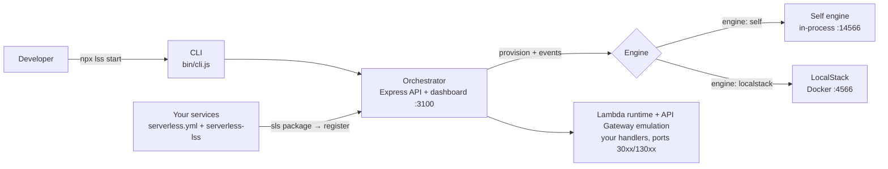
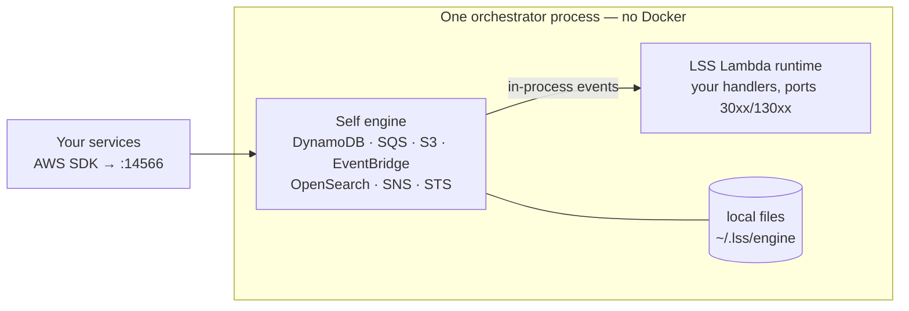
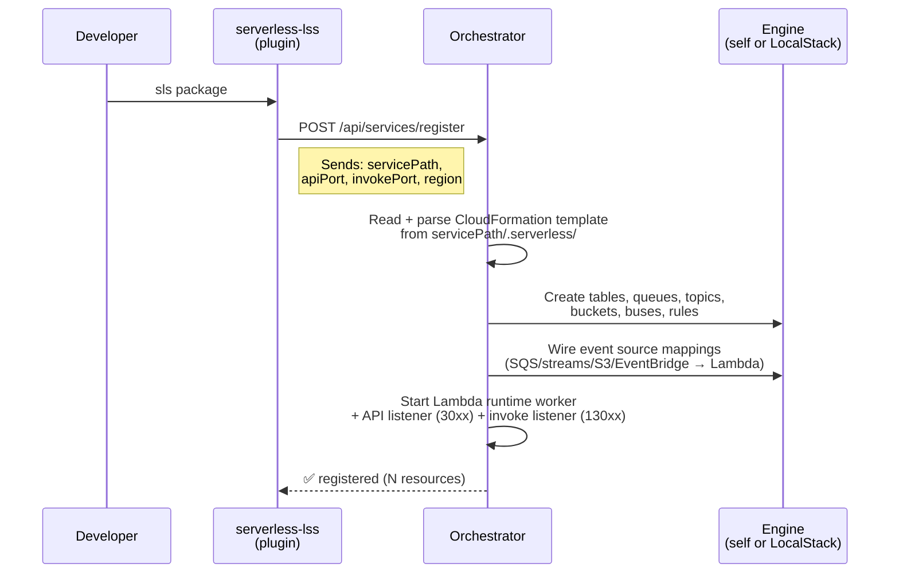
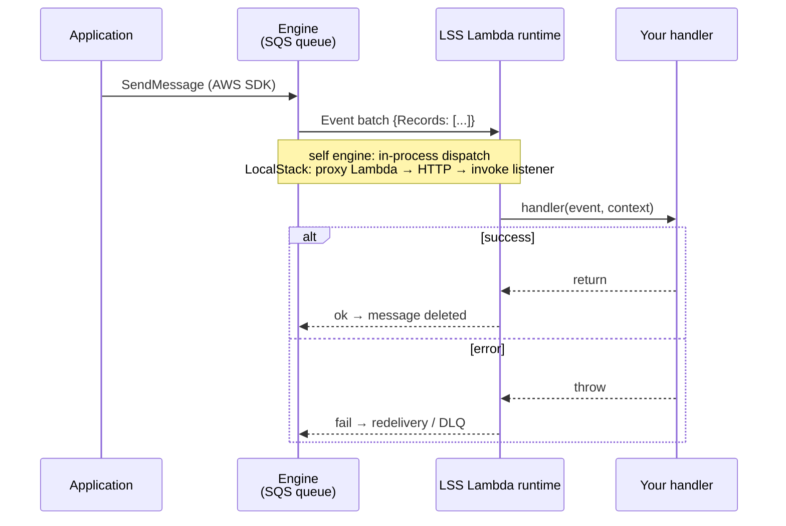

# Local Serverless Stack (LSS)

[](https://www.npmjs.com/package/local-serverless-stack)

**Local control plane for serverless development — with its own in-process AWS engine (no Docker) or LocalStack orchestration**

LSS provides a unified local development environment for serverless microservices: one orchestrator provisions and serves every AWS resource your services declare, eliminating the need to run separate LocalStack instances (or, with the **self engine**, any LocalStack at all). It scales to monorepos with 15+ microservices sharing one stack.



## Features

- **⚡ Self engine (the LSS differentiator)**: DynamoDB, SQS, S3, EventBridge, OpenSearch Serverless, SNS and the Lambda control plane emulated **in-process** by the orchestrator — no Docker, no LocalStack, no auth token. Boots in milliseconds, stores data in local files, delivers events straight into your handlers. See [Self engine](#self-engine--no-docker-no-localstack-no-auth-token) below.
- **Centralized provisioning**: Parses CloudFormation templates from `sls package` and provisions resources automatically — into the self engine or a single shared LocalStack, your choice per instance
- **Event source mappings**: Automatically connects SQS queues, streams, S3 notifications and EventBridge rules to Lambda handlers
- **Lambda runtime & API emulation**: LSS answers on the same API (30xx) and Lambda invoke (130xx) ports that serverless-offline used
- **Web UI**: Vue 3 dashboard to monitor services, resources, and event mappings — [brandable with your company's colors and logo](docs/CONFIGURATION.md#configuration-properties)
- **Hot reload**: Watch for code changes and auto-rebuild/reprovision
- **DynamoDB seeds**: fixtures auto-applied on table creation, re-applied via `lss seed` or the dashboard
- **CLI + programmatic client**: manage the orchestrator from the shell (`npx lss …`) or from code (`LssClient`)

See [docs/FEATURES.md](docs/FEATURES.md) for the complete feature inventory and how each capability is tested.

## Self engine — no Docker, no LocalStack, no auth token

LocalStack got heavy (a container eating 1 GB+ of RAM) and stopped being free by default
(community images `>= 2026.5` require an auth token). The **self engine** replaces it for
the typical serverless dev loop: the orchestrator itself serves the real AWS wire
protocols on one port, so your application code, the AWS SDK, the dashboard and `lss seed`
all work unchanged — there is simply no container underneath.

```bash
npx lss start --self-engine        # or "engine": "self" in lss.config.json
```

```
AWS_ENDPOINT=http://localhost:14566   # point your services here, done
```

What you get:

- **DynamoDB** with the full expression language (KeyCondition/Filter/Update/Projection,
  exact decimal arithmetic), GSIs/LSIs, TTL and streams — items persisted in local
  JSONL files under `~/.lss/engine/`, hydrated lazily and unloaded when idle.
- **SQS** with FIFO, visibility redelivery and live counters; **S3** with byte-exact
  object round trips and notifications; **EventBridge** with buses, pattern-filtered
  rules and `rate()`/cron schedules; minimal **SNS** and **STS**.
- **OpenSearch Serverless**: collections declared as
  `AWS::OpenSearchServerless::Collection` are provisioned via the real `aoss`
  control plane and served through the OpenSearch REST API — document CRUD,
  `_bulk`, `_search` with the everyday query DSL (match/term/range/bool…),
  sorting and `terms`/metric aggregations — at
  `http://localhost:14566/_aoss/<collection>`.
- **Events delivered in-process**: SQS batches, DynamoDB streams, S3 notifications and
  EventBridge targets go straight from the engine to the LSS Lambda runtime — no proxy
  Lambdas, no polling containers.



Measured on [examples/self-engine-sample](examples/self-engine-sample/) (3 microservices:
orders → billing → notifications): engine boot **~10 ms**; a full pipeline crossing
DynamoDB + SQS + S3 + EventBridge across the three services completes in **~170 ms** —
with the whole stack being the orchestrator process plus one small worker per service.

Migration is gradual: LocalStack mode remains the default and fully supported; a running
instance picks one engine. Anything the self engine doesn't implement yet answers with an
explicit error naming the operation — or is forwarded verbatim to a LocalStack via
`selfEngine.fallbackEndpoint`. Coverage matrix and storage model:
[docs/SELF_ENGINE.md](docs/SELF_ENGINE.md) · design/PRD:
[docs/PRD_SELF_ENGINE.md](docs/PRD_SELF_ENGINE.md) · runnable demo:
[examples/self-engine-sample](examples/self-engine-sample/).

## Quick Start

Prerequisites: Node.js >= 20 · Serverless Framework 3.x · Docker (**only** for the LocalStack engine)

```bash
# 1. Install
npm install -g local-serverless-stack

# 2. Start the orchestrator (self engine: no Docker needed)
npx lss start --self-engine        # or plain `npx lss start` for LocalStack

# 3. In each microservice: install the plugin and add it to serverless.yml
npm install --save-dev serverless-lss
```

```yaml
# serverless.yml
plugins:
  - serverless-lss

custom:
  orchestrator:
    enabled: true
    orchestratorUrl: http://localhost:3100   # must match serverPort
  lss:
    apiPort: 3000        # HTTP API (API Gateway emulation)
    invokePort: 3001     # direct Lambda invocations
```

```bash
# 4. Package the service — the plugin auto-registers it with LSS
#    (registration also fires on `sls offline` startup)
npx sls package

# 5. Watch everything in the dashboard
open http://localhost:3100
```

A minimal template lives at [docs/serverless.yml.example](docs/serverless.yml.example);
complete runnable projects live in [examples/](examples/):

| Example | Shows |
| --- | --- |
| [sample-microservice](examples/sample-microservice/) | DynamoDB, SQS, SNS, S3 notifications, streams, seeds |
| [multi-service-sample](examples/multi-service-sample/) | 3 services, cross-service events, schedules |
| [eventbridge-sample](examples/eventbridge-sample/) | EventBridge buses, rules, producer/consumer |
| [self-engine-sample](examples/self-engine-sample/) | The no-Docker engine end to end |
| [opensearch-sample](examples/opensearch-sample/) | OpenSearch Serverless: full-text search, filters, aggregations |
| [pro-sample-microservice](examples/pro-sample-microservice/) | LocalStack Pro edition + auth token |

## CLI

```bash
npx lss start                  # start the orchestrator in background (managed LocalStack)
npx lss start --self-engine    #   …with the in-process self engine (no Docker)
npx lss start --external       #   …connecting to a LocalStack you already run
npx lss start --pro            #   …with the LocalStack Pro image (needs auth token)
npx lss start --pro --localstack-token ls-xxx  #   …passing the auth token inline
npx lss start --enable-dynamo-proxy            #   …with the DynamoDB proxy on :8000
npx lss start --config ./e2e/lss.config.json   # explicit config file (any command)
npx lss status                 # is it running? which ports?
npx lss logs                   # tail the orchestrator log
npx lss seed [table]           # apply DynamoDB seed files (all tables or one)
npx lss seed:clear [table] -y  # empty seeded tables (prompts unless --yes)
npx lss stop                   # stop the orchestrator (and managed LocalStack)
npx lss help                   # all commands, flags and a config template
```

```bash
$ npx lss start --self-engine
🚀 LSS Orchestrator started (PID: 12345)
📊 Server: http://localhost:3100
🔧 Self Engine: http://localhost:14566 (no Docker)
✅ Service is running
```

The CLI runs the orchestrator detached, storing the PID in
`$TMPDIR/lss-orchestrator-{serverPort}.pid` and logs in
`$TMPDIR/lss-orchestrator-{serverPort}.log` (no suffix for the default port 3100;
under `stateDir` both move into that directory). The port-scoped paths let multiple
LSS instances coexist — one per project — without trampling each other.

## Configuration

Create an `lss.config.json` in the directory where you run `lss start` (all keys
optional — [full reference](docs/CONFIGURATION.md)):

```jsonc
{
  "serverPort": 3100,                // dashboard + API
  "engine": "localstack",            // "localstack" (default) | "self" (no Docker)
  "selfEngine": { "port": 14566 },   // engine "self" settings — docs/SELF_ENGINE.md
  "localstackPort": 4566,
  "services": ["dynamodb", "sqs", "sns", "s3", "lambda", "events"],
  "seedsDir": "./seeds",             // DynamoDB fixtures ({tableName}.json)
  "autoPackage": false,              // run `sls package` on register when template is missing
  "lambdaRuntime": { "enabled": true, "execution": "auto" },
  "branding": {                      // dashboard look & feel (optional)
    "title": "Acme Cloud",
    "logo": "./assets/acme.svg",
    "colors": { "brand-primary": "#e63946" }
  }
}
```

The most common environment overrides (env always wins over the file):
`LSS_DASHBOARD_PORT`, `LSS_ENGINE` (`localstack`/`self`), `LOCALSTACK_AUTH_TOKEN`,
`LSS_ENABLE_DYNAMO_PROXY`. Complete list: [docs/CONFIGURATION.md](docs/CONFIGURATION.md#environment-variables).

The self engine's default port sits **outside 4566–4599** on purpose: a real LocalStack
install intercepts that whole range on some hosts (Docker Desktop/WSL2). `--self-engine`
cannot be combined with the LocalStack-only flags (`--external`, `--pro`,
`--localstack-token`).

### LocalStack: managed, external, Pro

By default LSS spins up its own container (`lss-localstack-<port>`, services
`dynamodb,sqs,sns,s3,lambda,events`, persistence volume, local Lambda executor). To point
at an already-running instance set `mode: "external"` or pass `--external`. Recent
LocalStack images (`>= 2026.5` community, all `pro`) require an auth token:

```bash
export LOCALSTACK_AUTH_TOKEN=ls-xxxxxxxx
npx lss start            # community image with token
npx lss start --pro      # pro image (token required)
```

Details (`mode`, `localstackEdition`, `localstackVersion`, `localstackImage`):
[docs/CONFIGURATION.md](docs/CONFIGURATION.md).

## Dashboard

The Vue 3 dashboard at `http://localhost:3100` has seven tabs — **Overview** (health,
config snapshot), **Services** (status, start/stop, live logs, per-service resource
breakdown incl. EventBridge buses & rules), **Lambdas** (registry + invoke), **APIs**
(emulated HTTP routes), **Queues** (send/receive/purge, consumers), **S3** (objects,
upload/download), **DynamoDB** (items explorer, editor, TTL, seeds). A region selector
lets you inspect resources in any region.

It can carry your team's identity via the `branding` config key: navbar title/subtitle,
logo and favicon (URL or a file next to `lss.config.json`), default theme, and any
[TreeUI](https://www.npmjs.com/package/@treeui/vue) color token per theme:

```jsonc
"branding": {
  "title": "Acme Cloud",
  "subtitle": "Sandbox local",
  "logo": "./assets/acme.svg",
  "defaultTheme": "light",
  "colors": { "brand-primary": "#e63946", "brand-hover": "#c1121f" },
  "themeColors": { "dark": { "bg-primary": "#0d1b2a" } }
}
```

## How It Works

### Registration & provisioning



The plugin itself only reports *where* the service lives — the orchestrator reads
`.serverless/cloudformation-template-update-stack.json` from that path (running
`sls package` generates it; `autoPackage: true` lets the orchestrator regenerate it
on demand).

### Event flow



The same flow applies to DynamoDB streams, S3 notifications and EventBridge targets.
In LocalStack mode the hop goes through a generated proxy Lambda inside the container;
in self-engine mode the dispatcher calls the runtime directly — no proxy, no polling.

If you still want serverless-offline to own the ports for a service, disable the
LSS runtime globally or per service with `lambdaRuntime.enabled`/`serviceRuntime`.

## Architecture

```
local-serverless-stack/
├── bin/cli.js                # CLI entry point (npx lss)
├── src/
│   ├── server/               # Express API + orchestration
│   │   ├── routes/           # HTTP endpoints (/api/services, /api/queues, …)
│   │   ├── services/         # provisioner, registrar, packager, seeds, …
│   │   ├── engine/           # self engine (in-process AWS emulation)
│   │   ├── runtime/          # Lambda runtime + API Gateway emulation
│   │   └── dev/              # dev utilities (DynamoDB proxy)
│   ├── client/               # programmatic client (LssClient) — package entry point
│   └── ui/                   # Vue 3 dashboard (npm workspace, @treeui/vue)
├── packages/serverless-plugin/  # serverless-lss (published separately)
├── docs/                     # reference docs
├── examples/                 # runnable sample projects
└── tests/                    # unit + integration suites
```

- **CLI** (`bin/cli.js`): background process management (start/stop/status/logs/seed)
- **Server** (`src/server/`): Express API + engine orchestration; serves the built UI
- **Engine** (`src/server/engine/`): the AWS provider behind everything — in-process **self engine** (:14566, no Docker) or managed/external **LocalStack** (:4566)
- **Client** (`src/client/`): `LssClient` — the same API surface as the dashboard, from code
- **Plugin** (`packages/serverless-plugin/`): auto-registration on `sls package`

## Development

```bash
git clone https://github.com/viserion77/local-serverless-stack.git
cd local-serverless-stack
npm run setup          # install root + UI workspace deps
npm run dev            # server (tsx watch) + UI (vite) concurrently
npm run build          # ui + server + client + plugin
```

Granular builds: `server:build`, `ui:build`, `client:build`, `plugin:build`.

### Testing

```bash
npm test                    # unit suite (jest)
npm run test:coverage       # with coverage (CI gate)
npm run test:watch          # watch mode
npm run test:integration    # boots a real orchestrator (Docker/LocalStack required)
npm run lint                # eslint
npx jest tests/unit/services/config-manager.test.ts   # a single suite
```

## Troubleshooting

```bash
npx lss status          # running? which ports?
npx lss logs            # orchestrator log (also: $TMPDIR/lss-orchestrator*.log)
ls dist/server dist/ui  # built? if not: npm run build
lsof -i :3100           # who owns the port?
```

- **Plugin registers nothing** → is `orchestratorUrl` pointing at the right `serverPort`? Try `ORCHESTRATOR_URL=http://localhost:3100 npx sls package`.
- **Ports 4566–4599 behave strangely** → a real LocalStack install may intercept the whole range; the self engine defaults to 14566 for this reason.
- **DynamoDB on port 8000 expected by your tooling** → enable the proxy: `lss start --enable-dynamo-proxy` (or `enableDynamoProxy: true`); it forwards to the active engine.

## Contributing & Releasing

Contributions welcome — see [CONTRIBUTING.md](CONTRIBUTING.md). Release process
(automated npm publish on version bump): [docs/RELEASE.md](docs/RELEASE.md).
Changelog: [CHANGELOG.md](CHANGELOG.md).

## License

MIT
