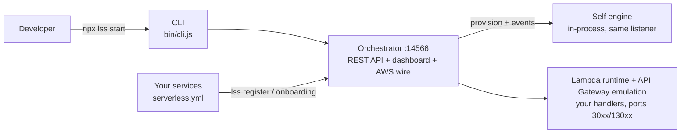
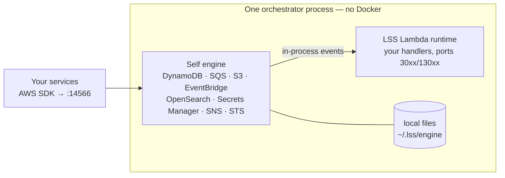
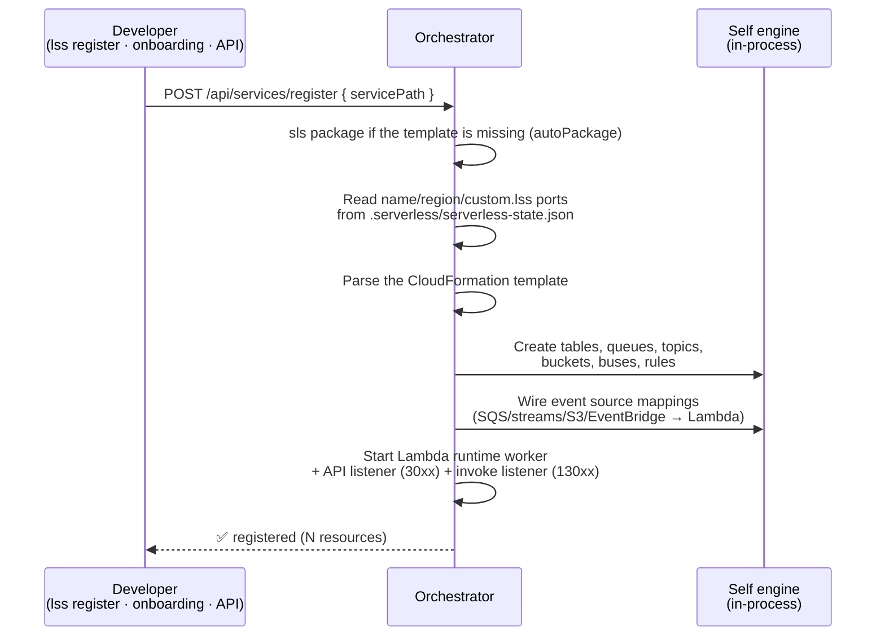
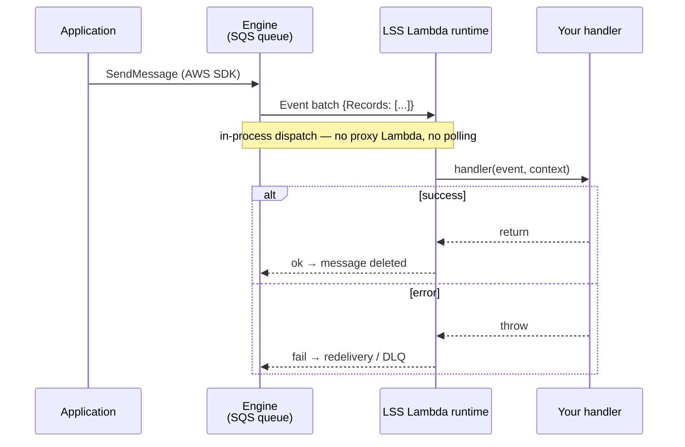

<p align="center">
  
</p>

# Local Serverless Stack (LSS)

[](https://www.npmjs.com/package/local-serverless-stack)

**Local control plane for serverless development — with its own in-process AWS engine. No Docker, no container, no auth token.**

LSS provides a unified local development environment for serverless microservices: one orchestrator provisions and serves every AWS resource your services declare, so a monorepo needs a single local stack instead of one emulator per service. Measured on a synthetic 40-service / 400-lambda / 400-table monorepo: **128 MB resident and a 2 s boot**.



## Features

Every feature LSS ships, grouped by area. Each one expands into **how it works** (the real
mechanism and defaults), **where it lives** (the files that own it) and **why it exists** (the
problem it solves). 86 features in nine areas — start with [Quick Start](#quick-start) if you just
want it running.

> **⚠️ Keep this inventory alive.** A new capability MUST be added here **and** to
> [docs/FEATURES.md](docs/FEATURES.md) (the canonical inventory, with the test that asserts each
> promise) — plus [docs/SELF_ENGINE.md](docs/SELF_ENGINE.md) when it touches the engine. A feature
> that isn't listed is treated as a feature that doesn't exist.

**Jump to an area:** [CLI](#cli) · [Service registration & discovery](#service-registration--discovery) ·
[Resource provisioning](#resource-provisioning-from-cloudformation) ·
[Lambda runtime & API Gateway](#lambda-runtime--api-gateway-emulation) ·
[Self engine](#the-self-engine-in-process-aws) ·
[Explorers & testing primitives](#explorers--testing-primitives) ·
[Dashboard](#dashboard) ·
[Client & MCP](#programmatic-client--mcp-server) ·
[Configuration & isolation](#configuration--isolation)

### CLI

<details>
<summary><b>Background orchestrator lifecycle</b> — <code>lss start</code> / <code>stop</code> / <code>status</code> run the whole stack as a detached process you can forget about</summary>

**How it works.** `start` first rejects any leftover v1 flag, then checks the PID file: if the recorded PID answers `kill(pid, 0)` it just reprints the URLs and returns; a dead PID file is deleted and boot continues. It resolves `dist/server/index.js`, opens the log file in append mode and `spawn`s `node` detached with stdio piped to that file, `unref`s the child and writes its PID. Ports come from config plus env (`serverPort` and the self engine both default to **14566**; the DynamoDB proxy is off, port **8000** when enabled), and they are passed down as `PORT`, `LSS_ENABLE_DYNAMO_PROXY`, `LSS_DYNAMO_PROXY_PORT`. Two seconds later it re-probes the PID and prints either "Service is running" or a failure pointing at the log. `stop` sends `SIGTERM` and then polls `kill(pid, 0)` every **200 ms for up to 10 s** before deleting the PID file — without that wait an immediate `lss start` would race the dying process for the port and die with `EADDRINUSE`. `status` prints PID, server URL, self engine URL, proxy URL (only when enabled) and log path, and self-heals a stale PID file.

**Where it lives.** `bin/cli.js` — `startOrchestrator()`, `stopOrchestrator()`, `waitForExit()`, `showStatus()`, `runtimePaths()`. `src/server/index.ts` — the orchestrator entry point that gets spawned.

**Why it exists.** One command replaces "start LocalStack, then start one `serverless-offline` per service". Because the process is detached and PID-tracked, the stack survives closing the terminal, and `status` answers the "is it up?" question without grepping `ps`.

</details>

<details>
<summary><b><code>lss register [path...]</code></b> — attach a service to the running stack without any Serverless plugin</summary>

**How it works.** It requires a running orchestrator (PID file present, otherwise it prints the start hint and exits 1), then resolves each positional argument to an absolute path — defaulting to `.` when none is given — and skips (counting as failed) any directory that does not exist. For each path it `POST`s `{ servicePath }` to `/api/services/register` on the server port; the orchestrator does everything else: packaging on demand via `autoPackage`, then reading name, region and `custom.lss` ports out of the packaged `serverless-state.json`. Each success prints resource/function/route counts plus any warnings the server returned; if any target failed, the process exits 1.

**Where it lives.** `bin/cli.js` — `registerServices()`, `postJson()`, `allPositionals()`. `src/server/routes/services.ts` — `POST /register`, which validates the path and delegates to the registrar.

**Why it exists.** v1 shipped a `serverless-lss` plugin that hooked into deploys; it was retired in v2. Registration is now a plain HTTP call, so a service joins the stack from any shell, a Makefile or CI without adding a dependency to its `serverless.yml`.

</details>

<details>
<summary><b><code>lss scan</code></b> — list every Serverless/osls service under the project root with its readiness flags</summary>

**How it works.** It calls `GET /api/services/scan`, which walks the project root (skipping `node_modules`, `.git`, `.serverless`, `.lss`, `.build`, `.esbuild`) and returns one row per service. Each row prints three flags — `registered` (known to this orchestrator), `installed` (a `node_modules` is resolvable from the service dir upward to the root, so packaging can run without an install) and `packaged` (`.serverless/cloudformation-template-update-stack.json` exists) — followed by the resolved `api:`/`invoke:` ports when known. A second line shows the effective package command for that service (per-service `servicePackaging`, else the global one), and any scan warnings are listed underneath. Empty results print the root that was searched.

**Where it lives.** `bin/cli.js` — `scanServices()` and the row formatting. `src/server/routes/services.ts` — `GET /scan`, which overlays runtime/packaging config on the raw scan. `src/server/services/service-scanner.ts` — the filesystem walk and the installed/packaged detection.

**Why it exists.** In a monorepo of 15+ services, the first question is "which of these does the stack already know about, and which one is missing an `npm install` or a `serverless package`?". `scan` answers it in one screen and mirrors exactly what the dashboard onboarding shows.

</details>

<details>
<summary><b><code>lss seed [table]</code></b> — load JSON fixtures into DynamoDB, and explain it when nothing lands</summary>

**How it works.** With no argument it `POST`s `{}` to `/api/seeds/run` and every `<table>.json` in `seedsDir` (default `./seeds`) is applied; with an argument only that table runs. Each result prints as inserted-count or skipped-with-reason. When any skip reason contains "does not exist in the engine", the CLI follows up with `GET /api/seeds` and prints both sides of the comparison: the seed files it inspected and the tables actually live in the engine. If there are live tables it tells you the file name must match the CloudFormation `TableName` exactly and to check for a prefix/suffix mismatch; if there are none it concludes the stack was never provisioned and prints the `lss start` → `serverless deploy` steps. The diagnostic is best-effort — a failure there is reported but never fails the seed.

**Where it lives.** `bin/cli.js` — `runSeed()`, `printSeedRunResults()`, `printSeedMismatchDiagnostic()`. `src/server/routes/seeds.ts` — `GET /`, `POST /run`. `src/server/services/config-manager.ts` — `getSeedsDir()`, the `./seeds` default.

**Why it exists.** Local development needs reproducible data after every wipe. The diagnostic exists because the single most common failure — a seed file whose name doesn't match the deployed `TableName` — is otherwise indistinguishable from "I forgot to deploy".

</details>

<details>
<summary><b><code>lss logs</code></b> — the tail of the orchestrator's own log</summary>

**How it works.** It resolves the log path for the instance this invocation addresses (the same `stateDir`/port-scoped rule `start` used), and prints the **last 50 lines** of that file. If the file doesn't exist yet it says so and names the path it looked at. Since `start` redirects both stdout and stderr of the detached process into this file, everything the orchestrator, the engine and the Lambda workers print ends up here.

**Where it lives.** `bin/cli.js` — `showLogs()`, `runtimePaths()`.

**Why it exists.** A detached process has nowhere to print. This is the debugging path when `start` reports a failed boot, and it works without knowing where the temp file lives.

</details>

<details>
<summary><b><code>lss seed:clear [table]</code></b> — wipe seeded tables, with a confirmation that shows you the blast radius first</summary>

**How it works.** Before deleting anything it calls `GET /api/seeds` and intersects the seed files with the tables that actually exist, so it can print the exact scope — one named table, or the count and names of all of them — along with the engine URL being targeted and an explicit "this does NOT touch any AWS account" line. If nothing matches it says why (no such table / no seed files / files exist but no live tables) and prints the same mismatch diagnostic as `seed`, without writing. Then it prompts you to type the word **`confirmar`** — deliberately untranslated in every locale, because scripts and docs depend on the token — and any other input aborts. `--yes` (or `-y`) skips the prompt and announces that it did; only then does it `POST /api/seeds/clear`.

**Where it lives.** `bin/cli.js` — `clearSeed()`, `promptConfirmation()`, `printSeedClearResults()`. `src/server/routes/seeds.ts` — `POST /clear`.

**Why it exists.** The one destructive command in the CLI. Showing the live target list and the local engine URL before the prompt is what makes "am I about to nuke a real table?" answerable in the moment; `--yes` keeps it usable from CI.

</details>

<details>
<summary><b>Per-instance config and state isolation</b> — <code>--config</code>, <code>stateDir</code> and env overrides let several stacks coexist on one machine</summary>

**How it works.** Config resolution is: `--config <path>` (or `LSS_CONFIG`), resolved absolute, then `./lss.config.json`, `./.lssrc`, `$HOME/lss.config.json`, `$HOME/.lssrc` — a missing or unparseable explicit file warns and falls back to the search rather than exiting, so `stop`/`status` can never orphan a running instance. Env overrides mirror the server's exactly: `LSS_DASHBOARD_PORT` or `PORT` for `serverPort`, `LSS_ENGINE_PORT` for the engine, `LSS_DYNAMO_PROXY_PORT`, and `LSS_ENABLE_DYNAMO_PROXY` (`true` or `1`); a non-numeric port is ignored rather than becoming `NaN`. PID/log paths follow from that: with a `stateDir` they are `<stateDir>/orchestrator.pid` and `.log`; otherwise `lss-orchestrator.pid`/`.log` in the OS temp dir on the default port 14566, or `lss-orchestrator-<port>.*` on any other. When `--config` is used, the file is also handed to the server as `LSS_CONFIG_PATH` so both config loaders read the same file.

**Where it lives.** `bin/cli.js` — `loadConfig()`, `getConfig()`, `envPort()`, `runtimePaths()`, `EXPLICIT_CONFIG`. `src/server/services/config-manager.ts` — the server-side loader that honours `LSS_CONFIG_PATH` and the same env vars.

**Why it exists.** An e2e stack, a demo example and your dev instance need to run side by side without stopping each other. Scoping the PID/log files by `stateDir` or port is what makes `lss stop --config ./e2e.json` hit the right process — and keeping the legacy global path on the default port means an upgrade doesn't lose track of an already-running orchestrator.

</details>

<details>
<summary><b><code>lss mcp</code></b> — serve the stack to an AI coding agent over stdio</summary>

**How it works.** It locates `dist/mcp/server.js`, reads the package version, and dynamically `import`s the module (the MCP build is ESM; loading it lazily keeps every other CLI invocation free of it) calling `main(version)`. Startup failures print to stderr and exit 1. The process speaks JSON-RPC on stdout — so it is launched by an MCP client, never typed at a prompt — and it only talks HTTP to an orchestrator that is already running; it never boots one, so `lss start` has to have happened first.

**Where it lives.** `bin/cli.js` — `runMcpServer()`, `getMcpServerPath()`, `getPackageVersion()`. `src/mcp/server.ts` — the MCP server and its tools.

**Why it exists.** It turns the running stack into tools an agent can call (list tables, invoke a lambda, read logs) instead of having the agent shell out and parse CLI output.

</details>

<details>
<summary><b>Localized help and messages</b> — <code>lss help</code> in English, Brazilian Portuguese or Spanish</summary>

**How it works.** The locale is resolved once at require time from `LSS_LANG`, then `LC_ALL`, `LC_MESSAGES`, `LANG`; POSIX suffixes are stripped (`pt_BR.UTF-8@euro` → `pt_BR`) and an unknown tag falls back to English rather than guessing. Every user-facing string goes through `t()`, which interpolates `{placeholder}` params and falls back English → raw key so an untranslated line still says something. Deliberately never translated: AWS proper nouns, command names, flags, config keys, paths, URLs and the `confirmar` token. `help` assembles its own layout — commands in a 19-column name gutter, options/env in a 29-column one — reflowing and hanging-indenting each description so a longer translation doesn't shred the column, and it prints the full `lss.config.json` template plus a worked example for each command.

**Where it lives.** `bin/i18n.js` — the three catalogues, `detectLocale()`, `matchLocale()`, `t()`. `bin/cli.js` — `showHelp()`, `helpRow()`, `helpExample()`.

**Why it exists.** Hand-rolled and dependency-free (like the dashboard's i18n) because the CLI is a plain CommonJS file with no build step, and a translation layer isn't worth an npm dependency in every install.

</details>

<details>
<summary><b>Legacy LocalStack guard</b> — v1 flags fail loudly instead of being silently ignored</summary>

**How it works.** `start` runs the check before anything else, including the already-running short-circuit. If `--external`, `--pro`, `--self-engine` or `--localstack-token` appear in argv (bare or as `flag=value`), or the resolved config sets `engine: "localstack"`, it names every offender, explains that v2 removed the LocalStack backend and that the self engine is the only engine, points at `docs/MIGRATION-v2.md`, and exits 1.

**Where it lives.** `bin/cli.js` — `assertNoLocalStackFlags()`.

**Why it exists.** A stale flag in a script or a stale key in `lss.config.json` would otherwise look like a successful no-op while quietly running a different engine than intended. Failing at the first line of `start` turns a silent behaviour change into a one-line fix.

</details>

### Service registration & discovery

<details>
<summary><b>Zero-config service registration</b> — point the orchestrator at a service directory and it figures out the rest</summary>

**How it works.** `POST /api/services/register` takes `{ servicePath }` — everything else is optional. The registrar resolves the path, reads `.serverless/cloudformation-template-update-stack.json` and parses it into typed resources, then reads `.serverless/serverless-state.json` for the service name, stage, functions, HTTP routes and authorizers (the CFN template's fully-resolved function environment is merged over the state's). It saves the template plus metadata to the per-project cache, provisions every parsed resource onto the engine, and activates the data plane: `FunctionRegistry` entry, Lambda worker, gateway/invoke listeners and the source watcher. A missing `serverless-state.json` degrades gracefully — functions still come from the CFN template, with a warning and no HTTP routes. The route rejects a path that isn't absolute or contains `..`, and ports outside 1024–65535. `lss register [path...]` is the CLI wrapper (defaults to `.`), and `lss_register_service` the MCP tool.

**Where it lives.** `src/server/services/service-registrar.ts` — the whole read → parse → cache → provision → activate pipeline. `src/server/routes/services.ts` — `POST /register` input validation and the response shape. `src/server/services/cloudformation-parser.ts` — template → typed resources + `templateHash`. `bin/cli.js` — `lss register`.

**Why it exists.** In v1 each service had to carry the `serverless-lss` plugin and announce itself from inside `sls package`. That package was retired in v2: services join the stack from the outside, so onboarding a 40-service monorepo means 40 paths, not 40 edits to 40 `serverless.yml` files.

</details>

<details>
<summary><b><code>sls package</code> artifacts as the only manifest</b> — LSS reads what Serverless already wrote; there is no LSS-specific config to author</summary>

**How it works.** `ServerlessStateParser` walks the resolved state file Serverless writes next to the CloudFormation template. Functions get `fullName` from `functions[].name` (falling back to `{service}-{stage}-{fn}`) and defaults resolved provider-first: runtime `nodejs20.x`, memory `1024` MB, timeout `6` s. `http` and `httpApi` events become routes — shorthand (`"GET /users"`), object form, `routeKey`, and `*`/`$default` (→ method `ANY`, path `$default`); paths are normalized to a leading slash with trailing slashes stripped. `provider.httpApi.authorizers` become request authorizers (default `resultTtlInSeconds` 300, payload version `2.0`); JWT and other unsupported types are skipped with a warning, and routes using them return 500. Env values still holding CFN intrinsics are coerced to strings (`{Ref}` → logical id, `Fn::GetAtt` → dotted join).

**Where it lives.** `src/server/services/serverless-state-parser.ts` — functions, routes, authorizers, port/region hints, `sanitizeEnvironmentValues`. `src/server/services/service-registrar.ts` — merges the CFN-resolved env over the state's per function. `src/server/services/cache-manager.ts` — the `ServiceMetadata` shape all of this lands in.

**Why it exists.** Serverless Framework already resolves your variables, plugins and stage at packaging time. Re-declaring routes or env in an LSS manifest would drift; parsing the artifact means the local stack always matches what would deploy.

</details>

<details>
<summary><b>Service discovery (<code>lss scan</code>)</b> — find every Serverless/osls service in the monorepo and show what's missing before you register it</summary>

**How it works.** `GET /api/services/scan` walks the project root, max depth 6, skipping `node_modules`, `.git`, `.serverless`, `.lss`, `.build`, `.esbuild`, `dist`, `build`, `coverage`, `.webpack`, `.vscode`, `.devcontainer`, `.idea` and any dot-directory. The first directory holding `serverless.yml`/`.yaml`/`.json`/`.ts` is a leaf — nested configs under a service are treated as fixtures. Each hit reports `name` (from `service:`, else the basename), absolute `root`, `relPath`, `configFile`, and three flags: `installed` (a `node_modules` found in the service or any parent up to the scan root, so workspace hoisting counts), `packaged` (a template already exists) and `registered` (root matches a cached service). Region and port hints come from a line-oriented scrape — `serverless.json` is parsed properly, `serverless.ts` contributes only a warning since it resolves at packaging time. The route then overlays `lss.config.json`: `serviceRuntime` ports win, and the effective package command is attached. Results sort by `relPath`. Surfaces as `lss scan`, the dashboard onboarding checklist and the `lss_scan_services` MCP tool.

**Where it lives.** `src/server/services/service-scanner.ts` — the walk, the flags and the YAML hint scrape. `src/server/routes/services.ts` — `GET /scan`, registered before `/:name` so the path isn't matched as a service named "scan". `bin/cli.js` — the `lss scan` checklist rendering. `src/ui/src/pages/OnboardingPage.vue` — the install → package → register flow built on it.

**Why it exists.** The scan is the discovery half the retired plugin used to do from inside each service's `sls package`. Values here are a preview only — the authoritative name, region and ports come from the packaged state at registration time, so a missed hint costs a default, never a wrong registration.

</details>

<details>
<summary><b>On-demand packaging (<code>autoPackage</code>)</b> — register a service that was never packaged, and LSS packages it for you</summary>

**How it works.** When the CloudFormation template is missing and `autoPackage` is on (default **false**; `LSS_AUTO_PACKAGE` also sets it), the registrar runs the effective package command with the service directory as cwd — default `npx serverless package`, global `packageArgs` then any per-service `packageArgs` appended as discrete argv (no shell re-parsing), `packageEnv` merged over `process.env`, timeout `300000` ms with `SIGTERM` then `SIGKILL` 2 s later — and re-reads the template. A non-zero exit or a timeout raises `ServerlessPackageError`; the registrar logs the full stdout/stderr and answers 500 pointing at `/tmp/lss-orchestrator.log`. With `autoPackage` off, a missing template is a 400 telling you to run `serverless package`. `POST /api/services/package` runs the same effective command on demand and returns `exitCode`, `durationMs` and the last 8000 characters of output (422 on failure). The source watcher's full reload re-packages the same way before re-registering.

**Where it lives.** `src/server/services/serverless-packager.ts` — quote-aware command parsing, spawn, timeout, `ServerlessPackageError`. `src/server/services/service-registrar.ts` — `readTemplate()` fallback and `reregister()`. `src/server/services/config-manager.ts` — `getPackageConfigForService()` merges global config with a `servicePackaging` entry. `src/server/routes/services.ts` — `POST /package`.

**Why it exists.** A TypeScript/esbuild service must be re-packaged before its template and handlers are current, and a stale `.serverless/` silently serves old code. Making packaging part of registration removes the "did you package first?" step from every onboarding and every hot reload.

</details>

<details>
<summary><b>Port and region precedence</b> — one deterministic order, so a service lands on the same ports every time</summary>

**How it works.** `apiPort` resolves as `lss.config.json` `serviceRuntime[<svc>].apiPort` > the request body > `custom.lss.apiPort` from the packaged state. `invokePort` follows the same three, then falls back to `apiPort + invokePortOffset` (default **10000**, so api `3010` → invoke `13010`). Region resolves as request > `provider.region` from the state > the config's `region` > `us-east-1`. Per-service config entries are matched by path relative to the config file's directory, path relative to the project root, or the directory basename. The resolved trio is written into the cached metadata, so a watcher reload or a boot rehydration replays the exact same numbers. The register route validates supplied ports at 1024–65535; both parsers independently reject anything outside 1–65535 so garbage never reaches a `listen()`.

**Where it lives.** `src/server/services/service-registrar.ts` — the precedence chain and the offset fallback. `src/server/services/config-manager.ts` — `getRuntimeConfigForService()`, `getInvokePortOffset()`, the key-matching rules. `src/server/services/serverless-state-parser.ts` — `custom.lss` hints, port sanity check. `src/server/routes/services.ts` — request-level port validation.

**Why it exists.** Dozens of services sharing one machine need stable, non-colliding ports without declaring them twice. Config wins so an operator can move a port without touching the service, and the packaged state carries the service's own preference so nothing has to be configured centrally by default.

</details>

<details>
<summary><b>Per-project registry cache & boot rehydration</b> — restart the orchestrator and every service comes back without re-registering</summary>

**How it works.** Each registration writes `cloudformation-template.json` and `metadata.json` under `~/.lss/orchestrator/cache/projects/<project-segment>/<serviceName>/`, holding the sha256 `templateHash`, root, ports, region, stage, functions, routes and authorizers. On boot the orchestrator lists that directory and re-activates every entry — registry, Lambda worker, gateway/invoke listeners, watcher; an entry whose root sits outside the project root is logged and reactivated anyway (config under `infra/`, services elsewhere), and one that throws is logged while the rest continue. If the real `service:` name differs from the directory basename (the 0.5.x cache key) the legacy entry for that same root is deactivated and deleted so no ghost service survives. `DELETE /api/services/:name` deactivates the data plane, cleans up provisioned resources from the re-parsed template, then removes the cache directory.

**Where it lives.** `src/server/services/cache-manager.ts` — the project-scoped on-disk layout. `src/server/services/service-registrar.ts` — `rehydrateAll()`, `activate()`, `deactivate()`, the name migration. `src/server/routes/services.ts` — `GET /`, `GET /:name`, `DELETE /:name`.

**Why it exists.** Re-registering 40 services after every restart is the tax LocalStack-per-service setups charge. Scoping the cache per project also stops two checkouts with a service of the same name from overwriting each other's metadata and rehydrating into the wrong orchestrator.

</details>

<details>
<summary><b>Guarded dependency install</b> — onboarding can prepare a freshly cloned service without turning the API into a shell</summary>

**How it works.** `POST /api/services/install` runs a package-manager install in a scanned service (packaging fails without `node_modules`). The command defaults to `npm install`, and validation is on its *shape*: the first token must be `npm`, `yarn` or `pnpm`; the second must be `install`, `ci`, `i` or `add` (`yarn`/`pnpm` may omit it, `npm` may not); every remaining token must start with `-`. So `npm install lodash`, `npm exec -- anything` and `node -e "…"` are all unrepresentable and answered 400. The path is resolved, must be absolute, must not contain `..`, must be **inside the project root**, and must be an existing directory (a `statSync` throw is treated as not-a-directory rather than crashing the handler). Timeout is the service's effective `packageTimeoutMs` (default 300000). The response carries `exitCode`, `durationMs` and the last 8000 characters of stdout+stderr; a non-zero exit is 422. `POST /package` shares the same path guard.

**Where it lives.** `src/server/routes/services.ts` — `resolveServiceDir()` (project-root confinement), `installCommandError()` (command shape), `POST /install`. `src/server/services/serverless-packager.ts` — the spawn/timeout/output capture. `src/ui/src/pages/OnboardingPage.vue` — the install button in the onboarding checklist.

**Why it exists.** The dashboard onboarding walks install → package → register for a service you just cloned, and every legitimate caller gets its paths from `GET /scan`, which never looks outside the project root. Without the fence and the shape check, an endpoint on a local port would be arbitrary command execution on the host.

</details>

### Resource provisioning from CloudFormation

<details>
<summary><b>Packaged template → typed resource graph</b> — LSS reads the same CloudFormation you deploy and turns it into the resources it will create locally</summary>

**How it works.** On `lss register` (or `POST /api/services/register`) the registrar reads `<service>/.serverless/cloudformation-template-update-stack.json` — running `serverless package` first when the file is missing and `autoPackage` is on — and `CloudFormationParser.parse()` walks `Resources`, switching on `Type`. Supported types: `AWS::Lambda::Function`, `AWS::DynamoDB::Table`, `AWS::SQS::Queue`, `AWS::SNS::Topic`, `AWS::S3::Bucket`, `AWS::SecretsManager::Secret`, `AWS::Lambda::EventSourceMapping`, `AWS::Events::EventBus`, `AWS::Events::Rule`, `AWS::OpenSearchServerless::Collection`, `AWS::ApiGatewayV2::Api` / `::Integration` / `::Route` / `::Authorizer`, and `AWS::Lambda::Permission`. Unknown types are dropped silently and the Serverless Framework's `ServerlessDeploymentBucket` is dropped by logical id; `AWS::Events::Archive` and `AWS::OpenSearchServerless::SecurityPolicy` / `::AccessPolicy` / `::VpcEndpoint` push an explicit warning ("not provisioned locally" / "no-op locally") into the `warnings[]` array returned to the caller and logged as `⚠️ [service] …`. A SHA-256 of the whole template is stored as the service's `templateHash`.

**Where it lives.** `src/server/services/cloudformation-parser.ts` — the type switch, one parser per resource type, and `calculateHash`. `src/server/services/service-registrar.ts` — reads the template (with auto-package fallback), collects warnings, persists metadata and calls the provisioner.

**Why it exists.** Your infrastructure is already declared once, in the template `sls package` emits — LSS provisions from that instead of asking you to maintain a second local description of the same tables, queues and buckets.

</details>

<details>
<summary><b>Idempotent, non-fatal provisioning passes</b> — registering the same service ten times converges instead of failing</summary>

**How it works.** `provisionResources(serviceName, resources, { invokePort, region })` re-creates its AWS SDK clients if the region changed, rebuilds a `logicalId → resource` map for reference resolution, then runs four ordered passes: (1) infrastructure — DynamoDB tables, SQS queues, SNS topics, S3 buckets, secrets, event buses, OpenSearch collections; (2) event source mappings; (3) EventBridge rules and targets; (4) S3 notification wiring (last, so the proxies created in pass 2 already exist). Every item is individually wrapped: the "already exists" family (`ResourceInUseException`, `QueueAlreadyExists`, `BucketAlreadyOwnedByYou`/`BucketAlreadyExists`, `ResourceExistsException`, `ResourceAlreadyExistsException`, `ConflictException`, `ResourceConflictException`) is swallowed and logged as `⚠ … already exists`; anything else is logged as an error and the loop continues, so one broken resource never aborts a boot. `AWS::Lambda::Function` resources are parsed but never provisioned — real functions run in the LSS Lambda runtime, not in the engine's Lambda control plane.

**Where it lives.** `src/server/services/resource-provisioner.ts` — the singleton that owns the AWS SDK clients (DynamoDB, SQS, SNS, S3 with `forcePathStyle`, Lambda, EventBridge, Secrets Manager, OpenSearch Serverless), all four passes and the per-resource error policy.

**Why it exists.** In a monorepo every service re-registers on every save, boot and hot reload, and several services legitimately declare the same shared table or queue. Provisioning has to be a convergence step, not a one-shot deploy.

</details>

<details>
<summary><b>DynamoDB tables — keys, GSIs/LSIs, streams and TTL</b> — tables come up exactly as the template describes them, streams included</summary>

**How it works.** `CreateTable` is sent with the template's `KeySchema`, `AttributeDefinitions`, `BillingMode` and any non-empty `GlobalSecondaryIndexes`/`LocalSecondaryIndexes`; attributes referenced by a key or index but missing from `AttributeDefinitions` are synthesized as type `S` so a partially-written template still provisions. A stream is enabled whenever `StreamSpecification` carries either `StreamViewType` or `StreamEnabled` (CFN has no separate boolean), with `NEW_AND_OLD_IMAGES` as the fallback view type. `TimeToLiveSpecification` is applied afterwards with `UpdateTimeToLive` (`Enabled` defaults to true unless explicitly `false`) — also for tables that already existed, and DynamoDB's "TimeToLive is already enabled/disabled" reply is treated as the steady state, not a failure. A successful create fires `SeedManager.seedOnTableCreated` in the background when a seed file exists for that table.

**Where it lives.** `src/server/services/cloudformation-parser.ts` — `parseDynamoDB` (stream/TTL normalization). `src/server/services/resource-provisioner.ts` — `createDynamoDBTable` and `applyTimeToLive`. `src/server/services/seed-manager.ts` — the fire-and-forget auto-seed hook.

**Why it exists.** Streams and TTL are what most local DynamoDB setups quietly skip, and they are exactly what a stream-triggered Lambda needs to be testable at all.

</details>

<details>
<summary><b>SQS queues — FIFO, retention and redrive to a DLQ</b> — queue attributes survive the trip from CloudFormation to the running queue</summary>

**How it works.** `CreateQueue` receives only the attributes the template declares: `VisibilityTimeout`, `MessageRetentionPeriod`, `FifoQueue` (plus `ContentBasedDeduplication`) and `RedrivePolicy`. Redrive is the interesting one: CFN declares it as an object, the SQS API wants a JSON *string*, and `deadLetterTargetArn` is usually `Fn::GetAtt [OrdersDlq, Arn]`. The parser reduces that to `OrdersDlq::Arn`, and the provisioner resolves the logical id through the template map into `arn:aws:sqs:<region>:000000000000:<queueName>` — so a DLQ declared *after* the queue that points at it still resolves, because nothing is looked up on the live engine. A redrive target that isn't an SQS queue in the same template is dropped with a warning and the queue is still created. Because `CreateQueue` cannot change an existing queue's attributes, a queue that already exists gets the policy pushed separately via `SetQueueAttributes`.

**Where it lives.** `src/server/services/cloudformation-parser.ts` — `parseSQS` / `parseRedrivePolicy` (an unparseable policy is dropped, never half-carried). `src/server/services/resource-provisioner.ts` — `createSQSQueue`, `buildRedrivePolicy`, `applyRedrivePolicy`.

**Why it exists.** Poison-message handling is a behaviour you want to exercise locally; without redrive the DLQ exists but never receives anything, and the retry path you shipped is untested.

</details>

<details>
<summary><b>S3 buckets — versioning, CORS and Lambda notifications</b> — an upload locally fires the same Lambda it fires in AWS</summary>

**How it works.** `CreateBucket` runs first, then `PutBucketVersioning` when `VersioningConfiguration.Status` is `Enabled`, then `PutBucketCors` when `CorsConfiguration` has at least one rule carrying both `AllowedMethods` and `AllowedOrigins` (both `ExposedHeaders`/`ExposeHeaders` and `MaxAge`/`MaxAgeSeconds` spellings are accepted, and `MaxAge: 0` is preserved); both follow-ups are non-fatal warnings on failure and `PutBucketCors` is a full replace, so re-registration is naturally idempotent. In the final pass each `NotificationConfiguration.LambdaConfigurations` entry resolves its target function through the logical-id map, ensures a trigger proxy exists, grants `s3.amazonaws.com` with `SourceArn arn:aws:s3:::<bucket>`, and is sent in one `PutBucketNotificationConfiguration` with `SkipDestinationValidation: true`. Events default to `s3:ObjectCreated:*` when the template omits them, and `Filter.S3Key.Rules` prefix/suffix carry through.

**Where it lives.** `src/server/services/cloudformation-parser.ts` — `parseS3` / `parseCorsRules`. `src/server/services/resource-provisioner.ts` — `createS3Bucket` and `configureS3Notifications`.

**Why it exists.** S3-triggered pipelines are otherwise the hardest thing to reproduce locally; wiring the notification at provision time means `aws s3 cp` against the engine drives the real handler with no extra glue.

</details>

<details>
<summary><b>Event source mappings — SQS and DynamoDB Streams → Lambda</b> — `AWS::Lambda::EventSourceMapping` becomes a live in-process poller</summary>

**How it works.** The target function name is taken from the CFN Lambda's own `FunctionName` (via its logical id) rather than reconstructed from service/stage. The `EventSourceArn` is then resolved: literal ARNs pass through; a `Fn::GetAtt` ref is looked up in the logical-id map — an SQS queue through `GetQueueUrl` + `GetQueueAttributes(QueueArn)`, a DynamoDB table through `DescribeTable`'s `LatestStreamArn` retried up to 5 times at 300 ms intervals (CreateTable returns before the stream exists), an SNS topic as a constructed ARN — with a legacy kebab-case match against live resources as a last resort. Mappings whose resolved ARN already exists on the function are skipped. `CreateEventSourceMapping` then sends `BatchSize` (default **10**) and `Enabled`, plus — for stream sources only — `StartingPosition` (default `TRIM_HORIZON`), `MaximumRetryAttempts` and the resolved `OnFailure` destination; `MaximumBatchingWindowInSeconds`, `FunctionResponseTypes` (`ReportBatchItemFailures`) and `FilterCriteria` are sent for both source kinds.

**Where it lives.** `src/server/services/resource-provisioner.ts` — `createEventSourceMapping` and `resolveEventSourceArn`. `src/server/services/cloudformation-parser.ts` — `parseEventSource`. `src/server/engine/emulators/lambda-ctl/index.ts` — the mapping registry the engine's pollers read.

**Why it exists.** This is the seam `serverless-offline` never covered: it serves HTTP, but nothing drains your queue or tails your stream. The mapping registered here is what `dispatch/sqs-poller.ts` and `dispatch/stream-tailer.ts` act on.

</details>

<details>
<summary><b>EventBridge buses, rules and targets</b> — custom buses and their rules are recreated, schedules included</summary>

**How it works.** Each `AWS::Events::EventBus` is created with `CreateEventBus` (`ResourceAlreadyExistsException` swallowed). Rules use `PutRule` + `PutTargets`, which are upserts — re-registration is idempotent by construction. `State` defaults to `ENABLED` unless the template says `DISABLED`, `EventPattern` is re-serialized to JSON, and `ScheduleExpression` passes straight through to the engine's scheduler. `EventBusName` resolves a same-template logical id to the provisioned bus name, otherwise treats the value as a literal name/ARN, otherwise targets the default bus; a bus name the parser could not reduce (e.g. `Fn::ImportValue`) makes the rule **skip with a warning** rather than silently bind to the default bus and never match. Each target ensures its Lambda trigger proxy, grants `events.amazonaws.com` with `SourceArn arn:aws:events:<region>:000000000000:rule/[<bus>/]<rule>`, and carries the optional `Input`/`InputPath`.

**Where it lives.** `src/server/services/resource-provisioner.ts` — `createEventBus`, `createEventRule`, `resolveEventBusName`. `src/server/services/cloudformation-parser.ts` — `parseEventBus` / `parseEventRule`.

**Why it exists.** Cross-service choreography in a monorepo usually runs over a custom bus; without the bus and its rules, publishing works locally and nothing ever consumes.

</details>

<details>
<summary><b>Lambda trigger proxies</b> — the shim that lets an engine-side trigger reach a function running in the LSS runtime</summary>

**How it works.** Every trigger target (event source mapping, EventBridge target, S3 notification) needs a function the engine's Lambda control plane knows about. `ensureLambdaProxyExists` calls `GetFunction` first; on `ResourceNotFoundException` it creates one with `CreateFunction` — runtime `nodejs20.x`, `MemorySize` 256, `Timeout` 60 — carrying `INVOKE_URL` and `FUNCTION_NAME` env vars. `INVOKE_URL` defaults to `http://127.0.0.1:<invokePort>` (`lambdaRuntime.invokeHost` / `LSS_INVOKE_HOST` override the host; `invokePort` falls back to `apiPort + 10000`). If the proxy already exists but its `INVOKE_URL` is stale — ports renumbered, host changed — `UpdateFunctionConfiguration` re-points it. On the self engine `lambda-ctl` discards the uploaded zip and keeps the record as metadata: invocations are handed to the in-process dispatcher, with `INVOKE_URL` kept only as an HTTP fallback.

**Where it lives.** `src/server/services/resource-provisioner.ts` — `ensureLambdaProxyExists`, `resolveLambdaName`, `generateProxyLambdaCode`. `src/server/engine/emulators/lambda-ctl/index.ts` — absorbs the proxy as metadata and routes Invoke to the dispatcher.

**Why it exists.** Handlers live in your repo and run in the LSS runtime, while triggers fire inside the engine — the proxy record is the name both halves agree on. It is a leftover of the LocalStack era that the self engine short-circuits instead of executing.

</details>

<details>
<summary><b>Secrets Manager secrets, including GenerateSecretString</b> — the secret exists with a value before your first `GetSecretValue`</summary>

**How it works.** Each `AWS::SecretsManager::Secret` is created with `CreateSecret` (name falls back to the logical id) so an `AWSCURRENT` version exists up front. When the template declares `GenerateSecretString` instead of `SecretString`, the value is synthesized the way CloudFormation does: `GetRandomPassword` with the real AWS defaults — `PasswordLength` **32**, `RequireEachIncludedType` **true**, every exclude flag passed through — and, when both `SecretStringTemplate` and `GenerateStringKey` are present, the generated password is injected into the parsed template at that key. `ResourceExistsException` is the idempotent path; `InvalidRequestException` (secret scheduled for deletion) warns and skips; a secret declaring neither form is created with no value and warns, matching AWS.

**Where it lives.** `src/server/services/resource-provisioner.ts` — `createSecret`. `src/server/services/secret-value.ts` — `resolveGeneratedSecretString`, shared with the boot seed applier so both paths synthesize identically. `src/server/services/cloudformation-parser.ts` — `parseSecret` (keeps the spec raw; synthesis happens at provision time).

**Why it exists.** Services read their credentials at cold start; a secret that does not exist yet turns into an opaque startup crash on every fresh stack.

</details>

<details>
<summary><b>Hand-written API Gateway v2 resources</b> — `AWS::ApiGatewayV2::Route`/`Integration`/`Authorizer` join the same route table as `httpApi` events</summary>

**How it works.** When a template declares an HTTP API by hand under `resources:` — often a gateway stack fronting Lambdas in *other* stacks — the assembler folds it into the same `HttpRoute`/`AuthorizerConfig` registry that `serverless-state.json` feeds. Each route resolves its `Target` (`integrations/<id>` literal, the `Fn::Sub` idiom and the `Fn::Join` form the framework compiles), requires `IntegrationType` `AWS_PROXY`, and reduces `IntegrationUri` to a Lambda ARN — unwrapping the `arn:aws:apigateway:<region>:lambda:path/2015-03-31/functions/<arn>/invocations` wrapper. Routes are deduped on `(METHOD, normalized path)` with serverless-state routes winning, because the framework compiles a mirror `::Route` for every `httpApi` event. `AuthorizationType: CUSTOM` pulls the matching REQUEST authorizer (`AuthorizerResultTtlInSeconds` default **300**, payload format default **'1.0'**); `JWT`/`AWS_IAM` or a non-REQUEST authorizer registers the route unauthorized with a warning. A missing `AWS::Lambda::Permission` for `apigateway.amazonaws.com` only warns — the grant is advisory locally. Integration `PayloadFormatVersion` defaults to **'2.0'** on the route.

**Where it lives.** `src/server/services/raw-api-assembler.ts` — route/integration/authorizer/permission assembly and dedup. `src/server/services/cloudformation-parser.ts` — `parseApi*` / `parseRouteKey` (`$default` and `*` become an `ANY` catch-all). `src/server/services/lambda-invoke-uri.ts` — the one place the invocation-URI shape is defined, shared with the gateway.

**Why it exists.** Real repos put a shared gateway in its own stack and point it at other services' functions; a local emulator that only understands `httpApi:` events silently serves none of those routes.

</details>

<details>
<summary><b>Cross-stack reference resolution</b> — `Fn::ImportValue`, `Fn::Sub` and pseudo-parameters reduce to real ARNs across services</summary>

**How it works.** `resolveArnLike` reduces `Ref`, `Fn::GetAtt`, `Fn::Sub` (both the string and `[template, vars]` forms), `Fn::Join` and `Fn::ImportValue`, substituting `AWS::Region`, `AWS::AccountId` (`000000000000`) and `AWS::Partition` (`aws`), and mapping same-template Lambda logical ids to `arn:aws:lambda:<region>:000000000000:function:<name>`. After each registration `collectStackExports` records that stack's `Outputs[].Export.Name → resolved value` into an orchestrator-wide map, so a service registered later can `Fn::ImportValue` a Lambda ARN another service exported. An import with no known export keeps the literal token and warns you to register the exporting service; the result carries a `resolved` flag so callers can skip a route rather than register a broken one.

**Where it lives.** `src/server/services/cloudformation-parser.ts` — `resolveArnLike`, `resolveSub`, `pseudoParam`. `src/server/services/raw-api-assembler.ts` — `collectStackExports`. `src/server/services/service-registrar.ts` — owns the accumulated `exportMap` across registrations.

**Why it exists.** A monorepo splits one logical system into many stacks that reference each other by export; resolving those in-process is what lets the whole stack be provisioned service by service, in any order.

</details>

<details>
<summary><b>OpenSearch Serverless collections</b> — `AWS::OpenSearchServerless::Collection` gets a real searchable endpoint</summary>

**How it works.** `CreateCollection` is sent with the template's `Name`, `Type` (`SEARCH`/`TIMESERIES`/`VECTORSEARCH`, passed through untouched) and `Description`. When `Name` is absent, the logical id is bent into the AOSS naming rule — lowercased, non-`[a-z0-9-]` replaced with `-`, leading non-letters stripped, truncated to 32 chars and prefixed `col-` when shorter than 3 — so it can actually provision. The data-plane URL is logged as `<engine endpoint>/_aoss/<name>`, which is the path the engine's router recognizes. `ConflictException` is the idempotent path; a "not yet implemented"/"pro feature" reply is re-thrown with an explicit message pointing at the self engine or the aoss sidecar. Security/access/VPC-endpoint policies are parsed away with a warning — nothing enforces them locally, and accepting them silently would fake a security posture.

**Where it lives.** `src/server/services/resource-provisioner.ts` — `createOpenSearchCollection`. `src/server/services/cloudformation-parser.ts` — `parseOpenSearchCollection` / `collectionNameFromLogicalId`. `src/server/engine/http/router.ts` — the `/_aoss/...` data-plane routing.

**Why it exists.** No LocalStack edition provides `aoss`, so search-backed services had no local story at all; the self engine serves it natively.

</details>

<details>
<summary><b>Teardown on deregistration</b> — removing a service takes its resources with it</summary>

**How it works.** `cleanupResources` rebuilds the same logical-id map provisioning uses, then deletes tables, queues, topics, buckets, EventBridge rules (targets removed first), OpenSearch collections and event source mappings, each in its own try/catch where a `NotFound`-shaped error is treated as success. Event buses are collected and deleted **after** the main loop, because EventBridge refuses to delete a bus that still has rules and template order guarantees nothing. Buckets are drained best-effort — one `ListObjectsV2` page of objects deleted before `DeleteBucket` — since this is dev cleanup, not production data. Event source mappings and their proxy are looked up under the legacy `${service}-${function}-proxy` name. Ends with `✅ Cleaned up N resources for <service>`.

**Where it lives.** `src/server/services/resource-provisioner.ts` — `cleanupResources` plus the per-type `delete*` helpers.

**Why it exists.** Dropping a service from the stack should not leave orphan tables and rules behind that the next boot rediscovers and the dashboard keeps listing.

</details>

### Lambda runtime & API Gateway emulation

<details>
<summary><b>In-process Lambda runtime</b> — your handlers run in a forked Node worker per service, with real Lambda context, timeouts and warm starts</summary>

**How it works.** Each registered service gets at most one forked worker process (`stdio: ignore/pipe/pipe/ipc`, `cwd` = service root, `NODE_PATH` pointed at the service's own `node_modules`). An invoke is an IPC message carrying handler, event, env, region, memory and timeout; the worker resolves the handler file (`.js`, `.cjs`, `.mjs`, `.ts`, `.cts`, `.mts`, or `index.*` in a directory), caches the loaded module between invocations for warm-start behaviour, and runs it with an AWS-shaped `context` (`awsRequestId`, `invokedFunctionArn`, `logGroupName: /aws/lambda/<fullName>`, `getRemainingTimeInMillis()`) plus `callback`-style support when the handler takes 3 arguments. Per-function `timeout` (default 6 s) and `memorySize` (default 1024 MB) come from the packaged state; the worker rejects with a `TimeoutError` at the deadline and the manager adds a 5 s IPC grace on top so a wedged worker still answers. TypeScript sources load through native type stripping when `process.features.typescript` is on, otherwise via `esbuild-register`, `tsx/cjs` or `ts-node/register/transpile-only` resolved from the service's `node_modules` first. A crashed worker is restarted up to 3 times per 30 s window before the runtime is parked in `error`; the last 50 invocations per service are kept with their logs, duration and HTTP status.

**Where it lives.** `src/server/services/lambda-runtime-manager.ts` — fork/restart supervision, invoke brokering, invocation history. `src/server/runtime/runtime-worker.ts` — handler resolution, TS loaders, context/timeout, IPC protocol. `src/server/services/function-registry.ts` — global name/ARN → function resolution shared by every invoke path. `src/server/routes/lambdas.ts` — `GET /api/lambdas`, `POST /api/lambdas/:name/invoke`, `GET /api/lambdas/:name/logs`.

**Why it exists.** This is what replaced `serverless-offline`: instead of one offline process per service (each with its own port, its own watcher and its own copy of the AWS SDK), the orchestrator owns every handler process and can report status, logs and timings for all of them in one place.

</details>

<details>
<summary><b>API Gateway emulation</b> — each service's HTTP routes are served on its own port with faithful v1/v2 payloads</summary>

**How it works.** For every service with routes and an `apiPort` (the examples use 3631–3634, declared as `custom.lss.apiPort`), the orchestrator binds an HTTP listener *inside its own process*. A request is matched against the service's routes by specificity — literal segment 100, `{param}` 10, `{proxy+}` 1, the HTTP API `$default` catch-all 0, with an exact method beating `ANY` by one point. The matched route builds either a REST payload format 1.0 event (`http`) or an HTTP API 2.0 event (`httpApi`, including split `cookies` and `routeKey`), invokes the target function, and maps the result back: v1 demands a well-formed `{statusCode,…}` and answers 502 otherwise, v2 accepts a bare return value and infers `200 application/json`. Binary bodies are base64-encoded unless the content type is textual (`text/*`, `application/json|xml|javascript|x-www-form-urlencoded`, `*+json`/`*+xml`). `OPTIONS` preflight is answered by the gateway itself (204, `access-control-max-age: 300`, allow-headers echoing the request or `Content-Type,Authorization,X-Api-Key`) when any route declares CORS; a handler failure returns 500 for HTTP APIs and 502 for REST.

**Where it lives.** `src/server/services/gateway-manager.ts` — listener lifecycle, request/response plumbing, CORS. `src/server/services/api-gateway-events.ts` — pure route matching, v1/v2 event builders, response mapping. `src/server/services/serverless-state-parser.ts` — routes from `functions[].events`. `src/server/services/raw-api-assembler.ts` — routes from raw `AWS::ApiGatewayV2::*` resources, de-duplicated against state routes by `METHOD /path` (state wins).

**Why it exists.** Existing callers in a monorepo already hard-code `http://localhost:3xxx` for each service; keeping the per-service port contract means the stack drops in without touching client code, while the emulation lives in one process instead of N `serverless-offline` instances.

</details>

<details>
<summary><b>AWS Lambda Invoke API listener</b> — the real `Invoke` contract on a per-service port, so the AWS SDK calls your local functions unchanged</summary>

**How it works.** Every service with functions also binds an invoke listener on its `invokePort`, derived by default as `apiPort + 10000` (`lambdaRuntime.invokePortOffset`, so 3631 → 13631) unless the service declares one. It serves `POST /2015-03-31/functions/<name-or-ARN>/invocations` and honours `X-Amz-Invocation-Type`: `RequestResponse` returns the payload with `X-Amz-Executed-Version: $LATEST` and the last 32 log lines base64 in `X-Amz-Log-Result`, `Event` answers 202 and runs fire-and-forget, `DryRun` answers 204. Handler failures follow Lambda semantics — HTTP 200 with `X-Amz-Function-Error: Unhandled` and an `{errorType, errorMessage, trace}` body — not an HTTP error. The function name is resolved against the port's own service first, then globally by short name, full name or ARN, so any registered function is reachable from any invoke port.

**Where it lives.** `src/server/services/gateway-manager.ts` — `handleInvokeRequest`, invocation-type handling, headers. `src/server/services/lambda-invoke-uri.ts` — the single definition of the invoke path, shared with the API Gateway `AuthorizerUri`/`IntegrationUri` unwrapper. `src/server/engine/dispatch/dispatcher.ts` — the engine's own resolution order (registry → in-process invoke → `INVOKE_URL` HTTP fallback).

**Why it exists.** Service-to-service calls in a monorepo go through `LambdaClient` with an endpoint override; keeping the wire contract means those calls, and any tool that speaks the Invoke API, work against the local stack with no code branch for "local".

</details>

<details>
<summary><b>Execution modes: artifact, source or auto</b> — run the packaged bundle or the raw source tree, per service</summary>

**How it works.** `lambdaRuntime.execution` (and per-service `serviceRuntime.<name>.execution`) picks how handler code is located. `artifact` resolves the zips declared in `serverless-state.json` — trying absolute, `.serverless/`-relative and root-relative interpretations, then falling back to scanning `.serverless/*.zip` — and extracts them into a content-addressed directory `~/.lss/orchestrator/runtime/<project>/<service>/<sha256-12 of path:size:mtime>`, so an unchanged package is never re-extracted and stale extractions are pruned. `source` loads handlers straight from the service root. `auto` (the default) picks artifact when a zip exists and source otherwise. Resolution happens at registration even in lazy mode, so a missing package fails loudly right away (`execution mode is "artifact" but no packaged zip was found under <root>/.serverless`) instead of at first request; the resolved mode is reported per service as `resolvedMode`.

**Where it lives.** `src/server/services/artifact-resolver.ts` — the three interpretations of `package.artifact` plus the `.serverless` scan. `src/server/services/lambda-runtime-manager.ts` — mode resolution and content-addressed extraction. `src/server/services/config-manager.ts` — `lambdaRuntime.execution` / `serviceRuntime` merge.

**Why it exists.** Bundled artifacts are what actually ships, but iterating on them means repackaging on every save; source mode gives instant edit-run cycles, and per-service overrides let a monorepo mix both — the service you're editing on source, the other 39 on their bundles.

</details>

<details>
<summary><b>Lazy workers, idle unload and a warm-worker ceiling</b> — memory scales with services in flight, not services registered</summary>

**How it works.** `lambdaRuntime.lazy` defaults to `true`: registering a service resolves its handler root but does not fork anything, and the runtime reports `status: online, warm: false`. The first invocation forks the worker (paying one cold start); concurrent invocations arriving while it boots are queued and released when the worker reports `ready`. After `lambdaRuntime.idleTimeoutMs` (default **60000**; `0` disables) with no invocation, the worker is killed and the service returns to the lazy state — never while an invocation is in flight. Independently, `lambdaRuntime.maxWarmWorkers` caps resident workers; the default is one per GB of system RAM clamped to **2..12** (`0` disables). When a fork pushes past the cap, the least-recently-invoked idle worker is evicted; if nothing is evictable the cap is exceeded transiently rather than blocking the request. Setting `lazy: false` restores eager forking at registration.

**Where it lives.** `src/server/services/lambda-runtime-manager.ts` — `armIdleUnload`, `enforceWarmCap`, `unloadWorker`, the `idle` → `starting` → `online` state machine. `src/server/services/config-manager.ts` — `isLambdaRuntimeLazy()`, `getLambdaIdleTimeoutMs()`, `getLambdaMaxWarmWorkers()`.

**Why it exists.** A worker is ~48 MB resident, so a 40-service monorepo used to pay ~1.9 GB before a single handler ran. Deferring and reclaiming workers is what makes a large stack usable on a modest laptop, at the cost of a ~200 ms first call and ~20 ms re-forks.

</details>

<details>
<summary><b>Hot reload</b> — save a handler and the next request runs the new code</summary>

**How it works.** Each service root is watched non-recursively (that's where `serverless.yml` and `package.json` live) plus one recursive watch per non-ignored child directory — `node_modules`, `.serverless`, `.esbuild`, `.build`, `.git`, `dist` and `.lss` are never watched, not merely filtered, which is what keeps 40 services from asking the kernel for ~70k inotify watches. Changes are debounced 500 ms and classified: a touched `serverless.yml`/`.yaml`/`.json` or `package.json` at the service root triggers a **full** reload (re-package when `autoPackage` is on, then re-register with the ports and region already on record), anything else triggers a **runtime** reload — a worker restart, which is all that's needed to flush its module cache. Watching is on by default in `source` mode and off in `artifact` mode (repackaging every save is expensive); `lambdaRuntime.watch` / `serviceRuntime.<name>.watch` overrides that. Last reload time, kind and error are exposed by `GET /api/services/:name/runtime`.

**Where it lives.** `src/server/services/source-watcher.ts` — the watch topology, debounce and change classification. `src/server/services/service-registrar.ts` — `activate()` (watch defaults) and `reregister()` (the full-reload path). `src/server/index.ts` — wires `onRuntimeReload` → `restartRuntime`, `onFullReload` → `reregister`.

**Why it exists.** It's the reload loop `serverless-offline` gave you per service, but driven centrally and cheaply enough to run for every service in a monorepo at once.

</details>

<details>
<summary><b>Lambda authorizers</b> — REST TOKEN/REQUEST and HTTP API authorizers, including ones owned by another service</summary>

**How it works.** When a matched route names an authorizer, the gateway extracts every configured identity source — `$request.header.x` / `$request.querystring.x`, `method.request.header.x` / `method.request.querystring.x`, or a bare header name — and answers **401** without invoking anything if any of them is missing, exactly as API Gateway does. The event shape follows the config: `TOKEN` for REST token authorizers, `REQUEST` for REST/payload-1.0, and the 2.0 shape (with `routeArn`, `identitySource`) otherwise. The target is resolved by function name or ARN through the global registry, so an authorizer living in another registered service works regardless of registration order. Results are interpreted either as simple responses (`isAuthorized`) or as an IAM policy — any `Allow` statement authorizes, otherwise **403** — and a failed or malformed authorizer is **500**. Decisions are cached per `(service, authorizer, identity values)` for `resultTtlInSeconds` when that is greater than 0. The resulting `principalId`/`context` is injected as `requestContext.authorizer` (values stringified for v1) or `requestContext.authorizer.lambda` for v2.

**Where it lives.** `src/server/services/authorizer-service.ts` — identity extraction, event building, caching, policy interpretation. `src/server/services/gateway-manager.ts` — the short-circuit before the handler invoke. `src/server/services/serverless-state-parser.ts` / `raw-api-assembler.ts` — where `AuthorizerConfig` comes from (function events and raw `AWS::ApiGatewayV2::Authorizer`).

**Why it exists.** Auth is usually the first thing that breaks locally: in a monorepo the authorizer frequently lives in a different service than the route it guards, which per-service emulators cannot resolve at all. One registry across all services makes cross-service authorizers just work.

</details>

<details>
<summary><b>Per-invocation log capture</b> — every line a handler prints, attributed to the invocation that printed it</summary>

**How it works.** The worker installs a capture that patches three layers: `console.*` (tagging the line `INFO`/`WARN`/`ERROR`/…), `process.stdout/stderr.write`, and `fs.write`/`writeSync`/`writev`/`writevSync` on fds 1 and 2 — the last one is what catches pino, which writes JSON straight to the descriptor via sonic-boom, and the patch returns the exact byte count so sonic-boom advances its buffer correctly. `AsyncLocalStorage` routes each line to the in-flight invocation that emitted it, so interleaved async handlers don't cross-contaminate; a line with no invocation context is attributed to the single in-flight invocation when that's unambiguous, and otherwise passes through to the worker's real stdout, where the manager prints it as `[<service>:worker] …`. Captured lines ship on the IPC result, land in the invocation history (last 50 per service) and are returned by `POST /api/lambdas/:name/invoke`, `GET /api/lambdas/:name/logs` and the `X-Amz-Log-Result` header.

**Where it lives.** `src/server/runtime/log-capture.ts` — the three-layer interception and line buffering. `src/server/runtime/runtime-worker.ts` — the `AsyncLocalStorage` sink selection and per-invoke flush. `src/server/services/lambda-runtime-manager.ts` — history retention and unattributed worker output.

**Why it exists.** With every handler in the monorepo running inside orchestrator-owned processes, interleaved stdout would be unreadable; attributing output to an invocation is what makes the dashboard's per-request log view — and CloudWatch-style debugging without CloudWatch — possible.

</details>

### The self engine (in-process AWS)

<details>
<summary><b>One listener, two protocols</b> — dashboard, REST API and the AWS wire all answer on the same port</summary>

**How it works.** The orchestrator's HTTP server runs `isAwsRequest()` on every incoming request and only forwards it to the engine on *positive* evidence of an AWS client: an `AWS4-HMAC-SHA256` Authorization header, an `X-Amz-Credential` query param (presigned URLs), any `x-amz-*` header, an engine-owned path (`/2015-03-31/`, `/_aoss`, `/_lss/health`, `/_localstack/health`), or a `POST` carrying `multipart/form-data` (presigned POST) or `x-www-form-urlencoded` (legacy Query SDKs). Everything else falls through to Express, so a bucket named `api` never collides with `/api/health`. Inside the engine the router resolves `{service, region}` in precedence order — SigV4 credential scope, then the `X-Amz-Target` prefix, then the Query `Action` / path heuristics, defaulting to S3 — decodes `aws-chunked` request bodies, dispatches to the emulator, and frames the reply per protocol (AWS JSON 1.0/1.1 `__type`, Query XML, S3 XML, Lambda REST-JSON) with `x-amzn-RequestId`, or `x-amz-request-id` + `x-amz-id-2` for S3. Signatures are never verified; the scope is mined for routing only. Default port is **14566** for both `serverPort` and `selfEngine.port` — equal values mean the engine runs embedded on the orchestrator's listener; give them different values and it binds its own.

**Where it lives.** `src/server/engine/http/is-aws-request.ts` — the one-directional AWS/browser demux. `src/server/engine/http/router.ts` — service resolution, dispatch, protocol-correct success/error framing, health endpoints. `src/server/engine/http/sigv4.ts` — credential-scope parsing (`{service, region}` only). `src/server/index.ts` — the single `http.createServer` that picks engine handler vs Express per request.

**Why it exists.** One URL for everything a service needs locally: `http://localhost:14566` is the dashboard, the control API and the AWS endpoint your SDKs point at, instead of a LocalStack container on `:4566` plus an orchestrator elsewhere. The default port sits deliberately outside 4566–4599, which a real LocalStack install intercepts on some Docker Desktop/WSL2 hosts.

</details>

<details>
<summary><b>DynamoDB</b> — tables, expressions, indexes, transactions, TTL and streams, in the same process</summary>

**How it works.** Table metadata lives in the `dynamodb/<region>/tables` catalog; items live in one `ItemTable` per table (JSONL snapshot + WAL, hydrated on first touch). A real expression engine (lexer → parser → evaluator) backs `ConditionExpression`, `UpdateExpression`, `ProjectionExpression` and `KeyConditionExpression`, with exact decimal-string arithmetic so `ADD`/`SET a = a + :v` and sort-key comparisons never lose precision. Query/Scan resolve GSIs and LSIs at read time by scanning the base table — index semantics (sparse items, `KEYS_ONLY`/`INCLUDE` projections, ordering, `ExclusiveStartKey`/`LastEvaluatedKey`) are enforced on read, never maintained on write. Limits match AWS: 400 KB per item, 25 `BatchWriteItem` entries, 100 `BatchGetItem` keys, 100 items per transaction, `ListTables` returns 100 by default. TTL is lazy — expired items are invisible and physically removed on read, emitting a `REMOVE` stream record with `userIdentity: {type: "Service", principalId: "dynamodb.amazonaws.com"}`. Streams are a per-table in-memory ring of **1000 records** (the local stand-in for the 24 h window) with 21-digit sequence numbers; every append emits `dynamo:stream-appended` on the engine bus.

**Where it lives.** `src/server/engine/emulators/dynamodb/index.ts` — control plane, item CRUD, batch and transaction operations. `src/server/engine/emulators/dynamodb/query.ts` — index resolution, key-condition matching, pagination. `src/server/engine/emulators/dynamodb/expressions/` — lexer, parser, evaluator and exact decimal arithmetic. `src/server/engine/emulators/dynamodb/streams.ts` — the change-record ring and the read cursor the tailer consumes.

**Why it exists.** DynamoDB is the table most services in a serverless monorepo talk to on every request; running it in-process removes both the container and the HTTP hop, and the stream ring is what lets DynamoDB → Lambda pipelines run locally without Kinesis or a Docker-hosted stream.

</details>

<details>
<summary><b>SQS</b> — queues with real visibility timeouts, FIFO ordering, dedup and dead-letter redrive</summary>

**How it works.** Served over AWS JSON 1.0 (`X-Amz-Target: AmazonSQS.*`). Queue *attributes* persist in the `sqs/<region>/queues` catalog and are read back with AWS defaults applied — `VisibilityTimeout 30`, `DelaySeconds 0`, `MessageRetentionPeriod 345600`, `ReceiveMessageWaitTimeSeconds 0`, `MaximumMessageSize 262144`. *Messages* are memory-only: a state machine per queue tracks delay deadlines, in-flight visibility, FIFO group serialization and a 5-minute deduplication window, driven by **one unref'd timer per queue** armed to the nearest deadline. Every message that becomes visible emits `sqs:message-visible` on the bus, which is what wakes the delivery loops instead of polling. A `RedrivePolicy` whose `deadLetterTargetArn` resolves to a live queue moves a message to the DLQ once its receive count exceeds `maxReceiveCount`, preserving `MessageId` and body; an unresolvable target logs one warning and disables redrive. Batch operations enforce the AWS caps (max 10 entries, distinct `Id`s). On graceful shutdown the messages are snapshotted to `sqs-messages.snapshot.json` in the data dir and restored before the delivery loops start.

**Where it lives.** `src/server/engine/emulators/sqs/index.ts` — the wire surface, catalog, batch validation and AWS-shaped errors (`AWS.SimpleQueueService.NonExistentQueue`, `QueueAlreadyExists`). `src/server/engine/emulators/sqs/queue.ts` — visibility/delay/FIFO/dedup/redrive state machine. `src/server/engine/emulators/sqs/md5.ts` — the `MD5OfBody`/`MD5OfMessageAttributes` digests SDKs verify.

**Why it exists.** Queue-driven fan-out is the backbone of a serverless monorepo, and it is the piece emulators usually fake worst. Real visibility timeouts and DLQ thresholds mean a retry storm or a poison message behaves locally the way it will in AWS. Note the engine speaks the JSON protocol only: an aws-sdk v2 / old boto3 client posting Query form bodies gets an explicit `InvalidAction` telling it to upgrade or set `fallbackEndpoint`.

</details>

<details>
<summary><b>Event source mappings → Lambda</b> — SQS and DynamoDB Streams delivered in-process, with AWS retry semantics</summary>

**How it works.** One delivery loop per **enabled** ESM, reconciled from the mapping catalog at boot and on every `onEsmChanged` hook. SQS loops wake on the `sqs:message-visible` bus event (plus a 1 s unref'd safety tick armed only while a batch may be in flight), receive up to `BatchSize` (default **10**), honour `MaximumBatchingWindowInSeconds` by waiting for a short batch to fill, then invoke. Success deletes the batch; failure deletes nothing and lets the visibility timeout redeliver — only `RuntimeUnavailable` (worker restarting) retries the same batch with a 1 s/2 s/4 s backoff. Stream tailers wake on `dynamo:stream-appended`, start at `TRIM_HORIZON` or `LATEST`, and retry a failed batch every 200 ms; `MaximumRetryAttempts` omitted or `-1` (the AWS stream default) means retry until the batch's oldest record rotates out of the 1000-record ring, at which point the `OnFailure` SQS destination — when configured — receives the `DDBStreamBatchInfo` envelope and the cursor advances so a poisoned batch never wedges the stream. Both loops apply `FilterCriteria` (EventBridge-style patterns, up to 5, OR'd) *before* batching, and both honour `ReportBatchItemFailures`: SQS deletes only the messages not listed, streams checkpoint past the earliest reported failure.

**Where it lives.** `src/server/engine/dispatch/sqs-poller.ts` — SQS delivery loops, batching window, partial-batch partitioning. `src/server/engine/dispatch/stream-tailer.ts` — stream cursors, retry/age-out policy, OnFailure envelope. `src/server/engine/dispatch/dispatcher.ts` — the single invoke path (`FunctionRegistry` → in-process runtime, else a stored `INVOKE_URL` over HTTP, else a failed result). `src/server/engine/dispatch/filter-criteria.ts` — pattern compilation and the per-source record views.

**Why it exists.** This is the replacement for polling a container: an event written to a table or a queue reaches your handler through a function call in the same process, so a DynamoDB → SQS → Lambda chain completes in milliseconds and the failure modes you debug locally (redelivery, partial batches, DLQ) are the ones AWS will produce.

</details>

<details>
<summary><b>S3</b> — buckets and objects on disk, with event notifications, presigned POST and CORS</summary>

**How it works.** Path-style rest-xml (the router peels virtual-host `Host` buckets back to path-style first). Bucket metadata lives in the `s3/buckets` catalog, each bucket keeps its object index in its own `ItemTable`, and object bodies are written as **sha256 content-addressed blobs** — bodies never sit in an in-memory map, and identical bytes de-duplicate to one file. Covered: `PutObject`/`GetObject` (with `Range` → 206)/`HeadObject`/`DeleteObject`/`DeleteObjects`/`CopyObject`, `ListObjectsV2` with continuation tokens, bucket versioning + notification + CORS configuration, and browser presigned `POST` via a byte-accurate multipart parser. CORS answers with the matching rule, or a dev-permissive fallback (echo the Origin, allow every method) so uploads work on a fresh bucket. Every write emits `s3:object-event` on the bus; the dispatcher matches it against the bucket's Lambda notification configuration (event globs like `s3:ObjectCreated:*` plus prefix/suffix rules) and delivers the AWS `Records` envelope, retrying twice at 1 s and 3 s before dropping with a warning. Multipart *upload* (`?uploads`/`?uploadId`) is explicitly `NotImplemented` (501), as is `ListObjects` v1.

**Where it lives.** `src/server/engine/emulators/s3/index.ts` — routing, bucket/object operations, notification and CORS configuration. `src/server/engine/emulators/s3/multipart.ts` — the presigned-POST form parser. `src/server/engine/dispatch/dispatcher.ts` — notification matching, `Records` payload and retry policy.

**Why it exists.** Uploads are how most local pipelines start, and holding object bodies in RAM is what makes emulators fall over on a realistic fixture set. Content-addressed blobs keep a bucket full of PDFs off the heap, and in-process notifications mean an upload triggers your handler without a container round-trip.

</details>

<details>
<summary><b>EventBridge</b> — buses, pattern rules and targets, matched and delivered in-process</summary>

**How it works.** AWS JSON 1.1 (`AWSEvents.*`): buses and rules are catalog metadata, and `PutEvents` matches each entry against every **ENABLED** pattern rule on the named bus (default `default`), returning per-entry `EventId`/`ErrorCode` results exactly like AWS. A match emits `events:rule-matched` on the bus with the canonical EventBridge envelope (`version`/`id`/`detail-type`/`source`/`account`/`time`/`region`/`resources`/`detail`) — never wrapped in `Records`. The dispatcher then resolves each target's payload (`Input` literal JSON wins over `InputPath`'s `$`/`$.detail.x` subset; neither means the whole envelope) and delivers by ARN service: an `arn:aws:sqs:` target is enqueued as a message (honouring `SqsParameters.MessageGroupId`), anything else is invoked as a function. The pattern matcher implements the v1 subset — leaf arrays as OR'd exact values (numbers compared numerically), `prefix`, `exists`, and nested objects; anything outside that set is rejected up front by `PutRule` with `InvalidEventPatternException` rather than silently never matching.

**Where it lives.** `src/server/engine/emulators/events/index.ts` — buses, rules, targets, `PutEvents` matching, the `onRulesChanged` hook. `src/server/engine/emulators/events/pattern.ts` — the pure pattern matcher and validator (also the base for ESM `FilterCriteria`). `src/server/engine/dispatch/dispatcher.ts` — target payload resolution and Lambda/SQS delivery.

**Why it exists.** Cross-service choreography in a monorepo usually runs on EventBridge, and it is the one AWS piece you cannot exercise by calling a handler directly. Publishing an event locally and watching the rule fan out to another service's Lambda is what proves the wiring before deploy.

</details>

<details>
<summary><b>Scheduled rules</b> — <code>rate()</code> and 6-field AWS <code>cron()</code> fire locally, on one timer</summary>

**How it works.** After every rule change (no polling — the events emulator calls `onRulesChanged`) the scheduler re-reads the rules catalog, parses each `ScheduleExpression` and computes the next fire time. `rate(n minutes|hours|days)` is validated with AWS's plural agreement (`rate(1 minutes)` is rejected); `cron()` takes the 6-field AWS form with month/day names and AWS day-of-week numbering (1 = SUN), matched by walking UTC minute boundaries inside a 366-day window. The `L`/`W`/`#` operators are unsupported: the rule is skipped with exactly one warning naming it, never silently dropped. Timer discipline is strict — **one unref'd `setTimeout` armed for the earliest next fire across every rule, and zero timers when no enabled schedule rule exists**. On fire, a `Scheduled Event` envelope goes to the same `deliverToTarget` path as rule matches, so scheduled rules reach SQS targets and Lambda targets alike.

**Where it lives.** `src/server/engine/dispatch/scheduler.ts` — expression parsing, next-fire computation, the single-timer loop, and the shared `resolveTargetInput` used by both delivery paths.

**Why it exists.** Cron handlers are otherwise untestable locally — you invoke them by hand and never find out that the expression was wrong. One timer for the whole stack (rather than one per rule, per service) is what keeps 40 services' worth of schedules cheap on a weak machine.

</details>

<details>
<summary><b>Persistence: JSONL snapshot + WAL</b> — state survives restarts without holding it all in memory</summary>

**How it works.** Three storage shapes. *Catalogs* (tables, queues, buckets, secrets, functions, ESMs) are one JSON file each, atomically rewritten on a 20 ms debounce. *Tables* (DynamoDB items, S3 object indexes, OpenSearch documents) are a `<name>.snapshot.jsonl` plus an append-only `<name>.wal.jsonl`; WAL appends are buffered and flushed on a 20 ms debounce or 256 KB, and the WAL is folded back into the snapshot once it outgrows both 4 MB and twice the table's resident size. Replay is snapshot-then-WAL, skipping WAL records at or below the snapshot header's `lastSeq`, so a crash between a compaction's rename and its truncation is harmless; a torn final line is dropped and repaired immediately. *Blobs* (S3 bodies) are sha256 content-addressed files, never on the heap. Residency is governed: tables hydrate on first touch, an LRU pass after every hydrate dehydrates the least-recently-touched tables until the total is under `memoryBudgetMb` (**128** by default), and an unref'd 60 s sweep unloads anything idle past `idleUnloadMs` (**300000**, 5 min). `fsync` defaults to **false** (durable at compaction, dehydrate and shutdown); `persistence: false` swaps in a pure in-memory store that reads and writes nothing, so a test run starts clean and leaves no `engine/` tree behind. Default data dir is `<stateDir>/engine`, else `~/.lss/projects/<project>/engine`.

**Where it lives.** `src/server/engine/store/engine-store.ts` — catalogs, blobs, budget enforcement and the idle sweeper. `src/server/engine/store/wal.ts` — the snapshot+WAL item table, replay, compaction, hydrate/dehydrate. `src/server/engine/store/memory-store.ts` — what `persistence: false` actually means. `src/server/engine/store/atomic.ts` — atomic write / append primitives.

**Why it exists.** A container-based stack either loses everything on restart or keeps it all resident. Lazy hydration plus an LRU budget is what makes ~10 DynamoDB tables per service across dozens of services survivable on a laptop, and the snapshot+WAL layout means a `kill -9` costs at most the last debounce window rather than the dataset.

</details>

<details>
<summary><b>Lambda control plane</b> — the <code>/2015-03-31</code> API: functions, permissions, ESMs and Invoke</summary>

**How it works.** REST-JSON on the real Lambda paths. Real functions run in the LSS runtime, so `CreateFunction` here absorbs the provisioner's proxy functions as pure metadata — `Code.ZipFile` is discarded, the `INVOKE_URL` environment variable survives as the dispatcher's HTTP fallback. It owns `event-source-mappings` CRUD (validating `FilterCriteria` on write, defaulting `BatchSize` to 10 and `MaximumRetryAttempts` to `-1` for stream sources), fires `onEsmChanged` so the delivery loops reconcile immediately, and stores `AddPermission` statements alongside the function record. `POST /2015-03-31/functions/<name>/invocations` passes through to the dispatcher: `RequestResponse` returns the payload, `Event` returns 202 fire-and-forget, `DryRun` returns 204, a handler error returns 200 with `X-Amz-Function-Error: Unhandled`, and a reference that resolves nowhere becomes the 404 `ResourceNotFoundException` the provisioner branches on.

**Where it lives.** `src/server/engine/emulators/lambda-ctl/index.ts` — the REST surface, function and ESM catalogs, invoke passthrough. `src/server/engine/dispatch/dispatcher.ts` — the three-step resolution (registry → `INVOKE_URL` HTTP POST with a 30 s timeout → failed result, never a throw).

**Why it exists.** Anything that speaks the AWS Lambda API — the LSS provisioner, `aws lambda invoke`, an SDK in a test, another service's client — works unchanged against the engine, and event source mappings created by a CloudFormation template start delivering the moment they are registered.

</details>

<details>
<summary><b>Secrets Manager</b> — real version staging, so config-on-boot works offline</summary>

**How it works.** AWS JSON 1.1 (`secretsmanager.*`), one catalog per region. `CreateSecret`/`PutSecretValue` maintain genuine version staging: a new version takes `AWSCURRENT` and the previous one is demoted to `AWSPREVIOUS`, and `GetSecretValue` resolves by `VersionId` or `VersionStage` the way applications expect. Values are stored exactly as received (string, or base64 for binary). `DeleteSecret` schedules recovery — 30 days by default, clamped to 7–30 — and `RestoreSecret` undoes it; `Describe`/`Update`/`List`, tagging and `GetRandomPassword` (32 chars by default) are covered too. Rotation scheduling, replication and resource policies are not: they fail with an explicit AWS-shaped error. `KmsKeyId` is accepted and ignored — nothing is encrypted locally.

**Where it lives.** `src/server/engine/emulators/secretsmanager/index.ts` — the full operation surface, version staging and recovery-window logic.

**Why it exists.** Services read their configuration from Secrets Manager on the first invocation, so without it every handler fails at boot. Having it in-process is what let the project retire the LocalStack Secrets Manager the engine used to proxy through `fallbackEndpoint`, and the orchestrator's seeds populate it before services are reactivated.

</details>

<details>
<summary><b>OpenSearch Serverless</b> — collections, indexes and a query-DSL subset, no cluster</summary>

**How it works.** One emulator covers both planes the way real AOSS splits them by host. The control plane is AWS JSON 1.0 (`OpenSearchServerless.*`: `CreateCollection`, `BatchGetCollection`, `ListCollections`, `DeleteCollection`) and hands out a collection endpoint under `<engine>/_aoss/<collection>`; the data plane is the OpenSearch REST API on that prefix — `_doc` CRUD, `_create`, `_update`, `_bulk` (NDJSON), `_search`, `_count`, `_mapping`, `_refresh` — answering with OpenSearch-shaped JSON errors rather than AWS ones, because that is what OpenSearch clients parse. Documents live in one `ItemTable` per index, so they get lazy hydration and idle unload for free. The query subset is evaluated in memory: `match_all`, `match`, `match_phrase`, `multi_match`, `term`, `terms`, `range`, `prefix`, `wildcard`, `exists`, `ids` and `bool` (with `minimum_should_match`), plus `terms`/`avg`/`sum`/`min`/`max`/`value_count` aggregations, default page size 10. There are no analyzers and no scoring — text tokenizes on non-alphanumerics and `_score` is a constant 1 — and any unsupported operator throws a 400 naming it instead of returning a silently empty result.

**Where it lives.** `src/server/engine/emulators/opensearch/index.ts` — both planes, collection/index catalogs, document storage, `_bulk`. `src/server/engine/emulators/opensearch/search.ts` — the query-DSL evaluator, sorting, source filtering and aggregations.

**Why it exists.** Search-backed features otherwise force a real OpenSearch container (or a paid LocalStack tier) into the local loop just to make one catalog endpoint answer. The `examples/self-hosted` catalog service exercises this path end to end.

</details>

<details>
<summary><b>SNS and STS</b> — the two small surfaces everything else assumes are there</summary>

**How it works.** Both speak the Query protocol (form-encoded `Action=`, XML replies). SNS keeps topics as catalog metadata — `CreateTopic` (idempotent by name), `ListTopics`, `DeleteTopic`, `GetTopicAttributes` — and `Publish` is a logged no-op with an in-memory per-topic counter: there are no subscriptions and no fan-out in v1. STS implements `GetCallerIdentity` only, answering with the configured account (default `000000000000`); every other action is an explicit `NotImplemented`.

**Where it lives.** `src/server/engine/emulators/sns/index.ts` — topic catalog and the publish counter. `src/server/engine/emulators/sts.ts` — the `GetCallerIdentity` stub.

**Why it exists.** Templates declare SNS topics that must provision cleanly even when nothing consumes them, and a great many application bootstraps call `GetCallerIdentity` before anything else and fail confusingly without it. These exist so a stack boots, not because the surface is complete — real fan-out belongs on SQS or EventBridge.

</details>

<details>
<summary><b><code>fallbackEndpoint</code></b> — forward what the engine doesn't implement, instead of failing</summary>

**How it works.** Unset by default (`null`). When set, any request the engine cannot serve — an unknown service, an unknown `X-Amz-Target` prefix, or a legacy Query-protocol SQS call — is proxied **verbatim** to that endpoint: the original bytes (including `aws-chunked` framing), the original headers minus `Host`, an explicit `Content-Length`, and the upstream response piped straight back. If the endpoint is unreachable the caller gets a `ServiceUnavailable` 502 naming it, not a hang. With no fallback configured the same request gets an explicit `NotImplemented` naming the service and operation and pointing at `docs/SELF_ENGINE.md#coverage` — the engine never silently succeeds. Gaps *inside* a service the engine does serve are a different error that deliberately does **not** mention the fallback, because forwarding them would read the wrong state.

**Where it lives.** `src/server/engine/http/router.ts` — `respondUnknown` / `proxyToFallback` and the legacy-SQS branch. `src/server/engine/http/errors.ts` — the two distinct `NotImplemented` messages. `src/server/services/config-manager.ts` — `selfEngine.fallbackEndpoint` resolution.

**Why it exists.** An escape hatch for the one niche AWS call a project still needs (Kinesis, an old Query-only SDK) without giving up the in-process engine for everything else — you keep the fast path and point the gap at a LocalStack instance, rather than running the whole stack on a container again.

</details>

### Explorers & testing primitives

<details>
<summary><b>Queue inspector</b> — live SQS counters, consumer wiring and message CRUD for every queue in the stack</summary>

**How it works.** A background poller ticks every **5000 ms**, reading `ApproximateNumberOfMessages` / `…NotVisible` per queue and deriving a synthetic `processed` counter: when messages leave the in-flight bucket, anything that re-appeared as available is subtracted first, so retries never inflate the count. `GET /api/queues` pages through `ListQueues` (1000 URLs per page) and joins each queue's ARN against `ListEventSourceMappings`, so every snapshot carries `available`/`inFlight`/`delayed`/`processed`/`total`, FIFO flag, visibility timeout, retention, and the consumer Lambdas with their UUID, batch size and enabled state. On top of that the router exposes send (`POST /:name/messages`, `delaySeconds` validated 0–900, auto `MessageGroupId: 'default'` for `.fifo` queues), receive (`/messages/receive`, `maxNumberOfMessages` clamped 1–10 default 10, `waitTimeSeconds` clamped 0–20 default 0), delete by receipt handle, `POST /:name/purge` and `POST /:name/reset-processed`.

**Where it lives.** `src/server/services/queue-inspector.ts` — the singleton: polling, metrics math, per-region SQS/Lambda clients. `src/server/routes/queues.ts` — `/api/queues/*`, name validation and status codes. `src/client/namespaces/queues.ts` — the typed `lss.queues.*` client surface. `src/mcp/tools.ts` — `lss_queues` and `lss_queue_send`.

**Why it exists.** Debugging an event-driven monorepo means answering "did the message land, and did anything consume it?" without a console. This turns that into one HTTP call that shows the counters and the consumer mapping side by side, and lets you inject a message without writing an SDK script.

</details>

<details>
<summary><b>await-idle</b> — block until a queue has actually drained, instead of sleeping and hoping</summary>

**How it works.** `POST /api/queues/:name/await-idle` polls the queue's counters every **250 ms**, forcing a fresh read rather than waiting on the ~5 s background poller, and returns as soon as `available === 0 && inFlight === 0`. The default budget is **15000 ms**, clamped by the route to **100–120000 ms**; on timeout it answers **408** with the last known counters and `drained: false` (200 with `drained: true` otherwise, 404 when the queue does not exist). Passing `sinceProcessed` (a non-negative integer) adds a second condition — `processed >= sinceProcessed` — which closes the "checked before the message even arrived" race. A transient read failure counts as "not idle yet" and polling continues to the deadline.

**Where it lives.** `src/server/services/queue-inspector.ts` — `awaitIdle()`, the poll loop and the timeout fallback. `src/server/routes/queues.ts` — argument validation, the clamp and the 200/408 split. `src/client/namespaces/queues.ts` — treats 408 as success and adds a 5 s grace on top of the server budget so the client abort never races the 408. `src/mcp/tools.ts` — `lss_queue_await_idle`.

**Why it exists.** In-process dispatch is fast but not synchronous, so an integration test that asserts right after producing is flaky. This is the one waiting primitive the whole local test story hangs on — a deterministic barrier that replaces `await sleep(3000)`.

</details>

<details>
<summary><b>Queue hold / capture / release</b> — freeze a consumer, inspect what the producer actually sent, then let it through</summary>

**How it works.** `POST /api/queues/:name/hold` disables every consumer event source mapping for that queue (`UpdateEventSourceMapping Enabled: false`, best-effort per UUID) and records the hold in memory keyed by queue URL. `GET /:name/captured` is pull-based: it drains whatever is in the queue into the capture buffer — up to **20 receive rounds of 10 messages (~200)** per call, deleting each message so it stays out of the queue — and returns the bodies with their attributes. `POST /:name/release` drains once more, re-enables the mappings and re-sends every captured message so the consumer finally processes it, forcing a fresh `replay-<messageId>-<heldAt>` dedup id on FIFO queues so the 5-minute dedup window can't swallow the replay. Both read endpoints distinguish **404** (no such queue) from **409** (queue exists but isn't held). Hold state is in-memory only and lost on orchestrator restart.

**Where it lives.** `src/server/services/queue-inspector.ts` — `holdQueue` / `getCaptured` / `releaseQueue` / `drainCaptured`. `src/server/routes/queues.ts` — the 404-vs-409 contract. `src/client/namespaces/queues.ts` — `hold`, `captured`, `release`.

**Why it exists.** Testing a producer in isolation normally means stubbing the consumer or splitting the deployment. Holding the queue lets you assert the exact payload one service emits, then release it and watch the downstream service run for real — with the same stack, no code changes.

</details>

<details>
<summary><b>DynamoDB explorer</b> — browse, query and edit every table the stack provisioned</summary>

**How it works.** `GET /api/dynamo/tables` follows `LastEvaluatedTableName` through the 100-names-per-page `ListTables` limit, then describes each table in parallel: key schema, attribute definitions, GSI/LSI presence, stream flag, item count, size, billing mode (defaulting to `PROVISIONED`) and a `warnings` array that flags `TTL not configured`. `POST /tables/:name/scan` and `/query` accept filter/key-condition/projection expressions, `indexName`, `limit`, `exclusiveStartKey` and `scanIndexForward`, marshalling plain JSON values into `AttributeValue` and unmarshalling items and `lastEvaluatedKey` back, so callers never touch the wire format. Items are read/written/deleted through `/items/get`, `/items` and `/items/delete`, and TTL is inspected and toggled via `GET`/`PUT /tables/:name/ttl` (enabling requires `attributeName`; disabling reuses the current one, falling back to `ttl`).

**Where it lives.** `src/server/services/dynamo-explorer.ts` — the singleton: pagination, marshalling and TTL handling. `src/server/routes/dynamo.ts` — `/api/dynamo/*`, name anti-traversal validation, 400 on bad expressions. `src/mcp/tools.ts` — `lss_dynamo_tables`, `lss_dynamo_scan`, `lss_dynamo_query`, `lss_dynamo_put_item`.

**Why it exists.** The AWS console's table browser is the thing people miss most when they go local, and `aws dynamodb scan --endpoint-url …` returns raw `AttributeValue` JSON. Forty services with ten tables each also blow straight past the 100-table page limit, which is exactly where a naïve explorer silently shows a quarter of the stack.

</details>

<details>
<summary><b>S3 explorer</b> — list buckets and objects, preview or download a body, upload and delete</summary>

**How it works.** `GET /api/buckets` lists buckets and enriches each one in parallel with object count and total size (a `ListObjectsV2` with `MaxKeys: 1000`); failures degrade to a bucket row without size info rather than an error. `GET /api/buckets/:name` adds location, versioning status and a notification count (Lambda + queue + topic configurations summed) via `Promise.allSettled`, so one unsupported call can't sink the response. `GET /:name/objects` pages with `prefix`, `delimiter`, `continuationToken` and `maxKeys` (**default 100**), returning objects plus `commonPrefixes` for folder-style browsing. `GET /:name/objects/content?key=…` streams the raw body with the stored content type, and `?download=1` switches to an attachment disposition; `POST /:name/objects` accepts `encoding: "base64"` so binary uploads fit in a JSON body. All clients are built with `forcePathStyle: true`.

**Where it lives.** `src/server/services/s3-explorer.ts` — the singleton: bucket enrichment, object listing, get/head/put/delete. `src/server/routes/buckets.ts` — `/api/buckets/*`, bucket-name and object-key traversal guards, content disposition. `src/mcp/tools.ts` — `lss_buckets`, `lss_bucket_objects`.

**Why it exists.** S3-triggered pipelines are impossible to debug blind: you need to see the object that fired the notification and read its body. This gives the dashboard (and an agent) a file browser over local buckets, including binary round-trips, without an S3 GUI client pointed at the emulator.

</details>

<details>
<summary><b>DynamoDB seeds</b> — drop a JSON file next to your project and every fresh table starts with data</summary>

**How it works.** Seed files live in the seeds directory (`seedsDir`, default **`./seeds`** resolved against the cwd, overridable with `LSS_SEEDS_DIR`), one `<TableName>.json` per table holding a JSON array of plain items. `GET /api/seeds` returns the files, their item counts and whether each table is actually live in the engine; `POST /api/seeds/run` applies one table or all of them, marshalling items and writing in `BatchWriteItem` chunks of **25**, retrying `UnprocessedItems` with exponential backoff (`100 × 2^attempt` ms) up to **5 attempts** before failing. The provisioner calls `seedOnTableCreated` fire-and-forget whenever it creates a table, so a fresh boot lands seeded. `POST /api/seeds/clear` scans key attributes and issues batched deletes — but only after `assertLocalEndpoint()` verifies the engine hostname is loopback/local (`localhost`, `127.0.0.1`, `::1`, `0.0.0.0`, `host.docker.internal`, `*.localhost`, …), refusing anything else outright.

**Where it lives.** `src/server/services/seed-manager.ts` — file discovery, batching, retry, the destructive-op guard. `src/server/routes/seeds.ts` — `/api/seeds`, `/run`, `/clear`. `bin/cli.js` — `lss seed [table]` / `lss seed:clear [table]`, which prints the exact scope, requires typing `confirmar` (untranslated, `--yes`/`-y` skips it) and diagnoses seed-file-vs-live-table mismatches. `src/mcp/tools.ts` — `lss_seeds`, `lss_seed_run`.

**Why it exists.** Every service in a monorepo needs fixture rows to be useful locally, and hand-writing put-item scripts per table doesn't survive a stack reset. Auto-seeding on table creation makes "wipe the stack and start over" a one-command operation instead of an afternoon.

</details>

<details>
<summary><b>Secrets Manager boot seeds</b> — secrets exist with a real value before the first Lambda asks for them</summary>

**How it works.** At boot the orchestrator merges two sources: every `*.json` found recursively under `<seedsDir>/secrets/` (the name is the path relative to that directory minus `.json`, so `billing/receipt-signing-key.json` becomes the slash-containing secret name) and the config `secrets` map, which wins on a name collision with a warning. Each entry is applied idempotently: `DescribeSecret` first, an existing active secret is left untouched, one scheduled for deletion is warned and skipped, and only a missing one is created. A value can be a bare string, a bare object (JSON-stringified into the `SecretString`, so a DB-cred blob just works), or a descriptor with `secretString` / `generateSecretString` / `description` / `kmsKeyId` / `tags`. `generateSecretString` is expanded exactly like CloudFormation does — `GetRandomPassword` with `PasswordLength` **32** and `RequireEachIncludedType` **true** by default, injected into `secretStringTemplate` at `generateStringKey` when both are given. Nothing here ever throws: a failing seed is logged and the rest still run.

**Where it lives.** `src/server/services/seed-manager.ts` — `seedAllSecrets` / `ensureSecret` and the recursive seed-file walk. `src/server/services/secret-value.ts` — `normalizeSecretSeed` and `resolveGeneratedSecretString`, shared with the CFN provisioner so both paths synthesize identical values. `src/server/services/config-manager.ts` — `getSeedsDir()` / `getSecretSeeds()`.

**Why it exists.** Services read config from Secrets Manager at cold start, and a service that never declares the secret in its own CloudFormation still expects it to be there. Seeding at boot removes the "works only after someone manually created the secret" step from onboarding a new machine.

</details>

<details>
<summary><b>Secrets explorer</b> — see which secrets exist, and reveal a value only when you ask for it</summary>

**How it works.** `GET /api/secrets` pages through `ListSecrets` (100 per page) and returns name, ARN, description, created/changed/accessed/deleted dates, tags and a version count, sorted by name. `GET /api/secrets/:name` adds the `versionId → staging labels` map (`AWSCURRENT`/`AWSPREVIOUS`/…) and the KMS key id. The current value lives behind a separate `GET /api/secrets/:name/value` — deliberately a distinct endpoint, so a plain listing never ships secret material to the browser; binary values come back base64-encoded. `ResourceNotFoundException` maps to a clean 404. Secret names legitimately contain `/`, so unlike table and bucket names slashes are allowed and only traversal (`..`, `\`) and control characters are rejected.

**Where it lives.** `src/server/services/secrets-explorer.ts` — the read-only singleton, pagination and not-found mapping. `src/server/routes/secrets.ts` — `/api/secrets/*` and the slash-tolerant name validation. `src/mcp/tools.ts` — `lss_secrets`.

**Why it exists.** "Which secret is my Lambda actually reading, and what's in it right now?" is a two-minute detour into the AWS console in the cloud and was previously unanswerable locally. Splitting the reveal into its own call keeps the value out of every dashboard poll and out of screen-shares.

</details>

<details>
<summary><b>OpenSearch Serverless explorer</b> — list collections and indices, and run a real search against them</summary>

**How it works.** `GET /api/opensearch/collections` calls the aoss control plane `ListCollections` and returns each collection with its data-plane base URL, `<engine endpoint>/_aoss/<name>`. `GET /collections/:name/indices` hits `_cat/indices?format=json` and normalizes the string `docs.count` into a number alongside health and status. `POST /collections/:name/search` forwards `index`, `query`, `from` and `size` as a body and `q` as a query parameter (the emulator derives a `match` from `field:value` or a `multi_match` from bare text, and rejects `q` together with a body query with a 400 that passes straight through) — the raw `_search` response is returned verbatim. Data-plane requests are unsigned but carry a scope-shaped `X-Amz-Credential` so the engine router pins them to the effective region. Upstream 4xx keeps its status (404 for an unknown collection); upstream 5xx surfaces as **502**, since the failure belongs to the emulator, not the API.

**Where it lives.** `src/server/services/opensearch-explorer.ts` — control-plane client, data-plane fetch, `OpenSearchDataPlaneError`. `src/server/routes/opensearch.ts` — `/api/opensearch/*` and the status-code translation. `src/mcp/tools.ts` — `lss_opensearch_search`.

**Why it exists.** No LocalStack edition provides OpenSearch Serverless at all, so v1 needed a sidecar container just to have something to point at; the self engine serves both planes itself. Being able to check what a service indexed — without installing OpenSearch Dashboards — is the difference between debugging a search bug locally and only finding it in staging.

</details>

<details>
<summary><b>Region-aware explorers</b> — every explorer answers for the project's region, whether or not the caller says so</summary>

**How it works.** All five explorers take an optional `?region=` on every endpoint and memoize one AWS SDK client per region, built from the live engine config. The fallback default is seeded at construction from the engine config and re-pinned at boot — and again whenever the configuration changes at runtime — through a single `applyRegionToExplorers(region)` call that covers Dynamo, S3, Secrets, OpenSearch and the queue inspector in one place.

**Where it lives.** `src/server/services/explorer-region.ts` — the one function that pins the default on all five singletons. `src/server/index.ts` — the boot call, right after config load. `src/server/routes/config.ts` — re-applies it after a config write.

**Why it exists.** The dashboard always sends the region it read from `/api/config`, so a wrong default stayed invisible there — but the CLI, `LssClient` and a bare `curl` all omit it, and any project not on `us-east-1` got empty lists back from all of them. Centralizing it means a newly added explorer is one line away from being covered.

</details>

### Dashboard

<details>
<summary><b>Live load panel</b> — what the runtime is doing right now, and what it costs this machine</summary>

**How it works.** The Overview polls `GET /api/lambdas/activity` every 5 s for a window you pick
(1/2/10 min). The server answers from a stack-wide ring of invocation spans (capped at 1000,
log-free) plus the current worker table and host counters. Three readings, coarse to fine: stat
tiles (resident workers against the `maxWarmWorkers` ceiling, peak parallelism, host memory %, load
normalised by core count), a step area of parallelism over the window, and a timeline with one row
per service and one bar per invocation — overlapping bars in a vertical slice *are* the parallelism.
Parallelism is the **peak** per bucket, never an average: a 300 ms burst that saturates the host is
the thing you are looking for, and an average erases it. A span still running when the window opens
is counted, so a long handler shows as load rather than as silence.

**Where it lives.** `src/ui/src/components/ActivityPanel.vue` — the panel and its hand-rolled SVG
(a charting gap tracked as TREEUX-003 in `src/ui/treeUxPatterns.md`).
`src/server/services/invocation-activity.ts` — the ring, the bucketing and the totals.
`src/server/routes/lambdas.ts` — `GET /activity`, which joins it to the worker table and host
counters. `src/server/services/lambda-runtime-manager.ts` — records one span per invocation.

**Why it exists.** Lazy workers and an idle unload make the stack cheap, but they also make it
opaque: "is anything resident right now, and is my machine slow because of LSS?" had no answer short
of `top`. Identity sits on the row axis instead of colour because a 40-service monorepo has no
readable categorical palette, and failures carry a shape marker plus a counted label because
red/green are 4.4 ΔE apart under deuteranopia.

</details>

<details>
<summary><b>Single-pane dashboard</b> — one browser tab that shows every service, resource and port in the stack</summary>

**How it works.** The orchestrator serves the built SPA from `dist/ui` on its own port (default `14566`), with an SPA fallback for unknown paths and a JSON 404 guard so a mistyped `/api/...` never returns HTML. The shell is TreeUI's `TAppShell`: a collapsible 16rem sidebar with ten entries (Overview, Services, Lambdas, APIs, Queues, S3, DynamoDB, OpenSearch, Secrets, Settings) — each carrying its official AWS service mark, or a TreeUI functional icon for the three LSS-native ones — and a header carrying the engine badge, the region select and a `⋮` menu. `GET /api/health` is polled every 10s to flip the engine badge (running/offline) and to show the DynamoDB-proxy badge when the proxy is enabled. Under `npm run dev` the UI runs on Vite port `3101` and talks to `http://localhost:14566` instead.

**Where it lives.** `src/ui/src/App.vue` — shell, nav, health polling, theme/locale menu. `src/ui/src/router.ts` — the routes behind each tab, unknown paths redirect to `/`. `src/ui/src/services/api.ts` — the single typed client for every `/api` endpoint. `src/server/index.ts` — static hosting of `dist/ui` plus the `/api` 404 guard.

**Why it exists.** A monorepo of 15+ services used to mean one emulator UI per service (or none). One control plane means one dashboard: every table, queue, bucket and Lambda in the stack is reachable from the same tab, whichever service declared it.

</details>

<details>
<summary><b>Overview tab</b> — the stack's status, its whole port map and resource totals on one screen</summary>

**How it works.** On mount it fires health, config, services, resources, lambdas, APIs and ports in parallel, then refreshes every 15s. It renders server status (engine running/offline, engine endpoint, DynamoDB proxy, autoPackage, persistence), the resolved configuration (engine kind, default region, server port, the services the engine reports it emulates, seeds dir, config file path), the full port table from `GET /api/config/ports` — each entry tagged `orchestrator`, `engine`, `proxy`, `service-api` or `service-invoke` with its URL — and eight stat tiles (services running, lambdas online, API routes, DynamoDB tables, SQS queues, SNS topics, S3 buckets, OpenSearch collections). If the stack has zero registered services and onboarding was never finished in this browser, it redirects to `/onboarding` instead of showing an empty dashboard.

**Where it lives.** `src/ui/src/pages/OverviewPage.vue` — the whole screen, the poll loop and the first-run redirect. `src/ui/src/services/onboarding.ts` — the `lss-onboarding-done` localStorage flag that gates the redirect.

**Why it exists.** "Which port is that service's API on, and is the engine actually up?" is the question every local run starts with. The port table answers it from what the orchestrator resolved, not from what a `serverless.yml` hoped for.

</details>

<details>
<summary><b>Guided onboarding</b> — a three-step wizard that finds your services and registers them into the stack</summary>

**How it works.** Step 1 confirms the port layout (`serverPort` and `selfEngine.port`, both `14566` by default, with a badge stating whether that is one listener or two, and a `lss stop && lss start` hint when a boot-materialized key changed). Step 2 sets dashboard title, subtitle, default theme and the `brand-primary` color (merged over the existing color map so other tokens survive). Step 3 calls `GET /api/services/scan`, lists every discovered Serverless/osls service with its installed/packaged/registered state, pre-ticking only the unregistered ones, and offers three sequential bulk actions — Install, Package, Register — sharing one lock so npm and `serverless` output never interleaves. Every step writes through the same public API as the CLI and Settings (`PUT /api/config`, `POST /api/services/install|package|register`), and a failed prepare surfaces the last 600 chars of the command's output.

**Where it lives.** `src/ui/src/pages/OnboardingPage.vue` — the three steps, the bulk runner and the per-row status. `src/ui/src/services/api.ts` — `scanServices` / `installService` / `packageService` / `registerService`. `src/ui/src/services/onboarding.ts` — the "seen it" flag, kept per browser so the flow stays re-runnable from Settings.

**Why it exists.** It replaces the retired `serverless-lss` plugin's job: instead of each service announcing itself from inside `sls package`, the orchestrator finds them and you tick the ones you want. A freshly cloned monorepo goes from `git clone` to a provisioned stack without editing 15 `serverless.yml` files.

</details>

<details>
<summary><b>Per-service port and package-command editing</b> — fix a port clash or a custom build command from the wizard, permanently</summary>

**How it works.** Each scanned row exposes three editable fields — API port, invoke port and package command — pre-filled with the *effective* values (a `serviceRuntime`/`servicePackaging` override if present, otherwise the yml hint or the global `packageCommand`). Before Package or Register runs, and again on Finish, the edits are persisted with `PUT /api/config` into `serviceRuntime` / `servicePackaging`, keyed by the project-root-relative path (the basename when the service *is* the root). Ports are validated to the 1024–65535 range; clearing a field sends `null`, which deletes that override so the fallback returns, and the rows are then re-read from a fresh scan rather than guessed at.

**Where it lives.** `src/ui/src/pages/OnboardingPage.vue` — `persistOverrides()`, `configKey()` and `refreshEffective()`. `src/ui/src/services/api.ts` — the `LssConfigUpdate.serviceRuntime` / `servicePackaging` shapes, whose map entries merge per service on the server.

**Why it exists.** Two services defaulting to port 3000 is the first thing that breaks in a monorepo. Fixing it in the dashboard writes the fix into `lss.config.json`, so it survives the next boot and lands in a diff the human reviews.

</details>

<details>
<summary><b>Settings tab</b> — edit `lss.config.json` from the browser without hand-writing JSON</summary>

**How it works.** It loads `GET /api/config` into a flat form (server port, region, persistence, debug, seeds dir; self-engine port/account/memory budget/idle unload/fsync/fallback endpoint plus the data dir; Lambda runtime enabled/execution `auto|artifact|source`/watch `default|on|off`/invoke port offset/invoke host; DynamoDB proxy; packaging; branding) and tracks dirty fields by plain comparison. Saving PUTs **only** the changed fields — a blank optional string becomes `null`, which deletes the key so the default returns — so resolved defaults are never baked into the file. The response drives two banners: `restartRequired` keys (run `lss stop && lss start`) and keys currently masked by an env var; masked fields also say so in their hint. "Reload from disk" re-reads the file via `POST /api/config/reload`, "Discard" reverts to the last snapshot, and edits typed while a save is in flight are re-applied over the fresh snapshot instead of being clobbered.

**Where it lives.** `src/ui/src/pages/SettingsPage.vue` — form, dirty tracking, patch building and the banners. `src/ui/src/services/api.ts` — `LssConfigSnapshot` / `LssConfigUpdate`, the writable subset. `src/server/services/config-manager.ts` — the merge rules and env-precedence the UI mirrors.

**Why it exists.** The config file is the contract for a whole team's local stack; editing it blind is how a wrong port or a deleted sibling key gets committed. A minimal patch keeps the diff reviewable, and the restart/env banners explain why a change did or did not take effect.

</details>

<details>
<summary><b>Services tab</b> — register, start, stop, inspect and drop a service from the stack</summary>

**How it works.** The list refreshes every 10s with each service's status, path, resource breakdown and last-updated time; a path box registers a new one via `POST /api/services/register`. Start/stop drive the orchestrator's process control, and a logs modal tails `GET /api/services/:name/logs` every 2s while it is open. The detail page groups the service's provisioned resources by type (lambda, dynamodb, sqs, sns, s3, eventbus, event-rule, opensearch, event-source), refreshes every 10s, and offers the same start/stop/logs plus a confirm-guarded delete.

**Where it lives.** `src/ui/src/components/ServicesList.vue` — table, register box, start/stop, logs modal, delete dialog. `src/ui/src/pages/ServiceDetailPage.vue` — per-service resources and process controls.

**Why it exists.** It is the answer to "what does this service actually own in the stack?" — the CFN parse result, per service, without reading a packaged template by hand.

</details>

<details>
<summary><b>Lambdas tab</b> — list every function and invoke it with a JSON payload from the browser</summary>

**How it works.** The list polls `GET /api/lambdas` every 10s and shows function, service, runtime, handler, triggers, status (`stopped|starting|online|error`), invocation and error counts. The detail screen has four tabs — Invoke, Triggers, Environment, Logs — with the active tab kept in the query string (`?tab=logs`) so a view is linkable. Invoke posts a JSON payload as `RequestResponse` (result payload, captured logs, duration, and the `functionError` type/message when the handler throws) or as `Event` (fire-and-forget, toast only); Triggers lists the function's HTTP routes with method/path/type/authorizer, Environment shows the resolved env map, and Logs replays `GET /api/lambdas/:name/logs` newest-first with expandable per-invocation output.

**Where it lives.** `src/ui/src/components/lambdas/LambdaDetail.vue` — tabs, invoke form, result rendering, log history. `src/ui/src/components/lambdas/LambdasList.vue` — the fleet table and totals.

**Why it exists.** Replaces `serverless invoke local` round-trips and the guesswork of finding a function's port: the dashboard invokes through the orchestrator's own Lambda runtime, so the handler runs with the same environment and triggers the stack gave it.

</details>

<details>
<summary><b>APIs tab</b> — every HTTP route in the stack, with its function, authorizer and a copyable curl</summary>

**How it works.** `GET /api/apis` is polled every 10s and rendered one card per service: the API and invoke listener status (`online`, `port-conflict`, `stopped`, `disabled`), a route table (method, path, → function, `http`/`httpApi`, authorizer) and an authorizer table (type, payload version, `resultTtlInSeconds`, identity sources, target). Each route has a copy button that puts `curl -X <METHOD> http://localhost:<apiPort><path>` on the clipboard, and each service has a "clear authorizer cache" action hitting `POST /api/apis/authorizer-cache/clear?service=…`, which reports how many cached decisions it removed.

**Where it lives.** `src/ui/src/components/apis/ApisView.vue` — cards, both tables, curl copy and the cache-clear action.

**Why it exists.** This is the routing table `serverless-offline` used to print at boot, except it is de-duplicated across every registered service and stays live. The `port-conflict` status names the exact failure that otherwise looks like "my endpoint 404s".

</details>

<details>
<summary><b>SQS console</b> — watch queue depth and send, receive, delete or purge messages by hand</summary>

**How it works.** The queue list refreshes every 4s with available / in-flight / processed counts, the owning service (joined from `GET /api/resources/owners`) and each queue's Lambda consumers. The detail page keeps the same 4s cadence and splits into three tabs: Send & receive, Consumers, Attributes. Sending takes a body, `delaySeconds`, typed message attributes (`String`/`Number`/`Binary`), and for FIFO queues a message group id (default `default`) and an optional deduplication id. Receiving polls with `maxNumberOfMessages` (default 10), `waitTimeSeconds` and `visibilityTimeout`, pretty-prints JSON bodies, and each message can be deleted by receipt handle; the queue can be purged behind a confirm dialog, and the processed counter reset.

**Where it lives.** `src/ui/src/components/queues/QueueSendReceivePanel.vue` — send/receive/delete/purge. `src/ui/src/components/queues/QueueDetail.vue` — stats, tabs and consumers. `src/ui/src/components/QueuesView.vue` — the fleet table with owners.

**Why it exists.** Event-driven services are hardest to debug at the queue: this shows whether a message was produced, whether a consumer is attached, and whether it is still in flight — without an AWS console or a hand-rolled SDK script.

</details>

<details>
<summary><b>DynamoDB explorer</b> — browse, query, edit and seed tables like a local AWS console</summary>

**How it works.** The tables list (15s refresh, searchable) merges table stats, the owning service and the matching seed file, tagging TTL / stream / GSI / LSI. A table opens on four tabs — Items, Indexes, Settings, Seed — with the tab in the query string. The Items explorer toggles between `Scan` and `Query` against the table or any GSI/LSI, builds an AWS-shaped key condition (`=`, `<=`, `<`, `>=`, `>`, `between`, `begins_with`) plus optional filters (`<>`, `contains`, `attribute_exists`, `attribute_not_exists`, …) with values coerced by the attribute's declared type, paginates via `lastEvaluatedKey` at a default limit of 50, and reports returned vs scanned counts. Items open in a raw-JSON modal (view / edit / clone / create) and can be deleted behind a confirm. Settings toggles TTL and its attribute via `PUT /api/dynamo/tables/:name/ttl`; Seed applies, purges or re-applies the table's seed file through `/api/seeds/run` and `/api/seeds/clear`.

**Where it lives.** `src/ui/src/components/dynamo/DynamoItemsExplorer.vue` — scan/query builder, results grid, pagination. `src/ui/src/components/dynamo/DynamoItemEditor.vue` — the JSON item modal. `src/ui/src/components/dynamo/DynamoSeedPanel.vue` — apply/purge/redo the seed. `src/ui/src/components/dynamo/DynamoTablesList.vue` — the searchable inventory with seed and owner columns.

**Why it exists.** Local Dynamo work usually degenerates into `aws dynamodb scan` one-liners. This gives the console's ergonomics against the in-process engine, and puts the seed workflow (re-apply fixtures between test runs) one click away.

</details>

<details>
<summary><b>S3 browser</b> — list buckets, walk objects, upload and preview without an SDK</summary>

**How it works.** The bucket list refreshes every 10s with object count, total size, versioning and notification counts. A bucket lists up to 200 objects at a time, filtered by prefix, showing key, size and last-modified; each object links to `GET /api/buckets/:name/objects/content?key=…` for inline preview or with `download=1` for a download, and can be deleted behind a confirm. A small upload form writes a text object with an explicit key and content type (`text/plain` by default) through `POST /api/buckets/:name/objects`.

**Where it lives.** `src/ui/src/components/buckets/BucketDetail.vue` — object listing, preview/download links, upload and delete. `src/ui/src/components/buckets/BucketsView.vue` — the bucket inventory.

**Why it exists.** S3-triggered pipelines need a way to drop a file and see what the notification did. Uploading from the dashboard fires the same in-process S3 → Lambda dispatch the engine uses for real writes.

</details>

<details>
<summary><b>Secrets viewer</b> — see which secrets exist and reveal a value only when you ask</summary>

**How it works.** `GET /api/secrets` is polled every 15s into a searchable table (name, description, version count, last changed), with totals for secrets and versions. Opening one describes it in a modal — version ids mapped to their stages, `AWSCURRENT` flagged — and the value stays hidden until you press Reveal, which calls `GET /api/secrets/:name/value`; a copy button puts the revealed string on the clipboard.

**Where it lives.** `src/ui/src/components/secrets/SecretsList.vue` — table, search, detail modal, reveal-on-demand and copy.

**Why it exists.** Services fail at boot when a secret is missing or staged wrong, and that is invisible from logs. Reveal-on-demand keeps values out of a shared screen until someone deliberately asks for one.

</details>

<details>
<summary><b>OpenSearch explorer</b> — list a collection's indices and run a query string search</summary>

**How it works.** The collections list refreshes every 15s from `GET /api/opensearch/collections`. Opening a collection lists its indices with doc count, health and status, and offers a search box: an optional index filter (or all indices), a free-text `q`, and a result size of 10/25/50, posted to `/api/opensearch/collections/:name/search`. Hits render as index / `_id` / pretty-printed `_source`. A 404 from the emulator ("no such index", "does not exist") is shown as an empty result with a hint rather than an error, because an index only exists after its first document.

**Where it lives.** `src/ui/src/components/opensearch/OpenSearchCollectionView.vue` — indices table, search form, hit rendering and the 404-as-empty handling. `src/ui/src/components/opensearch/OpenSearchCollectionsList.vue` — the collection inventory.

**Why it exists.** Search-backed services are otherwise a black box locally: this confirms a document actually landed in the index the handler wrote to, against the engine's own OpenSearch emulator.

</details>

<details>
<summary><b>Region switcher</b> — scope the whole dashboard to one AWS region</summary>

**How it works.** The header select lists 16 AWS regions plus any custom region coming from the config or a previous session, and the choice is appended as `?region=…` to **every** API call the dashboard makes. It is cached in `localStorage` (`lss-region`) for first paint, but the region from `GET /api/config` wins on every full load — unless the user picked one while that request was still in flight. The page component is keyed on the region, so switching remounts the current screen and its data instead of blending two regions.

**Where it lives.** `src/ui/src/services/region.ts` — the ref, the region list, the config-wins rule. `src/ui/src/services/api.ts` — `withRegion()`, which stamps the query parameter on every request. `src/ui/src/App.vue` — the header select and the keyed page.

**Why it exists.** The engine keeps resources per region; without this, a table created in `sa-east-1` looks missing in a dashboard silently querying `us-east-1`.

</details>

<details>
<summary><b>Branding and theming</b> — make the dashboard look like your project, in dark or light</summary>

**How it works.** `GET /api/config/branding` returns title, subtitle, logo/favicon URLs, default theme and two color maps (shared `colors` plus per-theme `themeColors.dark` / `.light`). The UI sets the document title and favicon, renders the brand lockup in the header (the logo image stays uncropped and the wordmark hides when the sidebar collapses), and injects the colors as a late `<style>` block mapping each key to a TreeUI token — `brand-primary` becomes `--tree-color-brand-primary`, while a full custom property like `--tree-radius-md` passes through untouched. Theme comes from `data-tree-theme` on `<html>`: the stored choice is applied before mount to avoid a flash, the `⋮` menu toggles and persists it, and the configured `defaultTheme` only applies when the user never chose. Logo and favicon files referenced by path are served by the orchestrator at `/api/config/branding/logo|favicon`.

**Where it lives.** `src/ui/src/services/branding.ts` — fetch, token injection, favicon, theme precedence. `src/ui/src/main.ts` — pre-mount theme application. `src/server/routes/config.ts` — the branding endpoint and the asset route.

**Why it exists.** A team runs this dashboard all day next to their own product; a project title, logo and accent color make "which stack am I looking at" answerable at a glance, and it is configuration, not a fork.

</details>

<details>
<summary><b>Official AWS service icons</b> — every resource in the UI wears the mark AWS publishes for it</summary>

**How it works.** 64 icons from AWS's own **Architecture Service Icons** pack (the 16 variant, whose `viewBox` is `0 0 24 24` — the same grid TreeUI's Branchline icons are drawn on) are vendored into the repo as geometry and registered into the TreeUI icon registry with `registerTreeIcons()`, once, before `createApp`. A `TIconRegistry` augmentation makes them typecheck, so `<TIcon name="aws-lambda" />` and every `icon="aws-sqs"` prop work exactly like a built-in icon. 12 cover what LSS provides today (Lambda, DynamoDB, S3, SQS, SNS, EventBridge, OpenSearch, Secrets Manager, API Gateway, CloudFormation, IAM — which also stands for STS — and CloudWatch, which also stands for CloudWatch Logs); the other 52 are a registered reserve (Step Functions, Kinesis, Cognito, KMS, ECS/EKS/Fargate, RDS/Aurora, CloudFront, Route 53, SES, X-Ray, Bedrock, IoT…). They appear on the sidebar, the Overview stat tiles and coverage rows, every per-service resource breakdown, the Lambda trigger tags, and each explorer's card headers and empty states. The marks are AWS trademarks and are reproduced unmodified: full-colour, ignoring the theme and the `branding.colors` overrides on purpose.

**Where it lives.** `src/ui/src/icons/aws/` — the vendored artwork, the registration and `NOTICE.md` (provenance and terms). `scripts/generate-aws-icons.mjs` — the curated catalogue and the converter (`npm run icons:aws`); it refuses artwork it cannot convert losslessly rather than redrawing it. `src/ui/src/icons/resourceIcons.ts` — the single resource-type → mark map, keyed by the API contract's unions so a new resource type is a type error until its mark is chosen. `src/ui/src/main.ts` — the one registration call.

**Why it exists.** A stack whose whole job is AWS resources was labelling them with emoji and then with generic glyphs — a database, an inbox, a target — which is exactly the vocabulary that stops scaling when one screen shows eight services at once. AWS's own pack is the canonical source, covers every service (including the ones no third-party icon set carries), and keeps one visual family. The `aws-` prefix is what keeps brands and functional icons apart in a single registry; the rule is written down in `src/ui/ui-ux.md`. The pack itself (~41 MB) is not committed — everything the build needs is generated and checked in.

</details>

<details>
<summary><b>Trilingual UI</b> — the whole dashboard in English, Brazilian Portuguese or Spanish</summary>

**How it works.** A ~40-line hand-rolled i18n layer (no `vue-i18n` dependency) exposes a reactive `t(key, params)` with `{placeholder}` interpolation. Catalogues live one file per feature area under `i18n/messages/`, each carrying all three languages side by side and flattened into `area.key` — currently **794 keys per locale**. The initial locale is the stored choice, else the best match from `navigator.languages` (`pt` → `pt-BR`, `es-AR` → `es`), else English; the `⋮` menu switches it with a ✓ on the active one, persists to `localStorage` and sets `document.documentElement.lang`. A missing key falls back to English and finally renders the key itself, so an untranslated screen still works. AWS vocabulary (service names, `Scan`/`Query`, attribute types, `RequestResponse`) is deliberately left untranslated; server scan warnings arrive with a stable `code` the dashboard translates, falling back to the server's English message for codes it does not know.

**Where it lives.** `src/ui/src/i18n/index.ts` — locale detection, storage, reactive `t()`. `src/ui/src/i18n/messages/index.ts` — area merge into the flat per-locale map. `src/ui/src/i18n/messages/*.ts` — 13 area catalogues (common, nav, onboarding, overview, services, lambdas, apis, queues, dynamo, buckets, opensearch, secrets, settings).

**Why it exists.** LSS is used by teams whose working language is not English, and a local tool is where that friction is least justified. Keeping the three languages in one file per area makes a missing translation visible in review instead of at runtime.

</details>

### Programmatic client & MCP server

<details>
<summary><b>`LssClient` — the whole stack as a typed API, for Jest and scripts</b> — drive seeds, queues, tables, buckets and Lambdas from test code instead of shelling out to the CLI.</summary>

**How it works.** `new LssClient()` resolves a base URL, then exposes ten namespaces over the orchestrator's `/api/*` REST surface — `seeds`, `queues`, `dynamo`, `buckets`, `resources`, `services`, `config`, `health`, `lambdas`, `apis` — plus `lifecycle`. Every call goes through one `fetch` layer with a 15 s default per-request timeout; a non-2xx answer throws `LssHttpError` carrying the orchestrator's own `{error|message}` string, and connection/timeout failures surface as `status: 0` with `statusText` `connection_error` / `timeout`. Namespaces created with a region default (`region` option or `AWS_REGION`) append it as `?region=` automatically, so per-call region arguments are optional. Two calls break the JSON mould deliberately: `buckets.getObject()` returns a raw `Buffer`, and `queues.awaitIdle()` treats HTTP 408 as success (additive to 2xx) while raising its own client budget to `clamp(timeoutMs ?? 15000, 100, 120000) + 5000 ms`, so the server's 408 always beats the client abort — inspect `drained` on the result. `client.request(method, path, body, query)` is the escape hatch for anything a namespace doesn't wrap.

**Where it lives.** `src/client/index.ts` — the class, namespace wiring and public type exports. `src/client/http.ts` — fetch layer, `LssHttpError`, `okStatuses`/`timeoutMs` per request. `src/client/namespaces/` — one file per namespace (`queues.ts` holds the await-idle grace logic, `lambdas.ts` the invoke/logs shapes). `src/client/types.ts` — `LssClientOptions` and the DTOs mirrored from the server services.

**Why it exists.** An e2e suite over 15 microservices needs to seed a table, push an SQS message, wait for the pipeline and assert on DynamoDB — without spawning `lss` per step or importing AWS SDK clients into every test file. It is the same REST API the dashboard uses, so tests and UI can never drift onto different truth. Published as the package main entry: `import { LssClient } from 'local-serverless-stack'`.

</details>

<details>
<summary><b>MCP server (`lss mcp`) — 25 tools</b> — hands an AI coding agent read and write access to the running stack.</summary>

**How it works.** `lss mcp` dynamic-imports the ESM build at `dist/mcp/server.js` and speaks newline-delimited JSON-RPC 2.0 on stdin/stdout — protocol revision `2024-11-05`, advertising `capabilities.tools.listChanged: false`. It implements `initialize`, `ping`, `tools/list` and `tools/call`; unimplemented *notifications* are silently accepted per spec, while a request for an unknown method gets `-32601`. Incoming lines are processed through a promise chain so responses come back in arrival order, and stdout carries protocol frames only (diagnostics go to stderr). The 25 tools are thin wrappers over the same REST API the client uses — no AWS SDK in the process — and five of them are flagged `MUTATES` in their description because the MCP client shows that text to a human before approving: `lss_register_service`, `lss_invoke`, `lss_dynamo_put_item`, `lss_queue_send`, `lss_seed_run`. A failing tool answers a text result with `isError: true` (a normal outcome the model reads and reacts to) rather than a transport-level JSON-RPC error, and every result is pretty-printed JSON text. The HTTP layer here uses a 130 s timeout — deliberately above `lss_queue_await_idle`'s 120 s server-side clamp — and treats 408 as a result, not a failure.

**Where it lives.** `src/mcp/tools.ts` — the 25 tool definitions, their JSON schemas and the HTTP call each makes. `src/mcp/protocol.ts` — hand-rolled JSON-RPC dispatch (`handleMessage`/`handleLine`), pure and testable. `src/mcp/server.ts` — the stdio seam: readline in, `JSON.stringify` frames out. `src/mcp/http.ts` — base-URL resolution and the fetch caller with `LssUnreachableError`.

**Why it exists.** An agent debugging a serverless monorepo otherwise guesses at local state; with this it can ask what's provisioned (`lss_health`, `lss_resources`, `lss_resource_owners`, `lss_apis`), read data (`lss_dynamo_scan`/`_query`, `lss_bucket_objects`, `lss_opensearch_search`, `lss_secrets`, `lss_lambda_logs`), and then act (`lss_invoke`, `lss_queue_send`, `lss_seed_run`) against the real local stack. The official MCP SDK is skipped on purpose: stdio JSON-RPC is a few dozen lines, and the package keeps a deliberately small dependency tree. The repo's own `.mcp.json` wires it up as `node ./bin/cli.js mcp`.

</details>

<details>
<summary><b>Orchestrator lifecycle from code</b> — start, stop, status, logs and a real readiness gate, callable from a Jest `globalSetup`.</summary>

**How it works.** `client.lifecycle.start()/stop()/status()/logs()` are not HTTP — they spawn `bin/cli.js` with `process.execPath` in the client's `cwd`, threading `--config <resolved path>` when a `configPath` is set, so the CLI's PID/state-dir handling stays the single implementation. `start({ enableDynamoProxy: true })` adds `--enable-dynamo-proxy`; a non-zero exit throws with the CLI's stderr attached, and the results expose both a parsed flag (`alreadyRunning`, `wasRunning`, `running`) and the `raw` output. Because `lss start` returns before the engine is actually serving, `waitUntilReady()` then polls `GET /api/health` every 1000 ms until `engineRunning === true`, rejecting after 120000 ms; connection errors during the poll are swallowed as "not up yet". The CLI path is `../../bin/cli.js` relative to the built client and can be overridden with `LSS_CLI_PATH`.

**Where it lives.** `src/client/lifecycle.ts` — the spawn wrapper, `resolveCliPath()` and the readiness poll. `src/client/namespaces/health.ts` — the `GET /api/health` call the poll uses.

**Why it exists.** CI and local e2e need one command to bring the whole stack up and a trustworthy "it's ready" signal before the first assertion; sleeping an arbitrary number of seconds is the failure mode this removes. Shelling out rather than reimplementing means process supervision has exactly one owner.

</details>

<details>
<summary><b>Zero-config connection discovery</b> — both entry points find the orchestrator on their own.</summary>

**How it works.** The client resolves its base URL in order: explicit `baseUrl` → `LSS_BASE_URL` → `host` (default `localhost`) plus a port from the `port` option → `LSS_SERVER_PORT` (strictly parsed; non-integer/zero/negative values are ignored) → `serverPort` read from `lss.config.json` then `.lssrc` in `cwd` → the default **14566**. `configPath` (or `LSS_CONFIG`) narrows the file lookup to that one file, and unreadable or invalid JSON falls through instead of throwing. The MCP server mirrors the same ladder, minus the host/port options it has no way to receive: `LSS_BASE_URL` → `serverPort` from `lss.config.json`/`.lssrc` in the process cwd → 14566 — which is the case that matters, since the editor launches it from the project directory. Trailing slashes are stripped on both sides. Neither ever boots a stack: if nothing answers, the MCP server's error tells you to run `npx lss start` or set `LSS_BASE_URL`.

**Where it lives.** `src/client/config-discovery.ts` — `resolveConfig()`, the full option/env/file/default ladder. `src/mcp/http.ts` — `resolveBaseUrl()`, the same ladder for the MCP process.

**Why it exists.** A test file, an editor-launched MCP process and the CLI must all land on the same port without anyone passing it around — LSS serves everything from a single port (14566), and one config file is enough to move it. The alternative is hard-coded URLs in dozens of test files that break the moment a developer changes `serverPort`.

</details>

### Configuration & isolation

<details>
<summary><b>One config file, one env-var layer</b> — `lss.config.json` (or `.lssrc`), with every key overridable by an `LSS_*` variable</summary>

**How it works.** `ConfigManager` is a singleton that searches, in order: `$LSS_CONFIG_PATH` (exported by the CLI from `lss <cmd> --config <path>`), `./lss.config.json`, `./.lssrc`, `~/lss.config.json`, `~/.lssrc`. The first file that exists is parsed and wins; a file that fails to parse logs a warning and the search continues to the next candidate. Environment variables are then applied *over* the file — `LSS_DASHBOARD_PORT`/`PORT`, `AWS_REGION`, `LSS_PERSISTENCE`, `LSS_DEBUG`, `LSS_SEEDS_DIR`, `LSS_ENABLE_DYNAMO_PROXY`, `LSS_DYNAMO_PROXY_PORT`, `LSS_AUTO_PACKAGE`, `LSS_PACKAGE_COMMAND`, `LSS_PACKAGE_TIMEOUT_MS`, `LSS_LAMBDA_RUNTIME`, `LSS_LAMBDA_EXECUTION`, `LSS_LAMBDA_WATCH`, `LSS_INVOKE_HOST`, `LSS_ENGINE_PORT`, `LSS_ENGINE_DATA_DIR`. Every key is optional; the resolved defaults are `serverPort` 14566, `selfEngine.port` 14566 (same value, which is what puts the API, the dashboard and the AWS wire on **one** listener — give them different values to split them), `region` `us-east-1`, `persistence` true, `debug` false, `seedsDir` `./seeds`, `dynamoProxyPort` 8000, `autoPackage` false, `packageCommand` `npx serverless package`, `packageTimeoutMs` 300000, `selfEngine.account` `000000000000`, `idleUnloadMs` 300000, `memoryBudgetMb` 128, `fsync` false, `fallbackEndpoint` null. A leftover v1 `engine: "localstack"` (from the file or `LSS_ENGINE`) throws a migration error instead of being silently ignored.

**Where it lives.** `src/server/services/config-manager.ts` — the `LSSConfig` shape, the file search, `loadFromEnv()` and every typed getter with its default. `bin/cli.js` — the CLI's own copy of the search plus the same env overrides, so `lss start`/`stop` and the server always agree on the port. `docs/CONFIGURATION.md` — the full key reference.

**Why it exists.** A monorepo's stack settings belong in one reviewable, committable file at the repo root, not spread across 15 services' env blocks. The env layer on top is what lets CI, a second checkout or a throwaway test run retarget ports and state without editing (and dirtying) that file.

</details>

<details>
<summary><b>Per-project state isolation</b> — two checkouts on one machine never share tables, queues or caches</summary>

**How it works.** `getProjectRoot()` anchors the project identity on the loaded config file's directory (realpath-resolved), falling back to `process.cwd()` when no file was loaded or when the file came from `$HOME` — a user-global file must not collapse every project into one identity. `projectCacheSegment()` turns that root into `<basename-slug>-<sha256[0..8]>`, so two directories that share a basename still get distinct namespaces. Three state roots use it: engine data at `~/.lss/projects/<segment>/engine` (when no `stateDir` or `selfEngine.dataDir` is set), the registered-service template cache at `~/.lss/orchestrator/cache/projects/<segment>/<service>/`, and extracted Lambda artifacts at `~/.lss/orchestrator/runtime/<segment>/<service>/<hash>/`.

**Where it lives.** `src/server/services/project-scope.ts` — `projectCacheSegment()`, the single naming scheme. `src/server/services/config-manager.ts` — `getProjectRoot()` and the `homeStateDir()` fallback for the engine. `src/server/services/cache-manager.ts` — the per-project template/metadata cache. `src/server/services/lambda-runtime-manager.ts` — per-project artifact extraction dirs.

**Why it exists.** Before the scoping, `~/.lss` was flat: opening a second repo showed the first one's DynamoDB tables, and same-named services from different projects overwrote each other's cached CloudFormation templates. Nothing about running LSS in a new checkout should require remembering to clean a shared directory first.

</details>

<details>
<summary><b>Edit the config from the dashboard</b> — `PUT /api/config` writes the file and tells you what needs a restart</summary>

**How it works.** `PUT /api/config` takes a partial patch and validates every key against a spec table (`port` = integer 1–65535, `positiveInt`, `nonNegativeInt`, `boolean`, `string` with optional enum, `stringArray`, `stringRecord`, `object` with fixed subkeys or per-entry subkeys); unknown keys and unknown subkeys are rejected, and **all** errors come back at once as a 400 with a `details[]` array. `secrets` is explicitly blocked — seed material must never cross the dashboard API. The write re-reads the raw file from disk and patches it key-by-key (never the env-resolved in-memory config, so env values are not baked in); object blocks merge one level deep, map blocks like `serviceRuntime` two levels, and a `null` deletes a key or subkey. The manager then reloads and answers with `restartRequired` — the diff of boot-materialized values (`serverPort`, `enableDynamoProxy`, `dynamoProxyPort`, `region`, `persistence`, `debug`, `stateDir`, and the `selfEngine` block), which keep their old value until `lss stop && lss start` — plus `envOverridden`, the patched keys currently masked by an env var. `POST /api/config/reload` runs the same reload after a hand edit; if the loaded file no longer parses it answers 400 and keeps the working config. `GET /api/config` returns the resolved snapshot with `packageEnv` collapsed to key names and secret seeds to a count, and `GET /api/config/ports` lists every port the stack exposes (orchestrator, engine, DynamoDB proxy, each service's API and invoke listener).

**Where it lives.** `src/server/routes/config.ts` — the four endpoints and the redacted snapshot builder. `src/server/services/config-manager.ts` — `EDITABLE_CONFIG_KEYS`, `updateConfig()`, `reloadFromDisk()`, `resolvedBootValues()`. `src/ui/src/pages/SettingsPage.vue` — the form, which PUTs only the fields actually changed and renders the restart / env-masked badges.

**Why it exists.** Config mistakes are the most common way a local stack "silently doesn't work" — an edit that never took effect because an env var masks it, or because the value is only read at boot. Surfacing `restartRequired` and `envOverridden` turns both into an explicit answer. LSS writes the file and stops there: the human reviews and commits it.

</details>

<details>
<summary><b>Two stacks side by side</b> — a test run, a second checkout or a demo can boot next to your dev stack</summary>

**How it works.** Set `stateDir` and the CLI puts that instance's `orchestrator.pid` and `orchestrator.log` inside it (resolved from the cwd), and the engine defaults its `dataDir` to `<stateDir>/engine` — so `lss stop --config <path>` targets that instance and never the dev one. Without a `stateDir`, the CLI scopes the files by port: `/tmp/lss-orchestrator-<serverPort>.pid|.log`, keeping the unsuffixed `/tmp/lss-orchestrator.pid` when the port is the default 14566 so existing installs survive an upgrade. Because the CLI applies the same env overrides the server does, the purely environmental recipe also holds end to end: `LSS_DASHBOARD_PORT=… LSS_ENGINE_PORT=… LSS_ENGINE_DATA_DIR=… lss start` boots a fully separate stack with its own listeners and its own engine state, and the matching `lss stop` finds the right PID file.

**Where it lives.** `bin/cli.js` — `runtimePaths()` (stateDir vs port-scoped PID/log), `loadConfig()`/`getConfig()` (the `--config` / `LSS_CONFIG` resolution, exported to the server as `LSS_CONFIG_PATH`). `src/server/services/config-manager.ts` — `getStateDir()` and the `selfEngine.dataDir` resolution. `src/client/lifecycle.ts` — `LssClient` threads `configPath` through to the CLI as `--config` for start/stop/status/logs.

**Why it exists.** Integration tests, the `examples/` demos and a second repo all need a stack of their own without killing the one you are developing against. Isolation here is a config concern rather than a container concern precisely because the self engine runs in-process — there is no Docker namespace to lean on.

</details>

<details>
<summary><b>Per-service overrides</b> — one service can package or run differently without forking the global settings</summary>

**How it works.** `servicePackaging` and `serviceRuntime` are maps keyed by service. A lookup tries the keys most-specific-first: the service path relative to the config file's directory, then relative to the project root, then the plain directory basename — both relative spellings are computed because a symlinked checkout or a `~`-loaded config makes them differ, which used to drop overrides silently. Packaging merges as: per-service `packageCommand`/`packageTimeoutMs` **replace** the global value, `packageArgs` are **appended** after the global args, and `packageEnv` is merged over the global (service wins). Runtime merges `enabled`, `execution`, `watch`, plus explicit `apiPort`/`invokePort` over the global `lambdaRuntime` block; `watch` is left undefined when unset so the runtime can apply its mode-dependent default (on for `source`, off for `artifact`).

**Where it lives.** `src/server/services/config-manager.ts` — `serviceEntryKeys()`, `lookupServiceEntry()`, `getPackageConfigForService()`, `getRuntimeConfigForService()`.

**Why it exists.** In a 40-service monorepo one service inevitably needs a different package command, an extra `--param`, a pinned port or source-mode execution. Without per-service keys the choice is global (wrong for 39 services) or a hand-run command outside the stack.

</details>

<details>
<summary><b>Dashboard branding</b> — the control plane can carry your team's name, logo and colors</summary>

**How it works.** The `branding` block sets `title` (default `Local Serverless Stack`), `subtitle` (default `Local development control plane`) and `defaultTheme` (`dark` unless set to `light`). `logo` and `favicon` accept an `http(s):`/`data:` URL, used as-is, or a file path resolved relative to the config file's directory — a local file that exists is rewritten to `/api/config/branding/logo` or `/branding/favicon`, which the orchestrator serves (404 when no local file is configured). `colors` overrides TreeUI tokens in both themes, keyed either by suffix (`brand-primary` → `--tree-color-brand-primary`) or by a full custom property name, and `themeColors.dark` / `themeColors.light` merge over it per theme. Branding is cosmetic only and never affects orchestration.

**Where it lives.** `src/server/services/config-manager.ts` — `getBranding()` and the asset URL/file resolution. `src/server/routes/config.ts` — `GET /api/config/branding` and the asset-serving route.

**Why it exists.** A stack that a whole team leaves open all day is worth making theirs, and shipping assets next to `lss.config.json` avoids standing up a separate web server just to serve a logo.

</details>

## The engine — no Docker, no container, no auth token

Container-based emulators got heavy (1 GB+ of RAM each) and stopped being free by default.
The LSS engine replaces them for the serverless dev loop: the orchestrator itself serves
the real AWS wire protocols on one port, so your application code, the AWS SDK, the
dashboard and `lss seed` all work unchanged — there is simply no container underneath.

> **Upgrading from v1?** v2 removed the LocalStack backend. See
> [docs/MIGRATION-v2.md](docs/MIGRATION-v2.md) — for a project already on `engine: "self"`
> it is a matter of deleting a few config keys.

```bash
npx lss start
```

```
AWS_ENDPOINT=http://localhost:14566   # point your services here, done
```



Measured on [examples/self-hosted](examples/self-hosted/) (orders → billing →
notifications pipeline; the example also carries an OpenSearch catalog service):
engine boot **~10 ms**; a full pipeline crossing DynamoDB + SQS + S3 + EventBridge
across the three pipeline services completes in **~170 ms** — with the whole stack
being the orchestrator process plus one small worker per service.

Anything the engine doesn't implement answers with an explicit error naming the
operation — or is forwarded verbatim to any AWS-compatible endpoint via
`selfEngine.fallbackEndpoint`. Coverage matrix and storage model:
[docs/SELF_ENGINE.md](docs/SELF_ENGINE.md) · design/PRD:
[docs/PRD_SELF_ENGINE.md](docs/PRD_SELF_ENGINE.md) · runnable demo:
[examples/self-hosted](examples/self-hosted/).

## Quick Start

Prerequisites: Node.js >= 20 · [osls](https://github.com/oss-serverless/serverless) 4.x (open-source Serverless Framework fork; provides the `serverless`/`sls` CLI). **No Docker.**

```bash
# 1. Install
npm install -g local-serverless-stack

# 2. Start the orchestrator (engine runs in-process — no Docker needed)
npx lss start

# 3. Register your services — no plugin, no per-service setup:
npx lss scan            # list every Serverless/osls service under the project root
npx lss register ./orders-service ./billing-service
#    …or open http://localhost:14566 and let the guided onboarding
#    scan the project and register the services you tick.
```

Per-service ports live under `custom.lss` in each `serverless.yml` (optional —
without them the service gets no HTTP listener, but stays invocable via the API):

```yaml
custom:
  lss:
    apiPort: 3000        # HTTP API (API Gateway emulation)
    invokePort: 3001     # direct Lambda invocations
```

```bash
# 4. Watch everything in the dashboard
open http://localhost:14566
```

A minimal template lives at [docs/serverless.yml.example](docs/serverless.yml.example);
complete runnable projects live in [examples/](examples/) — one per engine flavor:

| Example | Shows |
| --- | --- |
| [self-hosted](examples/self-hosted/) | The no-Docker self engine end to end: orders → billing → notifications pipeline + an OpenSearch Serverless catalog |

Each example ships an `index.html` validation console and its own dashboard
branding — see [examples/README.md](examples/README.md) for the full port map and
shared conventions.

## CLI

```bash
npx lss start                  # start the orchestrator + engine in background
npx lss start --self-engine    #   …with the in-process self engine (no Docker)
npx lss start --enable-dynamo-proxy            #   …with the DynamoDB proxy on :8000
npx lss start --config ./e2e/lss.config.json   # explicit config file (any command)
npx lss status                 # is it running? which ports?
npx lss logs                   # tail the orchestrator log
npx lss scan                   # list Serverless/osls services under the project root
npx lss register [path...]     # register services (defaults to the current directory)
npx lss seed [table]           # apply DynamoDB seed files (all tables or one)
npx lss seed:clear [table] -y  # empty seeded tables (prompts unless --yes)
npx lss stop                   # stop the orchestrator
npx lss help                   # all commands, flags and a config template
```

```bash
$ npx lss start --self-engine
🚀 LSS Orchestrator started (PID: 12345)
📊 Server: http://localhost:14566
🔧 Self Engine: http://localhost:14566 (no Docker)
✅ Service is running
```

The CLI runs the orchestrator detached, storing the PID in
`$TMPDIR/lss-orchestrator-{serverPort}.pid` and logs in
`$TMPDIR/lss-orchestrator-{serverPort}.log` (no suffix for the default port;
under `stateDir` both move into that directory). The port-scoped paths let multiple
LSS instances coexist — one per project — without trampling each other.

## Configuration

Create an `lss.config.json` in the directory where you run `lss start` (all keys
optional — [full reference](docs/CONFIGURATION.md)):

```jsonc
{
  "serverPort": 14566,               // dashboard + REST API + AWS wire, one port
  "selfEngine": { "port": 14566 },   // equal to serverPort ⇒ one listener
  "seedsDir": "./seeds",             // DynamoDB fixtures ({tableName}.json)
  "autoPackage": false,              // run `sls package` on register when template is missing
  "lambdaRuntime": { "enabled": true, "execution": "auto" },
  "branding": {                      // dashboard look & feel (optional)
    "title": "Acme Cloud",
    "logo": "./assets/acme.svg",
    "colors": { "brand-primary": "#e63946" }
  }
}
```

The most common environment overrides (env always wins over the file):
`LSS_DASHBOARD_PORT`, `LSS_ENGINE_PORT`, `LSS_ENGINE_DATA_DIR`, `AWS_REGION`,
`LSS_ENABLE_DYNAMO_PROXY`. Complete list: [docs/CONFIGURATION.md](docs/CONFIGURATION.md#environment-variables).

Those three are all a second instance needs — no config file to write, nothing shared
with your dev stack:

```bash
LSS_DASHBOARD_PORT=3250 LSS_ENGINE_PORT=14766 \
  LSS_ENGINE_DATA_DIR=/tmp/lss-run-7/engine npx lss start
```

The engine's default port sits **outside 4566–4599** on purpose: a real LocalStack
install intercepts that whole range on some hosts (Docker Desktop/WSL2), and your machine
may still have one.

## Dashboard

The Vue 3 dashboard at `http://localhost:14566` has ten tabs — **Overview** (health,
config snapshot, exposed-ports map), **Services** (status, start/stop, live logs,
per-service resource breakdown incl. EventBridge buses & rules), **Lambdas** (registry +
invoke), **APIs** (emulated HTTP routes), **Queues** (send/receive/purge, consumers),
**S3** (objects, upload/download), **DynamoDB** (items explorer, editor, TTL, seeds),
**OpenSearch**, **Secrets**, and **Settings** — which edits `lss.config.json` in place
(only changed fields are written, so you review and commit the diff), hot-reloads what it
can, and flags the keys that need `lss stop && lss start` or are masked by env vars.
A region selector lets you inspect resources in any region. Every AWS resource in
the UI is labelled with the official AWS service icon (64 marks from AWS's own
Architecture Service Icons pack, vendored and registered into TreeUI's icon
registry), so a screen listing eight services is readable at a glance.

It can carry your team's identity via the `branding` config key: navbar title/subtitle,
logo and favicon (URL or a file next to `lss.config.json`), default theme, and any
[TreeUI](https://www.npmjs.com/package/@treeui/vue) color token per theme:

```jsonc
"branding": {
  "title": "Acme Cloud",
  "subtitle": "Sandbox local",
  "logo": "./assets/acme.svg",
  "defaultTheme": "light",
  "colors": { "brand-primary": "#e63946", "brand-hover": "#c1121f" },
  "themeColors": { "dark": { "bg-primary": "#0d1b2a" } }
}
```

## How It Works

### Registration & provisioning



A bare `{ servicePath }` is a complete registration: the orchestrator packages the
service when the template is missing (`autoPackage`), then resolves everything else
from the packaged output. `lss scan` (or the dashboard onboarding) finds the
services to feed it.

### Event flow



The same flow applies to DynamoDB streams, S3 notifications and EventBridge targets:
the dispatcher calls the runtime directly — no proxy Lambda, no polling.

The LSS runtime owns the service ports; `lambdaRuntime.enabled`/`serviceRuntime`
can disable it globally or per service when a service should not be served at all.

## Architecture

```
local-serverless-stack/
├── bin/cli.js                # CLI entry point (npx lss)
├── src/
│   ├── server/               # Express API + orchestration
│   │   ├── routes/           # HTTP endpoints (/api/services, /api/queues, …)
│   │   ├── services/         # provisioner, registrar, packager, seeds, …
│   │   ├── engine/           # self engine (in-process AWS emulation)
│   │   ├── runtime/          # Lambda runtime + API Gateway emulation
│   │   └── dev/              # dev utilities (DynamoDB proxy)
│   ├── client/               # programmatic client (LssClient) — package entry point
│   ├── mcp/                  # MCP server (`lss mcp`)
│   └── ui/                   # Vue 3 dashboard (npm workspace, @treeui/vue)
├── docs/                     # reference docs
├── examples/                 # runnable sample projects
└── tests/                    # unit + integration suites
```

- **CLI** (`bin/cli.js`): background process management (start/stop/status/logs/seed)
- **Server** (`src/server/`): Express API + engine orchestration; serves the built UI
- **Engine** (`src/server/engine/`): the AWS provider behind everything — the in-process **self engine**, sharing the orchestrator's listener (no Docker)
- **Client** (`src/client/`): `LssClient` — the same API surface as the dashboard, from code
- **MCP** (`src/mcp/`): the stack as tools for AI coding agents

## Development

```bash
git clone https://github.com/viserion77/local-serverless-stack.git
cd local-serverless-stack
npm run setup          # install root + UI workspace deps
npm run dev            # server (tsx watch) + UI (vite) concurrently
npm run build          # ui + server + client + mcp
```

Granular builds: `server:build`, `ui:build`, `client:build`, `mcp:build`.

### Testing

```bash
npm test                    # unit suite (jest)
npm run test:coverage       # with coverage (CI gate)
npm run test:watch          # watch mode
npm run test:integration    # boots a real orchestrator end to end (no Docker, no token)
npm run lint                # eslint
npx jest tests/unit/services/config-manager.test.ts   # a single suite
```

## Troubleshooting

```bash
npx lss status          # running? which ports?
npx lss logs            # orchestrator log (also: $TMPDIR/lss-orchestrator*.log)
ls dist/server dist/ui  # built? if not: npm run build
lsof -i :14566          # who owns the port?
```

- **Plugin registers nothing** → is `orchestratorUrl` pointing at the right `serverPort`? Try `ORCHESTRATOR_URL=http://localhost:14566 npx sls package`.
- **Ports 4566–4599 behave strangely** → a real LocalStack install may intercept the whole range; the self engine defaults to 14566 for this reason.
- **DynamoDB on port 8000 expected by your tooling** → enable the proxy: `lss start --enable-dynamo-proxy` (or `enableDynamoProxy: true`); it forwards to the active engine.

## Contributing & Releasing

Contributions welcome — see [CONTRIBUTING.md](CONTRIBUTING.md). Release process
(automated npm publish on version bump): [docs/RELEASE.md](docs/RELEASE.md).
Changelog: [CHANGELOG.md](CHANGELOG.md).

## License

MIT
