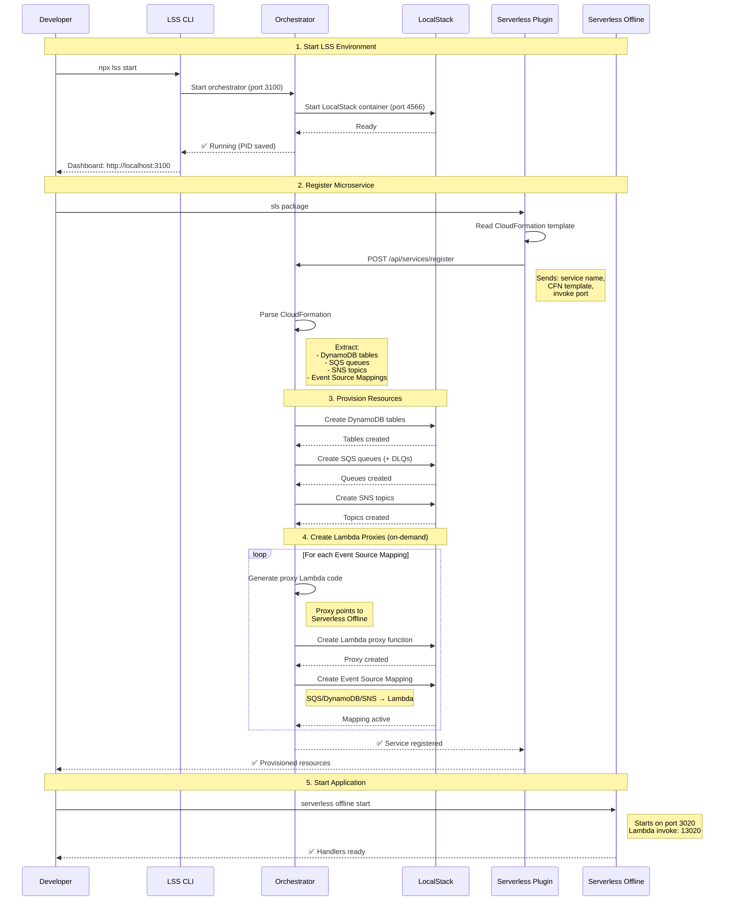
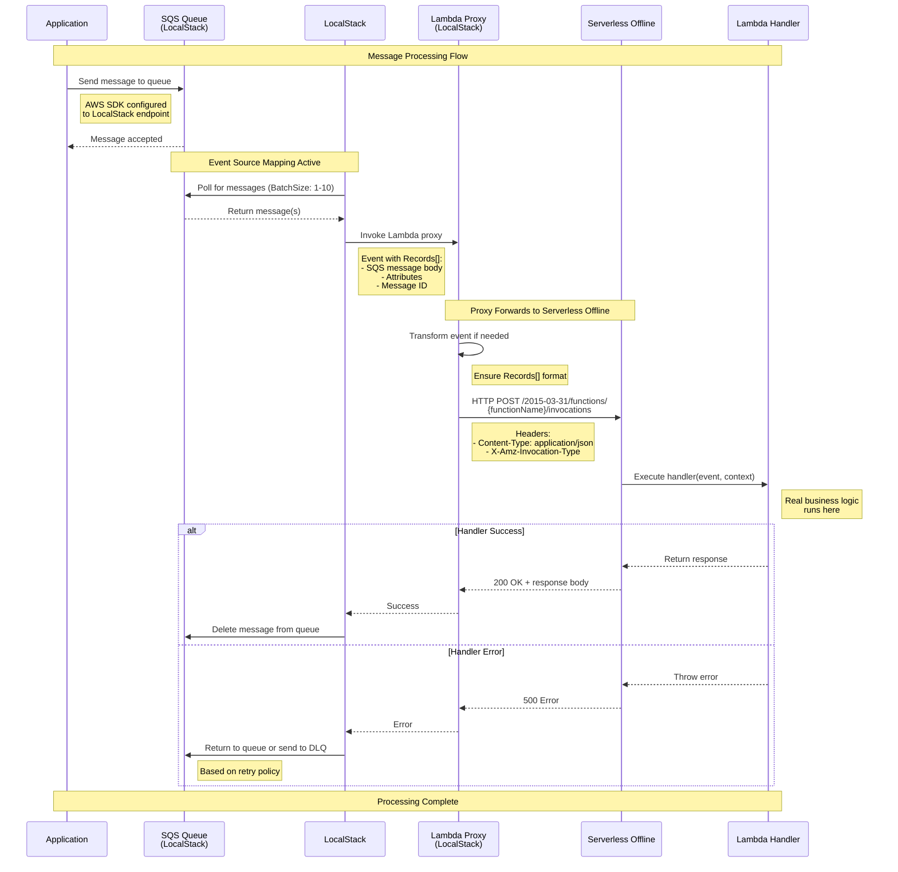

# Local Serverless Stack (LSS)

[](https://www.npmjs.com/package/local-serverless-stack)

**Local control plane for serverless development with LocalStack orchestration**

LSS provides a unified local development environment for serverless microservices, eliminating the need to run separate LocalStack instances for each service.

## Features

- **Centralized LocalStack**: Single LocalStack instance manages DynamoDB, SQS, SNS, S3, and Lambda
- **Auto-provisioning**: Parses CloudFormation templates from `sls package` and provisions resources automatically
- **Event source mappings**: Automatically connects SQS queues to Lambda handlers via LocalStack
- **Lambda proxies**: Generated proxy functions forward events to serverless-offline invoke endpoints
- **Web UI**: Vue 3 dashboard to monitor services, resources, and event mappings
- **Hot reload**: Watch for code changes and auto-rebuild/reprovision
- **Process management**: Start/stop microservices from the orchestrator
- **CLI Tool**: Simple commands to manage the orchestrator (start/stop/status/logs)

See [docs/FEATURES.md](docs/FEATURES.md) for the complete feature inventory and how each capability is tested.

## Architecture

```
local-serverless-stack/
├── bin/                      # CLI executable
│   └── cli.js               # lss command entry point
├── src/                      # Source code
│   ├── server/              # Express API + services
│   │   ├── routes/          # API endpoints
│   │   ├── services/        # Business logic
│   │   └── dev/             # Dev utilities
│   └── ui/                  # Vue 3 dashboard
├── packages/
│   └── serverless-plugin/   # Serverless Framework plugin (published separately)
├── dist/                     # Build output
│   ├── server/              # Compiled Express app
│   └── ui/                  # Built Vue app
└── tests/                    # Integration tests
```

**Components**:
- **CLI** (`bin/cli.js`): Background process management (start/stop/status/logs)
- **Server** (`src/server/`): Express API + LocalStack orchestration
- **UI** (`src/ui/`): Vue 3 dashboard for monitoring
- **Plugin** (`packages/serverless-plugin/`): Auto-registration for Serverless Framework
- **LocalStack**: Docker container (port 4566) with AWS services

## Quick Start

### Prerequisites

- Node.js >= 18
- Docker (for LocalStack)
- Serverless Framework 3.40.0

### Installation

```bash
npm install -g local-serverless-stack
```

Or install locally:

```bash
cd /path/to/local-serverless-stack
npm install
npm run build
npm link
```

The `npm link` command makes the `lss` CLI available globally via `npx`.

### Serverless Framework Plugin

To automatically register your microservices with LSS, install the Serverless plugin:

```bash
npm install --save-dev serverless-lss
```

See the [plugin documentation](packages/serverless-plugin/README.md) for configuration details.

## CLI Commands

LSS provides a simple CLI to manage the orchestrator in background mode:

```bash
# Start the orchestrator in background
npx lss start

# Check if orchestrator is running
npx lss status

# View recent logs
npx lss logs

# Stop the orchestrator
npx lss stop

# Show help
npx lss help
```

### CLI Output

```bash
$ npx lss start
🚀 LSS Orchestrator started (PID: 12345)
📊 Dashboard: http://localhost:3100
🔧 LocalStack: http://localhost:4566
📝 Logs: /tmp/lss-orchestrator.log
✅ Service is running

$ npx lss status
🟢 LSS Orchestrator: RUNNING (PID: 12345)
📊 Dashboard: http://localhost:3100
🔧 LocalStack: http://localhost:4566
📝 Logs: /tmp/lss-orchestrator.log
```

## Development Mode

For active development with hot reload:

```bash
npm run orchestrator:dev
```

This starts:
- Orchestrator API on http://localhost:3100
- LocalStack on http://localhost:4566
- Web UI at http://localhost:3100
- Auto-reload on code changes

## Integration with Projects

### 1. Link LSS to Your Project

In your project root:

```bash
npm link local-serverless-stack
```

### 2. Install Plugin in Microservices

In each microservice directory:

```bash
npm link serverless-lss
```

### 3. Configure serverless.yml

Add the plugin to your `serverless.yml`:

```yaml
plugins:
  - serverless-auto-swagger
  - serverless-esbuild
  - serverless-offline
  - serverless-localstack
  - serverless-lss  # Add this line

custom:
  orchestrator:
    url: http://localhost:3100  # optional, defaults to this
```

### 4. Workflow

```bash
# 1. Start LSS Orchestrator
npx lss start

# 2. Package your microservice (auto-registers with LSS)
cd your-microservice
npx sls package

# 3. Start serverless offline
npx serverless offline start --host 0.0.0.0 --httpPort 3020 --lambdaPort 13020

# 4. Monitor in the dashboard
open http://localhost:3100
```

Now when you send a message to an SQS queue in LocalStack, the orchestrator will:
1. Detect the event via event source mapping
2. Invoke the Lambda proxy in LocalStack
3. Proxy forwards to serverless-offline on the invoke port
4. Your handler executes

## Project Structure

```
local-serverless-stack/
  bin/
    cli.js              # CLI implementation (npx lss)
  package.json          # Workspace root with bin config
  packages/
    orchestrator/       # Main orchestrator (Express + Vue UI)
      server/           # Backend (TypeScript)
      ui/              # Frontend (Vue 3 + Vite)
      dist/            # Compiled output
    serverless-plugin/ # Serverless Framework plugin
      src/index.ts     # Plugin implementation
      dist/            # Compiled plugin
  docs/                # Documentation
```

## Configuration

### Environment Variables

- `PORT`: Orchestrator API port (default: 3100)
- `ENABLE_DYNAMO_PROXY`: Enable DynamoDB proxy on port 8000 (default: false)
- `DYNAMO_PROXY_PORT`: DynamoDB proxy port (default: 8000)

### LocalStack Settings

LocalStack is configured with:
- Services: `dynamodb,sqs,sns,s3,lambda`
- Persistence: Enabled (volume: `lss-localstack-data`)
- Lambda executor: `local` (no Docker-in-Docker required)
- Docker socket: Mounted from host

#### Managed vs external mode

By default LSS spins up its own LocalStack container. To point at an already-running instance (e.g. one you're sharing across projects) set `mode: "external"` in `lss.config.json` or pass `--external`:

```bash
npx lss start --external                 # connect to whatever is on localstackEndpoint
```

#### Edition and auth token

Recent LocalStack images (`>= 2026.5` for community, all `pro` builds) require `LOCALSTACK_AUTH_TOKEN`. Provide it via env var (preferred) or `--localstack-token`:

```bash
export LOCALSTACK_AUTH_TOKEN=ls-xxxxxxxx
npx lss start                            # community image with token
npx lss start --pro                      # pro image (token required)
```

See [docs/CONFIGURATION.md](docs/CONFIGURATION.md) for the full reference (`mode`, `localstackEdition`, `localstackVersion`, `localstackImage`, `localstackAuthToken`).

## Development

### Build All Packages

```bash
npm run build
```

### Build Individual Packages

```bash
# Build orchestrator only
npm run orchestrator:build

# Build plugin only
npm run plugin:build
```

### Watch Mode (Development)

```bash
# Orchestrator with hot reload
npm run orchestrator:dev

# Plugin with watch
cd packages/serverless-plugin
npm run dev
```

## Testing

LSS includes comprehensive integration tests covering CLI, Orchestrator API, and Plugin functionality.

### Quick Start

```bash
# Run all tests
npm test

# Run with coverage
npm run test:coverage

# Run specific test suite
npm run test:cli
npm run test:orchestrator
npm run test:plugin

# Watch mode
npm run test:watch
```

### Using Test Runner Script

```bash
# Run all integration tests
./run-tests.sh

# Run specific suite
./run-tests.sh cli
./run-tests.sh orchestrator
./run-tests.sh plugin

# Run with coverage
./run-tests.sh coverage

# Watch mode
./run-tests.sh watch
```

### Test Coverage

The test suite validates:

✅ **CLI Commands**
- `npx lss start` - Orchestrator startup
- `npx lss stop` - Graceful shutdown
- `npx lss status` - Status reporting
- `npx lss logs` - Log viewing
- `npx lss help` - Help information

✅ **Orchestrator API**
- Service registration
- Resource provisioning (DynamoDB, SQS, SNS)
- Lambda proxy creation
- Event source mappings
- Error handling

✅ **Serverless Plugin**
- CloudFormation parsing
- Resource creation in LocalStack
- Service lifecycle management

See [tests/README.md](tests/README.md) for detailed test documentation.

## How It Works
npm run orchestrator:dev

# Plugin with watch
cd packages/serverless-plugin
npm run dev
```

## How It Works

### Part 1: Initialization & Service Registration



### Part 2: Event Processing Flow



### Detailed Explanation

1. **Service Registration**:
   - Developer runs `sls package` in their microservice
   - Plugin reads `.serverless/cloudformation-template-update-stack.json`
   - Plugin POSTs to orchestrator `/api/services/register` with service metadata

2. **Resource Provisioning**:
   - Orchestrator parses CloudFormation template
   - Extracts DynamoDB tables, SQS queues, SNS topics
   - Creates resources in LocalStack via AWS SDK
   - **Only creates Lambda proxies when Event Source Mappings exist**
   - Generates proxy code that forwards to serverless-offline invoke endpoint
   - Creates event source mappings (SQS/DynamoDB/SNS → Lambda)

3. **Event Flow**:
   - Message arrives in SQS queue
   - LocalStack polls queue via event source mapping
   - Lambda proxy is triggered automatically
   - Proxy transforms event and makes HTTP POST to serverless-offline
   - Real handler executes in serverless-offline process
   - Response returned through proxy chain
   - Message deleted from queue on success, or sent to DLQ on failure

## CLI Implementation Details

The `npx lss` CLI is implemented in `/bin/cli.js` and provides:

- **Background Process Management**: Uses `spawn` with `detached: true` to run orchestrator independently
- **PID File**: Stores process ID in `/tmp/lss-orchestrator-{serverPort}.pid` (or `/tmp/lss-orchestrator.pid` when serverPort is the default 3100). The port-scoped path lets multiple LSS instances coexist — one per project — without trampling each other.
- **Log File**: Redirects stdout/stderr to `/tmp/lss-orchestrator-{serverPort}.log` (or `/tmp/lss-orchestrator.log` for the default port).
- **Process Monitoring**: Checks if process is alive before starting/stopping
- **Clean Shutdown**: Sends SIGTERM for graceful termination

### Files

- **PID File**: `/tmp/lss-orchestrator-{serverPort}.pid`
- **Log File**: `/tmp/lss-orchestrator-{serverPort}.log`

## Troubleshooting

### Check Logs

```bash
npx lss logs

# Or directly
tail -f /tmp/lss-orchestrator.log
```

### Orchestrator Won't Start

```bash
# Check if already running
npx lss status

# Check if build is complete
ls -la /workspaces/local-serverless-stack/dist/server/
ls -la /workspaces/local-serverless-stack/dist/ui/

# Rebuild if needed
npm run build
```

### Port Already in Use

The orchestrator uses port 3100 by default. If this port is in use:

```bash
# Find process using port 3100
lsof -i :3100

# Kill if needed
kill -9 <PID>
```

## Optional Features

### DynamoDB Proxy (Port 8000)

The orchestrator includes an optional reverse proxy on port 8000 that forwards to LocalStack (4566).

Enable with:
```bash
ENABLE_DYNAMO_PROXY=true npm run server:dev
```

Located in: `src/server/dev/dynamo-proxy.ts`

## Project Status

⚠️ **Version 0.1.0 - Internal Development**

This project is currently in active development and is being used internally. It is not yet published to npm.

### Completed Features

- ✅ CLI with start/stop/status/logs commands
- ✅ Background process management
- ✅ Serverless Framework plugin
- ✅ Auto-provisioning of AWS resources
- ✅ Event source mapping (SQS → Lambda)
- ✅ Web dashboard (Vue 3)
- ✅ npm link support for local development

## Use Case Example

LSS can be used in monorepo setups to manage 15+ microservices with a single LocalStack instance. This eliminates the complexity of running multiple LocalStack containers and provides a unified development experience.

Integration approach:
- Place LSS in a dedicated directory (e.g., `/workspaces/local-serverless-stack`)
- Use `npm link` for local development and seamless updates
- Install the plugin in each microservice that needs AWS resource orchestration
- Orchestrator managed via `npx lss start/stop` commands

## Contributing

Contributions welcome! This is an open-source project designed to simplify local serverless development.

## License

MIT

## Publishing to npm

⚠️ **For maintainers only**

### Automatic Publishing (Recommended)

The project uses GitHub Actions for automatic publishing to NPM when you update the version:

**1. Update version in package.json**:
```bash
# For the root package (CLI + orchestrator)
npm version patch  # 0.0.1 -> 0.0.2
npm version minor  # 0.0.1 -> 0.1.0
npm version major  # 0.0.1 -> 1.0.0
```

**2. Push to main branch**:
```bash
git add package.json CHANGELOG.md
git commit -m "chore: bump version to 0.0.2"
git push origin main
```

**3. GitHub Actions will automatically**:
- ✅ Detect version change
- ✅ Run full test suite
- ✅ Build the project
- ✅ Publish to NPM
- ✅ Create a git tag (e.g., `v0.0.2`)

### Plugin Package

To publish the serverless plugin separately:

```bash
cd packages/serverless-plugin
npm version patch
cd ../..
git add packages/serverless-plugin/package.json
git commit -m "chore(plugin): bump version to 0.0.2"
git push origin main
```

### Required Setup (One-time)

Before automatic publishing works:

1. **NPM Access Token**:
   - Go to npmjs.com → Access Tokens → Generate New Token
   - Select "Automation" type
   - Copy the token

2. **GitHub Secret**:
   - Go to your repo → Settings → Secrets and variables → Actions
   - Add new repository secret: `NPM_TOKEN`
   - Paste your NPM token

### Pre-publish Checklist

1. ✅ All tests passing
2. ✅ Build successful (`npm run build`)
3. ✅ Version updated in `package.json`
4. ✅ CHANGELOG.md updated
5. ✅ README.md updated
6. ✅ No breaking changes (or properly documented)

### Manual Publishing (Emergency Only)

If GitHub Actions fails, you can publish manually:

```bash
# 1. Ensure clean working directory
git status

# 2. Build all packages
npm run build

# 3. Test the package contents
npm pack
tar -tzf local-serverless-stack-*.tgz

# 4. Publish to npm (dry-run first)
npm publish --dry-run

# 5. Publish for real
npm publish --access public

# 6. Create git tag
git tag v0.0.1
git push origin v0.0.1
```

### What Gets Published

The `files` field in package.json controls what's published:

- `bin/` - CLI scripts
- `dist/` - Compiled server + UI
- `packages/serverless-plugin/dist/` - Compiled plugin
- `README.md`, `LICENSE`, `CHANGELOG.md`

Source files and development dependencies are **not** included.

### Post-publish

After publishing, users can install with:

```bash
npm install local-serverless-stack
npx lss start
```

No build step required for end users!
