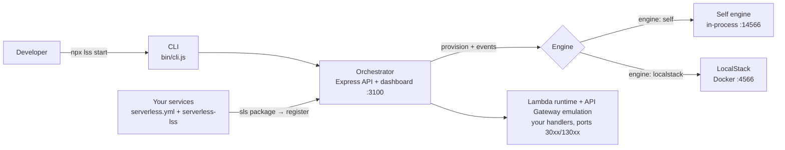
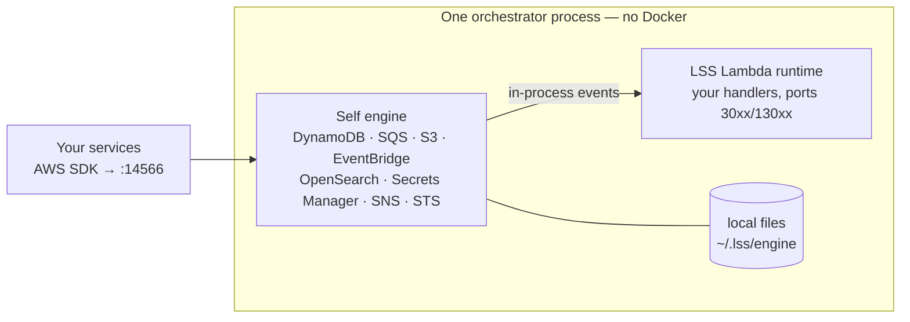
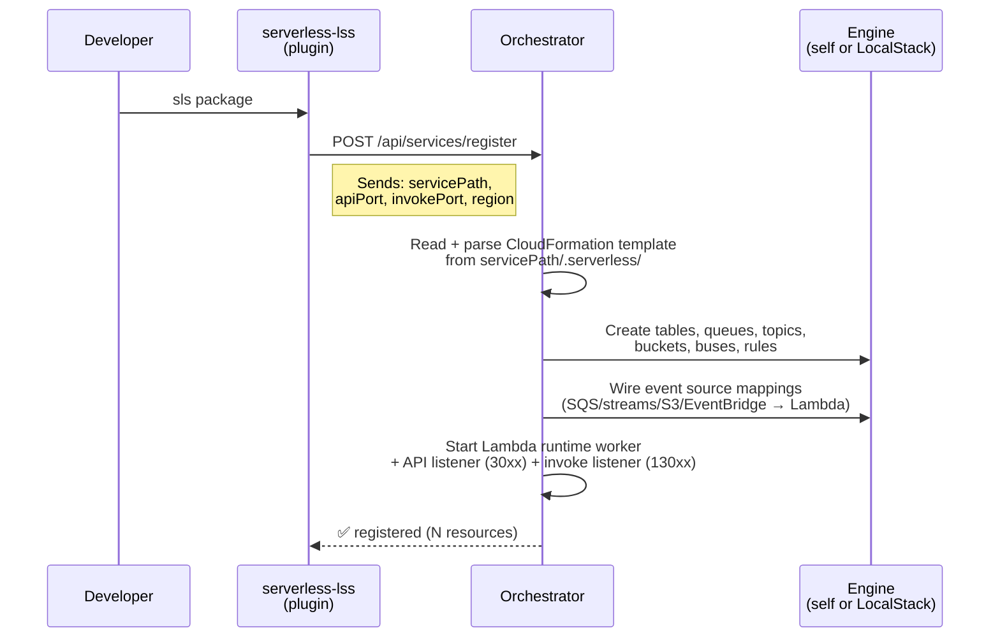
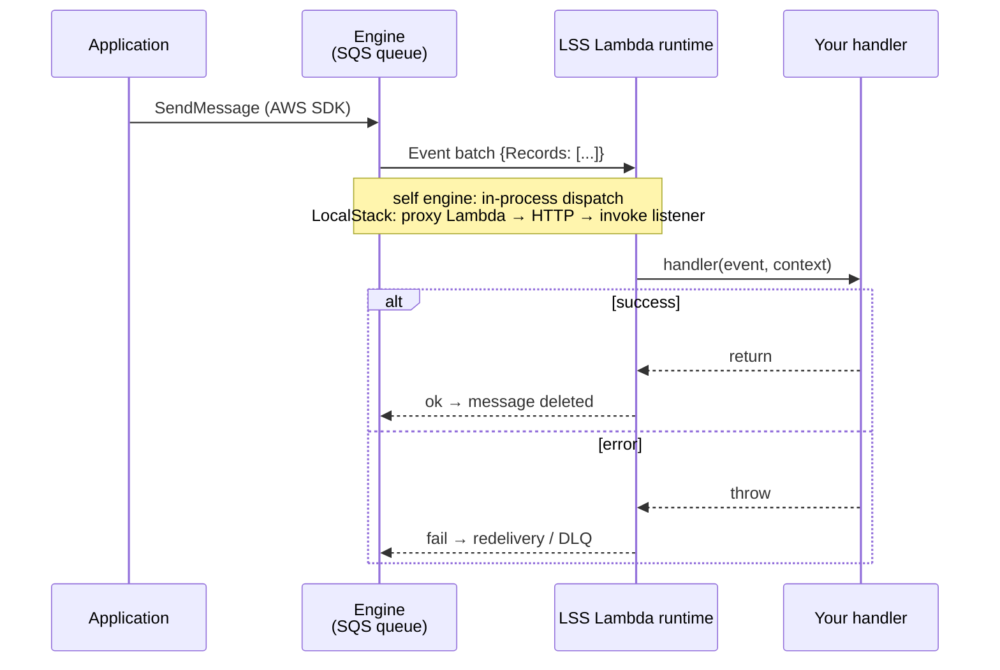

# Local Serverless Stack (LSS)

[](https://www.npmjs.com/package/local-serverless-stack)

**Local control plane for serverless development — with its own in-process AWS engine (no Docker) or LocalStack orchestration**

LSS provides a unified local development environment for serverless microservices: one orchestrator provisions and serves every AWS resource your services declare, eliminating the need to run separate LocalStack instances (or, with the **self engine**, any LocalStack at all). It scales to monorepos with 15+ microservices sharing one stack.



## Features

> **⚠️ Keep this inventory alive.** Every new capability MUST be added here **and** to the
> canonical inventory in [docs/FEATURES.md](docs/FEATURES.md) — plus
> [docs/SELF_ENGINE.md](docs/SELF_ENGINE.md) when it touches the self engine. Treat a feature that
> isn't listed as a feature that doesn't exist: keeping these three documents in sync is part of
> shipping the change, not an afterthought.

LSS features come in two layers:

- **Platform** — the orchestrator, CLI, dashboard, plugin, programmatic client, Lambda/API runtime
  and seeds. **Engine-agnostic:** they behave the same whichever backend you choose.
- **AWS engine** — the backend that actually serves the AWS wire protocols. You pick **one per
  instance**: LocalStack Free, LocalStack Ultimate (Pro), or the in-process self engine.

### 🧩 Platform (engine-agnostic)

- **CLI (`npx lss …`)**
  - `start` — runs the orchestrator detached (PID + log files), flags `--self-engine`, `--external`, `--pro`, `--localstack-token`, `--enable-dynamo-proxy`, `--config`
  - `status` · `logs` · `stop` (also tears down the managed LocalStack)
  - `seed [table]` / `seed:clear [table] -y` — apply / wipe DynamoDB fixtures (hard local-endpoint guard on clear)
  - `help` — every command, flag and a config template
- **Orchestration & provisioning**
  - Service registration API (`POST /api/services/register`) — the plugin reports only *where* the service lives
  - CloudFormation parsing from `sls package` → auto-provisions tables, queues (incl. `RedrivePolicy`), topics, buckets (incl. `CorsConfiguration`), secrets, EventBridge buses/rules, raw ApiGatewayV2 routes and OpenSearch collections
  - `autoPackage` — runs `sls package` on demand when the template is missing
  - Automatic event source mappings: SQS / DynamoDB streams / S3 notifications / EventBridge rules → Lambda — with AWS-faithful failure semantics (`FilterCriteria` enforced, `ReportBatchItemFailures` partial batches, `maximumRetryAttempts` incl. the `-1` "until the record ages out" default)
  - Per-instance isolation — `stateDir` + port-scoped PID/log paths let many LSS instances coexist (one per project); with no `stateDir` the engine/aoss/artifact directories fall back to a **per-project** path under `~/.lss/projects/`, so two checkouts never share state
  - Explorers honour the configured `region` when a caller omits `?region=`, and page through `ListTables`/`ListQueues` (400 tables list as 400, not the first 100)
  - Config: `lss.config.json` / `.lssrc` + env overrides (`LSS_*`); public-safe `GET /api/config` snapshot (never leaks the auth token); editable from the dashboard via `PUT /api/config` (writes the file for you to commit) + `POST /api/config/reload`; `GET /api/config/ports` lists every exposed port
- **Lambda runtime & API Gateway emulation** (serverless-offline replacement — same `30xx`/`130xx` ports)
  - Function + route registry: REST (`http`, payload v1), HTTP API (`httpApi`, payload v2) and authorizers — persisted and rehydrated on restart
  - Per-service worker processes: lazy/warm handler loading, function env/timeout/context, per-invocation log capture, crash restart
  - **Bounded memory by default**: `lambdaRuntime.lazy` forks a worker on the first invocation instead of at registration, `idleTimeoutMs` (60 s) unloads it once it goes quiet, and `maxWarmWorkers` (one per GB of RAM) caps how many may be resident at once — so host memory tracks the services *in flight*, not the services *registered*. Measured on 40 services / 400 lambdas / 400 tables: **2.0 GB → 128 MB** at rest, ~20 ms cold start per service used
  - Execution modes: `artifact` (extracted zip) · `source` (direct require/import; TS via native type-stripping → esbuild/tsx/ts-node) · `auto`
  - Lambda Invoke API on `130xx` (`X-Amz-Invocation-Type` RequestResponse/Event/DryRun, `X-Amz-Function-Error`)
  - API Gateway proxy on `30xx`: route precedence (literal > `{param}` > `{proxy+}` > `$default`, method > ANY), payload v1/v2, CORS preflight, `port-conflict` status
  - Lambda authorizers: REST `token`/`request`, HTTP API `request` (simple responses), identity-source extraction, TTL cache + cache-clear, cross-service resolution by ARN
  - Raw `AWS::ApiGatewayV2::*` routes from CFN `resources:` — on their own `::Api` or the framework's `HttpApi`; `Target`/`IntegrationUri`/`AuthorizerUri`/`SourceArn` reduced through `Fn::Sub` (incl. `${Id.Arn}`), `Fn::Join`, `Fn::GetAtt`, `Fn::ImportValue` and the apigateway invocation-URI wrapper; de-duplicated against `httpApi:` events
  - Hot reload: source changes restart the worker; `serverless.yml` changes re-package + re-register
- **Explorers & testing primitives** (HTTP API + dashboard)
  - **Queues** (`/api/queues`): list + metrics (available/inFlight/processed/delayed), send/receive/delete/purge (FIFO group/dedup), `reset-processed`, `await-idle` (block until drained), `hold`/`captured`/`release` (capture-and-replay)
  - **DynamoDB** (`/api/dynamo`): list/describe (keys, GSI/LSI, stream, TTL), scan/query with filters, item CRUD, get/set TTL
  - **S3** (`/api/buckets`): list buckets (size/versioning/notifications), list/stream/upload (base64 or utf8)/delete objects
  - **OpenSearch** (`/api/opensearch`): list collections, per-collection indices, run search queries
  - **Secrets** (`/api/secrets`): list/describe secrets, reveal current value (separate endpoint so lists never carry secret material)
  - **Seeds** (`/api/seeds`): auto-seed on table creation + on-demand run/clear, seed-file ↔ live-table mismatch diagnostic
  - **Resources** (`/api/resources`, `…/owners`): provisioned resources mapped to owning services
  - **Health** (`/api/health`): orchestrator + active engine + dynamo-proxy status
- **Dashboard (Vue 3 SPA)** — ten tabs: **Overview** (health, config, exposed-ports map), **Services** (status/start/stop/logs + per-service resource breakdown incl. EventBridge buses & rules and OpenSearch collections), **Lambdas** (registry + invoke + logs), **APIs**, **Queues**, **S3**, **DynamoDB**, **OpenSearch**, **Secrets**, **Settings** — plus a region selector and theme toggle
  - **Settings**: edit `lss.config.json` from the dashboard — only changed fields are written (you review and commit the diff), hot-reload for lazy keys, explicit restart-required and env-var-masked flags, plus a reload-from-disk button
  - **Branding**: navbar title/subtitle, logo, favicon, default theme and any TreeUI color token per theme, via the `branding` config key
- **serverless-lss plugin** — auto-registers each service on `sls package`/`offline`; orchestrator URL precedence (`ORCHESTRATOR_URL` > `LSS_DASHBOARD_PORT` > `custom.orchestrator` > 3100)
- **Programmatic client (`LssClient`)** — the CLI/dashboard surface from code: HTTP namespaces `seeds`, `queues`, `dynamo`, `buckets`, `resources`, `services`, `lambdas`, `apis`, `config`, `health` + `lifecycle` (`start`/`stop`/`status`/`logs`/`waitUntilReady`, shells out to the CLI)
- **DynamoDB dev proxy** — optional reverse proxy on `:8000` (`enableDynamoProxy`) forwarding to the active engine, for tooling that expects DynamoDB on the standard port
- **DynamoDB seeds** — `seeds/{tableName}.json` fixtures auto-applied on table creation, re-applied via `lss seed` or the dashboard
- **Secret seeds** — `seeds/secrets/{name}.json` fixtures (plus an optional `secrets:` config map) created on boot *before* services are reactivated, so a handler's first `GetSecretValue` finds an `AWSCURRENT` version with no bootstrap step; idempotent (an existing secret is never clobbered) and non-fatal

### 🆓 Engine: LocalStack Free (community image, Docker)

LSS spins up and manages its own community LocalStack container (`lss-localstack-<port>`) with
`dynamodb, sqs, sns, s3, lambda, events`, a persistence volume and the local Lambda executor. Events
reach your handlers through a generated proxy Lambda inside the container that calls the LSS invoke
listener. This is the default engine; the [localstack-free example](examples/localstack-free/) runs
community 4.0 with no token.

- **Provisioned & wired**: DynamoDB tables (keys, GSI/LSI, streams, TTL), SQS queues (incl. FIFO), SNS topics, S3 buckets (versioning + `s3:ObjectCreated:*` notifications), EventBridge buses & rules (pattern or `rate()`/cron schedules), Lambda event source mappings
- **Not available on community**: OpenSearch Serverless (`aoss`) — provisioning fails with an explicit error pointing you at Pro or the self engine
- Community images `>= 2026.5` require `LOCALSTACK_AUTH_TOKEN`; `mode: external` / `--external` points at a LocalStack you already run

### 💎 Engine: LocalStack Ultimate (Pro image, auth token)

`npx lss start --pro` (optionally `--localstack-token ls-xxx`) runs the LocalStack **Pro** image — same
provisioning and wiring as Free, plus the Pro-only services (OpenSearch Serverless and more). The
[localstack-ultimate example](examples/localstack-ultimate/) keeps the serverless-offline path in
charge of the ports and exercises the full resource menu (custom bus + pattern rule with an audit
trail, `rate()` schedule, SQS DLQ redrive with `ReportBatchItemFailures`, DynamoDB GSI + streams →
SNS, S3 notifications, TTL from the UI).

- Requires `LOCALSTACK_AUTH_TOKEN` (Ultimate plan)
- `localstackEdition` / `localstackVersion` / `localstackImage` select the exact image

### ⚡ Engine: Self (in-process AWS emulator — no Docker, no token) — *the LSS differentiator*

The orchestrator serves the AWS wire protocols itself on one port (default `14566`); events are
delivered **in-process** straight to the LSS Lambda runtime — no container, no proxy Lambdas, no
polling. Data persists as JSONL snapshot + WAL / content-addressed blobs under `~/.lss/engine`,
hydrated on first touch and dehydrated when idle. Anything unimplemented answers with an explicit
AWS-shaped error or is forwarded to `selfEngine.fallbackEndpoint`. See the [Self engine
section](#self-engine--no-docker-no-localstack-no-auth-token) below for boot-time numbers and the
migration story, and [docs/SELF_ENGINE.md](docs/SELF_ENGINE.md) for the full coverage matrix.

- **DynamoDB**
  - Full expression language: KeyCondition, Condition, Filter, Update, Projection — decimal-exact `N` arithmetic
  - GSI/LSI with projection + sparse semantics; Limit-before-filter parity; LEK paging
  - Item ops: Put/Get/Delete/UpdateItem, Query, Scan, BatchGet/BatchWrite, TransactWrite/TransactGet (all-or-nothing, `CancellationReasons`, `ClientRequestToken` idempotency)
  - **Streams** delivered in-process (TRIM_HORIZON/LATEST, retry-then-advance, OnFailure SQS destination)
  - Lazy **TTL** expiry; AWS error names the provisioner relies on
  - Works unchanged with platform **seeds**, the DynamoDB explorer and the dev proxy
- **SQS** — CreateQueue (idempotent), send/receive(+batch)/delete/purge, ChangeMessageVisibility; FIFO groups/dedup, event-driven long poll, visibility redelivery, **queue-level redrive** (`RedrivePolicy` → DLQ when `ApproximateReceiveCount` exceeds `maxReceiveCount`, keeping the `MessageId`/body/MD5s and unblocking the FIFO `MessageGroupId`), live counters, MD5 digests, `x-amzn-query-error` compat header
- **S3** — buckets (create/head/delete/list, location, versioning flag), ListObjectsV2 (prefix/delimiter/pagination/encoding), PutObject (aws-chunked), **presigned POST browser uploads** (`multipart/form-data`, `${filename}`, `success_action_status`/`redirect`, `x-amz-meta-*`), **presigned GET/HEAD `response-*` header overrides** (content-disposition/type/…), **CORS** (`Put`/`Get`/`DeleteBucketCors`, preflight `OPTIONS`, `Access-Control-Allow-Origin` on responses — matching rule or dev-permissive default), GetObject (Range), HeadObject, DeleteObject(s), CopyObject, notification config — bodies streamed to disk, never held in heap
- **EventBridge** — buses/rules/targets, PutEvents per-entry results, pattern matcher (exact, array-OR, `prefix`, `exists`, nested), rule/schedule targets to **Lambda or SQS** (FIFO `MessageGroupId`), schedules (`rate()` + 6-field cron) from one timer wheel
- **OpenSearch Serverless** — `aoss` control plane (Create/BatchGet/List/DeleteCollection, deterministic ids, `collectionEndpoint`) + REST data plane under `/_aoss/<collection>`: index & document CRUD with versioning, `_bulk` NDJSON, `_search`/`_count` (match/term/terms/range/prefix/wildcard/exists/ids/bool + sort, `_source` filtering, `?q=`), `terms`+metric aggregations, `_mapping`, `_refresh`, `_cat/indices`
- **Secrets Manager** — Create/Get/Put/Update/Describe/Delete/Restore/ListSecrets, Tag/Untag, GetRandomPassword; real `AWSCURRENT`/`AWSPREVIOUS` staging, `SecretString`/`SecretBinary`, `ClientRequestToken` idempotency, per-region scoping (values persisted, not encrypted); secrets are staged before the first read from CFN `AWS::SecretsManager::Secret` (with `GenerateSecretString` expansion) and from boot seeds — `seeds/secrets/<name>.json` plus the `secrets:` config map
- **SNS** (minimal) — CreateTopic, ListTopics, DeleteTopic, GetTopicAttributes, Publish (logged + counted, no fan-out)
- **STS** — GetCallerIdentity
- **Lambda control plane** — proxy absorption as metadata (`INVOKE_URL` kept as HTTP fallback), event source mapping lifecycle (`Enabled` toggle = QueueInspector hold/release), Invoke passthrough
- **In-process event delivery** — SQS→Lambda (batch size/window, visibility semantics), DynamoDB streams, S3 notifications (globs + prefix/suffix), EventBridge rule/schedule targets to Lambda (invoke) or SQS (enqueue; FIFO `MessageGroupId`) with `Input`/`InputPath`, schedules — no proxies, no polling
- **Wire front door & storage** — single-port routing (SigV4-scope / X-Amz-Target / path), per-protocol error shapes, `/_localstack/health` alias, `fallbackEndpoint` reverse proxy; JSONL snapshot + WAL (torn-tail-safe, compaction), atomic JSON catalogs, content-addressed S3 blobs, hydrate-on-touch + idle dehydrate + `memoryBudgetMb` LRU

For how each capability is tested (unit vs integration) see [docs/FEATURES.md](docs/FEATURES.md); the
self-engine coverage matrix and known divergences from AWS live in
[docs/SELF_ENGINE.md](docs/SELF_ENGINE.md).

## Self engine — no Docker, no LocalStack, no auth token

LocalStack got heavy (a container eating 1 GB+ of RAM) and stopped being free by default
(community images `>= 2026.5` require an auth token). The **self engine** replaces it for
the typical serverless dev loop: the orchestrator itself serves the real AWS wire
protocols on one port, so your application code, the AWS SDK, the dashboard and `lss seed`
all work unchanged — there is simply no container underneath.

```bash
npx lss start --self-engine        # or "engine": "self" in lss.config.json
```

```
AWS_ENDPOINT=http://localhost:14566   # point your services here, done
```

What you get:

- **DynamoDB** with the full expression language (KeyCondition/Filter/Update/Projection,
  exact decimal arithmetic), GSIs/LSIs, TTL and streams — items persisted in local
  JSONL files under `~/.lss/engine/`, hydrated lazily and unloaded when idle.
- **SQS** with FIFO, visibility redelivery and live counters; **S3** with byte-exact
  object round trips and notifications; **EventBridge** with buses, pattern-filtered
  rules and `rate()`/cron schedules; minimal **SNS** and **STS**.
- **OpenSearch Serverless**: collections declared as
  `AWS::OpenSearchServerless::Collection` are provisioned via the real `aoss`
  control plane and served through the OpenSearch REST API — document CRUD,
  `_bulk`, `_search` with the everyday query DSL (match/term/range/bool…),
  sorting and `terms`/metric aggregations — at
  `http://localhost:14566/_aoss/<collection>`.
- **Events delivered in-process**: SQS batches, DynamoDB streams, S3 notifications and
  EventBridge targets go straight from the engine to the LSS Lambda runtime — no proxy
  Lambdas, no polling containers.



Measured on [examples/self-hosted](examples/self-hosted/) (orders → billing →
notifications pipeline; the example also carries an OpenSearch catalog service):
engine boot **~10 ms**; a full pipeline crossing DynamoDB + SQS + S3 + EventBridge
across the three pipeline services completes in **~170 ms** — with the whole stack
being the orchestrator process plus one small worker per service.

Migration is gradual: LocalStack mode remains the default and fully supported; a running
instance picks one engine. Anything the self engine doesn't implement yet answers with an
explicit error naming the operation — or is forwarded verbatim to a LocalStack via
`selfEngine.fallbackEndpoint`. Coverage matrix and storage model:
[docs/SELF_ENGINE.md](docs/SELF_ENGINE.md) · design/PRD:
[docs/PRD_SELF_ENGINE.md](docs/PRD_SELF_ENGINE.md) · runnable demo:
[examples/self-hosted](examples/self-hosted/).

## Quick Start

Prerequisites: Node.js >= 20 · [osls](https://github.com/oss-serverless/serverless) 4.x (open-source Serverless Framework fork; provides the `serverless`/`sls` CLI) · Docker (**only** for the LocalStack engine)

```bash
# 1. Install
npm install -g local-serverless-stack

# 2. Start the orchestrator (self engine: no Docker needed)
npx lss start --self-engine        # or plain `npx lss start` for LocalStack

# 3. In each microservice: install the plugin and add it to serverless.yml
npm install --save-dev serverless-lss
```

```yaml
# serverless.yml
plugins:
  - serverless-lss

custom:
  orchestrator:
    enabled: true
    orchestratorUrl: http://localhost:3100   # must match serverPort
  lss:
    apiPort: 3000        # HTTP API (API Gateway emulation)
    invokePort: 3001     # direct Lambda invocations
```

```bash
# 4. Package the service — the plugin auto-registers it with LSS
#    (registration also fires on `sls offline` startup)
npx sls package

# 5. Watch everything in the dashboard
open http://localhost:3100
```

A minimal template lives at [docs/serverless.yml.example](docs/serverless.yml.example);
complete runnable projects live in [examples/](examples/) — one per engine flavor:

| Example | Shows |
| --- | --- |
| [localstack-free](examples/localstack-free/) | LocalStack community 4.0 (Docker, no token): 3 services + a shared EventBridge bus — authorizers, SQS, schedules, DynamoDB stream → SNS, S3 notifications, seeds |
| [localstack-ultimate](examples/localstack-ultimate/) | LocalStack Pro image (Ultimate plan, auth token) with the serverless-offline path preserved |
| [self-hosted](examples/self-hosted/) | The no-Docker self engine end to end: orders → billing → notifications pipeline + an OpenSearch Serverless catalog |

Each example ships an `index.html` validation console and its own dashboard
branding — see [examples/README.md](examples/README.md) for the full port map and
shared conventions.

## CLI

```bash
npx lss start                  # start the orchestrator in background (managed LocalStack)
npx lss start --self-engine    #   …with the in-process self engine (no Docker)
npx lss start --external       #   …connecting to a LocalStack you already run
npx lss start --pro            #   …with the LocalStack Pro image (needs auth token)
npx lss start --pro --localstack-token ls-xxx  #   …passing the auth token inline
npx lss start --enable-dynamo-proxy            #   …with the DynamoDB proxy on :8000
npx lss start --config ./e2e/lss.config.json   # explicit config file (any command)
npx lss status                 # is it running? which ports?
npx lss logs                   # tail the orchestrator log
npx lss seed [table]           # apply DynamoDB seed files (all tables or one)
npx lss seed:clear [table] -y  # empty seeded tables (prompts unless --yes)
npx lss stop                   # stop the orchestrator (and managed LocalStack)
npx lss help                   # all commands, flags and a config template
```

```bash
$ npx lss start --self-engine
🚀 LSS Orchestrator started (PID: 12345)
📊 Server: http://localhost:3100
🔧 Self Engine: http://localhost:14566 (no Docker)
✅ Service is running
```

The CLI runs the orchestrator detached, storing the PID in
`$TMPDIR/lss-orchestrator-{serverPort}.pid` and logs in
`$TMPDIR/lss-orchestrator-{serverPort}.log` (no suffix for the default port 3100;
under `stateDir` both move into that directory). The port-scoped paths let multiple
LSS instances coexist — one per project — without trampling each other.

## Configuration

Create an `lss.config.json` in the directory where you run `lss start` (all keys
optional — [full reference](docs/CONFIGURATION.md)):

```jsonc
{
  "serverPort": 3100,                // dashboard + API
  "engine": "localstack",            // "localstack" (default) | "self" (no Docker)
  "selfEngine": { "port": 14566 },   // engine "self" settings — docs/SELF_ENGINE.md
  "localstackPort": 4566,
  "services": ["dynamodb", "sqs", "sns", "s3", "lambda", "events"],
  "seedsDir": "./seeds",             // DynamoDB fixtures ({tableName}.json)
  "autoPackage": false,              // run `sls package` on register when template is missing
  "lambdaRuntime": { "enabled": true, "execution": "auto" },
  "branding": {                      // dashboard look & feel (optional)
    "title": "Acme Cloud",
    "logo": "./assets/acme.svg",
    "colors": { "brand-primary": "#e63946" }
  }
}
```

The most common environment overrides (env always wins over the file):
`LSS_DASHBOARD_PORT`, `LSS_ENGINE` (`localstack`/`self`), `LOCALSTACK_AUTH_TOKEN`,
`LSS_ENABLE_DYNAMO_PROXY`. Complete list: [docs/CONFIGURATION.md](docs/CONFIGURATION.md#environment-variables).

The self engine's default port sits **outside 4566–4599** on purpose: a real LocalStack
install intercepts that whole range on some hosts (Docker Desktop/WSL2). `--self-engine`
cannot be combined with the LocalStack-only flags (`--external`, `--pro`,
`--localstack-token`).

### LocalStack: managed, external, Pro

By default LSS spins up its own container (`lss-localstack-<port>`, services
`dynamodb,sqs,sns,s3,lambda,events`, persistence volume, local Lambda executor). To point
at an already-running instance set `mode: "external"` or pass `--external`. Recent
LocalStack images (`>= 2026.5` community, all `pro`) require an auth token:

```bash
export LOCALSTACK_AUTH_TOKEN=ls-xxxxxxxx
npx lss start            # community image with token
npx lss start --pro      # pro image (token required)
```

Details (`mode`, `localstackEdition`, `localstackVersion`, `localstackImage`):
[docs/CONFIGURATION.md](docs/CONFIGURATION.md).

## Dashboard

The Vue 3 dashboard at `http://localhost:3100` has ten tabs — **Overview** (health,
config snapshot, exposed-ports map), **Services** (status, start/stop, live logs,
per-service resource breakdown incl. EventBridge buses & rules), **Lambdas** (registry +
invoke), **APIs** (emulated HTTP routes), **Queues** (send/receive/purge, consumers),
**S3** (objects, upload/download), **DynamoDB** (items explorer, editor, TTL, seeds),
**OpenSearch**, **Secrets**, and **Settings** — which edits `lss.config.json` in place
(only changed fields are written, so you review and commit the diff), hot-reloads what it
can, and flags the keys that need `lss stop && lss start` or are masked by env vars.
A region selector lets you inspect resources in any region.

It can carry your team's identity via the `branding` config key: navbar title/subtitle,
logo and favicon (URL or a file next to `lss.config.json`), default theme, and any
[TreeUI](https://www.npmjs.com/package/@treeui/vue) color token per theme:

```jsonc
"branding": {
  "title": "Acme Cloud",
  "subtitle": "Sandbox local",
  "logo": "./assets/acme.svg",
  "defaultTheme": "light",
  "colors": { "brand-primary": "#e63946", "brand-hover": "#c1121f" },
  "themeColors": { "dark": { "bg-primary": "#0d1b2a" } }
}
```

## How It Works

### Registration & provisioning



The plugin itself only reports *where* the service lives — the orchestrator reads
`.serverless/cloudformation-template-update-stack.json` from that path (running
`sls package` generates it; `autoPackage: true` lets the orchestrator regenerate it
on demand).

### Event flow



The same flow applies to DynamoDB streams, S3 notifications and EventBridge targets.
In LocalStack mode the hop goes through a generated proxy Lambda inside the container;
in self-engine mode the dispatcher calls the runtime directly — no proxy, no polling.

If you still want serverless-offline to own the ports for a service, disable the
LSS runtime globally or per service with `lambdaRuntime.enabled`/`serviceRuntime`.

## Architecture

```
local-serverless-stack/
├── bin/cli.js                # CLI entry point (npx lss)
├── src/
│   ├── server/               # Express API + orchestration
│   │   ├── routes/           # HTTP endpoints (/api/services, /api/queues, …)
│   │   ├── services/         # provisioner, registrar, packager, seeds, …
│   │   ├── engine/           # self engine (in-process AWS emulation)
│   │   ├── runtime/          # Lambda runtime + API Gateway emulation
│   │   └── dev/              # dev utilities (DynamoDB proxy)
│   ├── client/               # programmatic client (LssClient) — package entry point
│   └── ui/                   # Vue 3 dashboard (npm workspace, @treeui/vue)
├── packages/serverless-plugin/  # serverless-lss (published separately)
├── docs/                     # reference docs
├── examples/                 # runnable sample projects
└── tests/                    # unit + integration suites
```

- **CLI** (`bin/cli.js`): background process management (start/stop/status/logs/seed)
- **Server** (`src/server/`): Express API + engine orchestration; serves the built UI
- **Engine** (`src/server/engine/`): the AWS provider behind everything — in-process **self engine** (:14566, no Docker) or managed/external **LocalStack** (:4566)
- **Client** (`src/client/`): `LssClient` — the same API surface as the dashboard, from code
- **Plugin** (`packages/serverless-plugin/`): auto-registration on `sls package`

## Development

```bash
git clone https://github.com/viserion77/local-serverless-stack.git
cd local-serverless-stack
npm run setup          # install root + UI workspace deps
npm run dev            # server (tsx watch) + UI (vite) concurrently
npm run build          # ui + server + client + plugin
```

Granular builds: `server:build`, `ui:build`, `client:build`, `plugin:build`.

### Testing

```bash
npm test                    # unit suite (jest)
npm run test:coverage       # with coverage (CI gate)
npm run test:watch          # watch mode
npm run test:integration    # boots a real orchestrator (Docker/LocalStack required)
npm run lint                # eslint
npx jest tests/unit/services/config-manager.test.ts   # a single suite
```

## Troubleshooting

```bash
npx lss status          # running? which ports?
npx lss logs            # orchestrator log (also: $TMPDIR/lss-orchestrator*.log)
ls dist/server dist/ui  # built? if not: npm run build
lsof -i :3100           # who owns the port?
```

- **Plugin registers nothing** → is `orchestratorUrl` pointing at the right `serverPort`? Try `ORCHESTRATOR_URL=http://localhost:3100 npx sls package`.
- **Ports 4566–4599 behave strangely** → a real LocalStack install may intercept the whole range; the self engine defaults to 14566 for this reason.
- **DynamoDB on port 8000 expected by your tooling** → enable the proxy: `lss start --enable-dynamo-proxy` (or `enableDynamoProxy: true`); it forwards to the active engine.

## Contributing & Releasing

Contributions welcome — see [CONTRIBUTING.md](CONTRIBUTING.md). Release process
(automated npm publish on version bump): [docs/RELEASE.md](docs/RELEASE.md).
Changelog: [CHANGELOG.md](CHANGELOG.md).

## License

MIT
