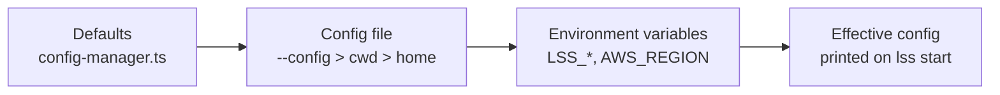

# Configuration Guide for LSS

LSS (Local Serverless Stack) supports configuration files to customize the behavior of the orchestrator: ports, the in-process AWS engine, the Lambda runtime, seeds, packaging, the DynamoDB proxy and dashboard branding.

## Configuration Files

LSS looks for configuration files in the following order:

1. A file passed explicitly: `lss <cmd> --config <path>` (the CLI exports it as `LSS_CONFIG_PATH` so the server reads the same file) — always wins
2. `lss.config.json` in the current working directory
3. `.lssrc` in the current working directory
4. `lss.config.json` in the home directory (`~`)
5. `.lssrc` in the home directory

The first file found will be used. Environment variables are always read afterwards and **override** values from the file (see [Priority Order](#priority-order)).



## Configuration Options

### lss.config.json or .lssrc

Both files should contain valid JSON with the following optional properties:

```json
{
  "serverPort": 14566,
  "enableDynamoProxy": false,
  "dynamoProxyPort": 8000,
  "region": "us-east-1",
  "persistence": true,
  "debug": false,
  "autoPackage": false,
  "packageCommand": "npx serverless package",
  "packageTimeoutMs": 300000,
  "lambdaRuntime": {
    "enabled": true,
    "execution": "auto",
    "invokePortOffset": 10000,
    "lazy": true,
    "idleTimeoutMs": 60000
  }
}
```

### Configuration Properties

- **serverPort** (number, default: 14566)
  - The one port the whole stack answers on: dashboard, REST API **and** the AWS
    wire. The Serverless Plugin registers here; your handlers point `AWS_ENDPOINT`
    here; you open the dashboard here.
  - It shares a listener with the engine because the two traffic shapes are
    distinguishable: a request carrying SigV4, `X-Amz-Target` or any `x-amz-*`
    header goes to the engine, everything else to the API/SPA. A bucket named
    `api` is therefore not a conflict — the SDK signs, the browser does not.
  - **Two listeners instead of one**: give `selfEngine.port` a different value.
    The orchestrator then binds `serverPort` and the engine binds its own, exactly
    as before.
  - Example: `14566`

- **selfEngine** (object, optional)
  - `port` (default 14566, env `LSS_ENGINE_PORT`) — **equal to `serverPort` by
    default, which is what puts everything on one listener**; set it to a
    different value to split them, `dataDir` (default
    `~/.lss/projects/<project-slug>-<hash>/engine`, or `<stateDir>/engine` when
    `stateDir` is set — the home fallback is scoped per project so two checkouts
    never share one set of tables), `account`,
    `idleUnloadMs`, `memoryBudgetMb`, `fsync`, `fallbackEndpoint` (reverse-proxy
    AWS operations the engine does not implement to any AWS-compatible endpoint).
  - Full reference: [SELF_ENGINE.md](SELF_ENGINE.md).

- **enableDynamoProxy** (boolean, default: false)
  - Enable a proxy for DynamoDB on a separate port
  - Useful for tools that expect DynamoDB on port 8000
  - Example: `true`

- **dynamoProxyPort** (number, default: 8000)
  - Port where the DynamoDB proxy will run (only if enableDynamoProxy is true)
  - Example: `8000`

- **region** (string, default: "us-east-1")
  - Default AWS region for the engine and provisioning
  - The dashboard's region selector and every explorer endpoint / `LssClient`
    data method also accept an explicit region (`?region=` query param /
    trailing `region` argument) to inspect resources provisioned elsewhere
  - Example: `"us-east-1"`

- **persistence** (boolean, default: true)
  - Whether engine data survives a restart.
  - `false` swaps the file-backed store for an **in-memory** one — no
    `dataDir` is created, no catalog, WAL or blob is written, and every boot starts
    from an empty engine. That is the mode to use for an automated test run that
    needs a guaranteed clean slate and no leftover files. (The residency knobs —
    `selfEngine.idleUnloadMs` / `memoryBudgetMb` — are inert there: with no
    snapshot on disk, evicting a table would be data loss rather than eviction.)
  - Example: `true`

- **debug** (boolean, default: false)
  - Verbose orchestrator logging.
  - Example: `false`

- **seedsDir** (string, default: `"./seeds"`)
  - Directory containing DynamoDB seed files (`{tableName}.json`). Relative paths
    resolve from the working directory. Env: `LSS_SEEDS_DIR`.
  - Each `{tableName}.json` must contain a **JSON array of plain objects** (native
    JSON types, not DynamoDB-typed AttributeValues) — LSS marshalls them
    automatically. Example: `[{"userId": "u-1", "active": true}]`. See
    [examples/self-hosted/seeds/](../examples/self-hosted/seeds/).
  - Seeds are auto-applied when a table is created, and on demand via
    `lss seed [table]` / `lss seed:clear [table]` or the seed panel in the
    dashboard's DynamoDB tab (open a table → Seed).

- **LSS_ENGINE_DATA_DIR** (env var, no config-file equivalent beyond `selfEngine.dataDir`)
  - Overrides where the self engine keeps its state, without touching a config file.
    Together with `LSS_ENGINE_PORT` and `LSS_DASHBOARD_PORT` it is everything a second
    instance needs:
    ```bash
    LSS_DASHBOARD_PORT=3250 LSS_ENGINE_PORT=14766 \
      LSS_ENGINE_DATA_DIR=/tmp/lss-run-7/engine npx lss start
    ```
  - Reported as an env override by `GET /api/config`, like every other `LSS_*` var.

- **stateDir** (string, optional)
  - Directory where this instance keeps its state (PID/lock/log files), resolved
    relative to the working directory. Setting it isolates an instance so
    `lss stop --config <path>` targets it and not your dev instance — useful for
    e2e stacks running next to a normal one.
  - It is also where the engine's `dataDir` lands.
    Without it they fall back to a **per-project** directory under
    `~/.lss/projects/<project-slug>-<hash>/`, derived from the absolute project
    root — so two checkouts of the same repo, or two examples, never share state.
    Setting `stateDir` (the examples use `.lss`) keeps everything inside the
    project and is still the recommended default.

- **autoPackage** (boolean, default: false)
  - When registering a service, if `.serverless/cloudformation-template-update-stack.json` is missing, run the configured `packageCommand` in the service directory and retry.
  - Useful when integrating new microservices without manually running `serverless package` first.
  - Example: `true`

- **packageCommand** (string, default: `"npx serverless package"`)
  - Command executed in the service directory when `autoPackage` is enabled and the template is missing.
  - Parsed as shell-style tokens (quoted args supported); not run through a shell.
  - Example: `"npm run package"` or `"npx serverless package --stage dev"`

- **packageTimeoutMs** (number, default: 300000)
  - Maximum time in milliseconds to wait for `packageCommand` before killing it.
  - Example: `600000` (10 minutes)

- **packageArgs** (string[], default: `[]`)
  - Extra arguments appended to **every** auto-package command. Passed as discrete
    argv elements straight to the process (no shell, no re-parsing), so values that
    contain `=` or spaces — e.g. `--param=custom-stage=offline` — are delivered intact.
  - Prefer this over embedding flags in `packageCommand`, which goes through a
    simple tokenizer.
  - Example: `["--param=custom-stage=offline"]`

- **packageEnv** (object, default: `{}`)
  - Extra environment variables merged over the orchestrator's env for every package
    child process (per-service `packageEnv` wins on key collisions). Useful to inject
    dummy credentials for offline packaging, e.g. `{ "AWS_ACCESS_KEY_ID": "test" }`.

- **servicePackaging** (object, default: `{}`)
  - Per-service packaging overrides. Each key identifies a service by its **directory
    name** (e.g. `"access"`) **or** by its path **relative to this config file's
    directory** using `/` (e.g. `"microservices/access"`). A relative-path key wins
    over a basename key.
  - Each value may set `packageCommand`, `packageArgs`, `packageEnv`, `packageTimeoutMs`.
    Resolution against the globals: per-service `packageCommand`/`packageTimeoutMs`
    **replace** the global value; `packageArgs` are **appended after** the global args;
    `packageEnv` is **merged over** the global env (per-service wins).
  - `packageArgs`/`packageEnv`/`servicePackaging` are file-only (no environment-variable
    equivalents). `LSS_PACKAGE_COMMAND`/`LSS_PACKAGE_TIMEOUT_MS` still apply as the global
    baseline that a per-service `packageCommand`/`packageTimeoutMs` can override.
  - Example — only the `access` service needs an offline param:
    ```jsonc
    "autoPackage": true,
    "servicePackaging": {
      "access": { "packageArgs": ["--param=custom-stage=offline"] }
    }
    ```

- **lambdaRuntime** (object, default: `{ "enabled": true, "execution": "auto", "invokePortOffset": 10000, "invokeHost": "127.0.0.1", "lazy": true, "idleTimeoutMs": 60000 }`)
  - Controls the Lambda runtime + API emulation (the serverless-offline replacement).
    When a service registers, LSS starts a runtime worker for its functions, binds an
    API Gateway emulator on the service's `apiPort` (30xx) and an AWS Lambda Invoke API
    on its `invokePort` (130xx).
  - `enabled` (boolean, default `true`): master switch for the runtime and listeners.
  - `execution` (`"auto"` | `"artifact"` | `"source"`, default `"auto"`): how handler code
    is loaded. `artifact` extracts the `sls package` zip and loads the compiled bundle
    (works uniformly for TS and JS); `source` requires handlers straight from the service
    source tree (TS via `esbuild-register`/`tsx`/`ts-node` resolved from the service's or
    LSS's node_modules); `auto` picks `artifact` when a zip exists, else `source`.
  - `watch` (boolean, default: `true` in source mode, `false` in artifact mode): hot
    reload — source changes restart the service worker; `serverless.yml`/`package.json`
    changes trigger a re-package (when `autoPackage` is on) and full re-registration.
  - `invokePortOffset` (number, default `10000`): when a service declares only an
    `apiPort`, its invoke port is derived as `apiPort + invokePortOffset`
    (e.g. 3010 → 13010).
  - `invokeHost` (string, default `"127.0.0.1"` — everything runs in this process):
    hostname used to build the invoke URL a service's event proxies call back on
    (`http://{invokeHost}:{invokePort}`). Override only when the orchestrator must
    be reachable under another name.
  - `lazy` (boolean, default `true`): fork a service's runtime worker on its **first
    invocation** instead of at registration. A worker is a Node process costing ~48 MB
    resident, so a 40-service monorepo paid ~1.9 GB before a single handler ran;
    deferring the fork brings a 40-service stack from ~2.0 GB to ~130 MB at rest and
    costs one cold start (~20 ms, measured) per service actually exercised. Handler
    resolution (and artifact extraction) still happens at registration, so a broken
    packaging is still reported there. Set `false` to restore the eager behaviour.
  - `idleTimeoutMs` (number, default `60000` — one minute): stop a worker that has
    served nothing for this long, returning the service to the lazy state; the next
    invocation re-forks it (~20 ms). LSS is a development stack, not a production
    workload — a handler only needs to be resident while it is being used, and a
    session that touches every service would otherwise end up as expensive as eager
    mode. An in-flight invocation is never interrupted. Set `0` to keep workers
    alive forever.
  - `maxWarmWorkers` (number, default: one per GB of system RAM, clamped to
    `2..12`): hard ceiling on resident workers. When a fork pushes past it, the
    least-recently-invoked idle worker is unloaded. This is what makes host memory a
    function of the services **in flight** rather than the services **registered**:
    a burst that touches all 40 services of a monorepo inside the idle window still
    settles at `maxWarmWorkers × ~48 MB`. Set `0` to remove the ceiling.

  > **Measured** on a synthetic 40-service / 400-lambda / 400-table stack: 128 MB
  > resident with everything registered and nothing invoked; 329 MB right after
  > invoking all 40 with `maxWarmWorkers: 4`; back to 132 MB once the idle timeout
  > elapsed — and the next request still answered in 23 ms.
  - Env overrides: `LSS_LAMBDA_RUNTIME`, `LSS_LAMBDA_EXECUTION`, `LSS_LAMBDA_WATCH`,
    `LSS_INVOKE_HOST`.

  > **Reading the runtime state.** `GET /api/services` reports `runtimeStatus` plus
  > `runtimeWarm`, and `GET /api/lambdas` reports `status` plus `warm`. `status`
  > stays `online` for a lazily-registered service — it *will* serve an invoke;
  > `warm: false` is what tells you no worker process is alive yet.

  Docker-in-Docker/devcontainer example:
  ```jsonc
  {
    "lambdaRuntime": {
      "invokeHost": "172.19.0.1"
    }
  }
  ```
  Or for one shell session:
  ```bash
  export LSS_INVOKE_HOST=172.19.0.1
  npx lss start
  ```

- **serviceRuntime** (object, default: `{}`)
  - Per-service runtime overrides, keyed like `servicePackaging` (directory basename or
    config-relative path; the relative-path key wins).
  - Each value may set `enabled`, `apiPort`, `invokePort`, `execution`, `watch`.
    Ports set here win over the register payload and over the service's
    `custom.lss` hints.
  - Example:
    ```jsonc
    "serviceRuntime": {
      "auth": { "apiPort": 3011, "invokePort": 13011 },
      "app":  { "apiPort": 3010, "execution": "source", "watch": true }
    }
    ```

- **branding** (object, optional — dashboard look & feel, purely cosmetic)
  - Make the dashboard carry your team's identity: title, logo, and theme colors.
  - `title` (default `"Local Serverless Stack"`): navbar + browser tab title.
  - `subtitle` (default `"Local development control plane"`): line under the title.
  - `logo` / `favicon`: an `http(s)`/`data:` URL used as-is, **or a file path**
    resolved relative to `lss.config.json` — the orchestrator serves it at
    `/api/config/branding/logo|favicon`, so assets can live next to the config.
  - `defaultTheme` (`"dark"` | `"light"`, default `"dark"`): theme applied until the
    user picks one in the UI menu (their choice is remembered per browser).
  - `colors`: [TreeUI](https://www.npmjs.com/package/@treeui/vue) token overrides
    applied to both themes. Keys are the token suffix (`"brand-primary"` →
    `--tree-color-brand-primary`) or a full custom property name (`"--tree-radius-md"`).
  - `themeColors.dark` / `themeColors.light`: per-theme overrides, merged over `colors`.
  - Example — company colors and logo:
    ```jsonc
    "branding": {
      "title": "Acme Cloud",
      "subtitle": "Sandbox local",
      "logo": "./assets/acme.svg",
      "defaultTheme": "light",
      "colors": { "brand-primary": "#e63946", "brand-hover": "#c1121f" },
      "themeColors": { "light": { "bg-primary": "#fdf6f0" } }
    }
    ```
  - A working showcase (local logo file + per-theme color overrides) ships with
    [examples/self-hosted](../examples/self-hosted/); every project under
    [examples/](../examples/) carries its own branding block.

> Note: configuration is read once when the orchestrator starts. After editing
> `lss.config.json`, restart the orchestrator for changes to take effect.

## Registering services (no plugin)

Since v2 there is no Serverless Framework plugin: services never announce
themselves. You bring them in through the orchestrator —

```bash
npx lss scan                 # list every Serverless/osls service under the project root
npx lss register ./orders    # register one or many (defaults to the current directory)
```

— or the dashboard's guided onboarding (first visit with no services; reopen it
from Settings), or `POST /api/services/register` / `LssClient.services.register`
from code. A bare `{ servicePath }` is a complete registration: with
`autoPackage` the orchestrator runs the package command when the template is
missing, then reads the service name, region and ports from the packaged
`.serverless/serverless-state.json`.

The onboarding's services step can also prepare a service before registering:
**Install selected** (`POST /api/services/install`, default `npm install`) and
**Package selected** (`POST /api/services/package`, the effective package
command). Per-service API/invoke ports and a custom package command are
editable inline; edits persist to `lss.config.json` as `serviceRuntime` /
`servicePackaging` entries (merged per service, so an edit to one field never
drops that entry's siblings).

### Service Ports (API emulation)

Each service declares its HTTP and invoke ports under `custom.lss` in its
`serverless.yml`, so LSS can bind the gateway (30xx) and Lambda invoke (130xx)
listeners:

```yaml
custom:
  lss:
    apiPort: 3010
    invokePort: 13010
```

When only `apiPort` is set, the orchestrator derives the invoke port via
`lambdaRuntime.invokePortOffset` (default: `apiPort + 10000`). Ports set in
`serviceRuntime` (lss.config.json) win over `custom.lss`; without either the
service gets no HTTP listener but stays invocable through `POST
/api/lambdas/:name/invoke`. A copy-paste template lives at
[serverless.yml.example](serverless.yml.example).

## Examples

`.lssrc` accepts exactly the same JSON as `lss.config.json`. A full annotated
template ships as [lss.config.json.example](../lss.config.json.example) in the
repo (and `lss help` prints one).

## Environment Variables

Environment variables can be used instead of — or to override — a configuration file:

- `LSS_CONFIG` - Explicit config file path for the CLI (equivalent to `--config <path>`; also honored by `LssClient`)
- `LSS_CONFIG_PATH` - Explicit config file path for the server (the CLI sets it from `--config` when spawning)
- `PORT` or `LSS_DASHBOARD_PORT` - The stack's port (dashboard + API + AWS wire)
- `LSS_ENABLE_DYNAMO_PROXY` - Enable DynamoDB proxy (true/false or 1/0; the legacy unprefixed `ENABLE_DYNAMO_PROXY` is still honored as a fallback, deprecated)
- `LSS_DYNAMO_PROXY_PORT` - DynamoDB proxy port
- `AWS_REGION` - AWS region
- `LSS_PERSISTENCE` - Persistence (true/false or 1/0)
- `LSS_DEBUG` - Debug mode (true/false or 1/0)
- `LSS_AUTO_PACKAGE` - Run package command when template is missing (true/false or 1/0)
- `LSS_PACKAGE_COMMAND` - Override the package command
- `LSS_PACKAGE_TIMEOUT_MS` - Override the package timeout in milliseconds
- `LSS_LAMBDA_RUNTIME` - Enable/disable Lambda runtime + API emulation (true/false or 1/0)
- `LSS_LAMBDA_EXECUTION` - `auto`, `artifact`, or `source`
- `LSS_LAMBDA_WATCH` - Enable/disable runtime source watching (true/false or 1/0)
- `LSS_INVOKE_HOST` - Override `lambdaRuntime.invokeHost`
- `LSS_SEEDS_DIR` - Directory with DynamoDB seed files
- `LSS_ENGINE_PORT` - Self engine port (default: 14566)
- `LSS_ENGINE_DATA_DIR` - Self engine state directory (overrides `selfEngine.dataDir`)

### LssClient environment variables

The programmatic client resolves its target from constructor options, then env,
then config file:

- `LSS_BASE_URL` - Full orchestrator URL (wins over the rest)
- `LSS_SERVER_PORT` - Builds `http://localhost:<port>`
- `LSS_CONFIG` - Config file to read `serverPort` from
- `AWS_REGION` - Default region for data-plane calls

### Environment Variable Examples

```bash
# Set server port
export LSS_DASHBOARD_PORT=3200

# Enable DynamoDB proxy
export LSS_ENABLE_DYNAMO_PROXY=true

# Move the whole stack off its default port
export LSS_DASHBOARD_PORT=14766
export LSS_ENGINE_PORT=14766

# Start the orchestrator
npx lss start
```

## Priority Order

Configuration is resolved in this order (later values override earlier ones):

1. Default values
2. Configuration file (`lss.config.json` or `.lssrc`)
3. Environment variables (so an instance can be retargeted — ports, engine data dir, region — without touching the file)

## Getting Started

1. Create an `lss.config.json` in your project root — a minimal one is enough
   (every key has a sensible default):
   ```json
   {
     "serverPort": 3100,
     "services": ["dynamodb", "sqs", "sns", "s3", "lambda", "events"]
   }
   ```
   From a clone of this repo you can also `cp lss.config.json.example lss.config.json`
   for the fully annotated template.

2. Edit `lss.config.json` with your desired settings

3. Update `serverless.yml` with the orchestrator configuration (if using custom port)

4. Start the orchestrator:
   ```bash
   npx lss start
   ```

## Editing configuration from the dashboard

The **Settings** tab of the dashboard edits `lss.config.json` in place. Saving writes only
the fields you actually changed into the loaded config file (or creates `lss.config.json`
in the project root when none is loaded) and hot-reloads the in-memory config — the file
is yours to review and commit; LSS never touches git.

The HTTP surface behind it:

| Endpoint | What it does |
|---|---|
| `GET /api/config` | Full public-safe snapshot: engine kind + endpoint, self-engine block, lambda runtime (with the resolved residency policy), packaging, branding, `configPath`/`projectRoot`, and `envOverrides` (keys currently masked by env vars). Secret **values** never appear: `packageEnv` maps collapse to key names and the `secrets` seed map collapses to a count. |
| `PUT /api/config` | Persist a partial patch. Scalar/array keys replace; `null` deletes the key (the default returns). Object blocks (`lambdaRuntime`, `selfEngine`, `aossSidecar`, `branding`, …) merge **one level deep** — a partial edit never drops sibling settings like `branding.logo` — and a `null` subkey deletes just that subkey. Nested keys are validated too (`selfEngine.port` must be a port, `lambdaRuntime.execution` must be a known mode, unknown subkeys are rejected). Invalid patches answer `400` with every problem listed in `details` and nothing touches the file. |
| `POST /api/config/reload` | Re-read the config file from disk after a hand edit, without restarting the orchestrator. A file that no longer parses answers `400` and the working in-memory config stays untouched. |
| `GET /api/config/ports` | Every local port the stack exposes: orchestrator, engine, DynamoDB proxy, plus each registered service's HTTP API and Lambda invoke listeners. Shown on the dashboard Overview. |

One key is **never editable via the API**: `secrets` (seed material — edit the file
directly).

Both `PUT` and `reload` classify what changed:

- **Lazily-consumed keys** (`seedsDir`, `autoPackage`, packaging settings, `branding`,
  `lambdaRuntime`/`serviceRuntime` for the *next* registration) take effect immediately.
- **Boot-materialized keys** (ports, `persistence`, `region`, `stateDir`, `selfEngine`)
  come back in `restartRequired` — the
  running process keeps the old value until `lss stop && lss start` (the
  `restart (rebuild local)` VSCode tasks chain build + stop + start for the examples).
- Patch keys currently masked by an env var come back in `envOverridden`: the file was
  written, but the env value keeps winning until it is unset.

## Checking Current Configuration

Start the orchestrator and check the logs:

```bash
npx lss start
npx lss logs
```

The orchestrator will print a configuration summary when it starts, showing all active settings.

## Troubleshooting

### Configuration not being loaded

1. Ensure the file is valid JSON
2. Check the file location (must be in cwd or home directory)
3. Check file permissions (must be readable)
4. Look at the logs: `npx lss logs`

### Port already in use

If a port is already in use, change it in the configuration file:

```json
{
  "serverPort": 14766
}
```

The CLI honours the same override as an env var (`LSS_DASHBOARD_PORT`/`PORT`),
so `lss status`/`stop` keep finding the instance.

### Registration can't find the server

1. Verify the server is running: `npx lss status`
2. If you changed `serverPort`, run the CLI with the same config (`--config`)
   or export `LSS_DASHBOARD_PORT` so `lss register` targets the right port
3. Check the logs: `npx lss logs`

### Can't find configuration file

Use environment variables instead:

```bash
export LSS_DASHBOARD_PORT=3100
export LSS_LOCALSTACK_PORT=4566
npx lss start
```
