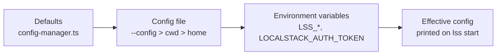

# Configuration Guide for LSS

LSS (Local Serverless Stack) supports configuration files to customize the behavior of the orchestrator, including server port, engine selection, LocalStack settings, DynamoDB proxy, and dashboard branding.

## Configuration Files

LSS looks for configuration files in the following order:

1. A file passed explicitly: `lss <cmd> --config <path>` (the CLI exports it as `LSS_CONFIG_PATH` so the server reads the same file) — always wins
2. `lss.config.json` in the current working directory
3. `.lssrc` in the current working directory
4. `lss.config.json` in the home directory (`~`)
5. `.lssrc` in the home directory

The first file found will be used. Environment variables are always read afterwards and **override** values from the file (see [Priority Order](#priority-order)).



## Configuration Options

### lss.config.json or .lssrc

Both files should contain valid JSON with the following optional properties:

```json
{
  "serverPort": 3100,
  "localstackPort": 4566,
  "localstackEndpoint": "http://localhost:4566",
  "mode": "managed",
  "localstackEdition": "community",
  "localstackVersion": "latest",
  "enableDynamoProxy": false,
  "dynamoProxyPort": 8000,
  "region": "us-east-1",
  "services": ["dynamodb", "sqs", "sns", "s3", "lambda", "events"],
  "persistence": true,
  "debug": false,
  "autoPackage": false,
  "packageCommand": "npx serverless package",
  "packageTimeoutMs": 300000,
  "lambdaRuntime": {
    "enabled": true,
    "execution": "auto",
    "invokePortOffset": 10000,
    "invokeHost": "host.docker.internal"
  }
}
```

### Configuration Properties

- **serverPort** (number, default: 3100)
  - Port where the LSS server (dashboard + API) will run
  - Used by both the web UI and REST API
  - The Serverless Plugin connects to this server to register services
  - Example: `3100`

- **engine** (`"localstack"` | `"self"`, default: `"localstack"`)
  - Which AWS provider backs the orchestrator: the LocalStack container, or the
    in-process self engine (no Docker, no auth token). Env: `LSS_ENGINE`; CLI:
    `lss start --self-engine`. The `localstack*` keys below are ignored in self
    mode. See [SELF_ENGINE.md](SELF_ENGINE.md).

- **selfEngine** (object, optional — only used when `engine` is `"self"`)
  - `port` (default 14566, env `LSS_ENGINE_PORT`), `dataDir` (default
    `~/.lss/engine`, or `<stateDir>/engine` when `stateDir` is set), `account`,
    `idleUnloadMs`, `memoryBudgetMb`, `fsync`, `fallbackEndpoint` (forward
    unimplemented AWS calls to a LocalStack instance during migration).
  - Full reference: [SELF_ENGINE.md](SELF_ENGINE.md).

- **localstackPort** (number, default: 4566)
  - Port where LocalStack container will expose its API
  - Example: `4566`

- **localstackEndpoint** (string, optional)
  - Custom endpoint for LocalStack
  - Example: `"http://localhost:4566"` or `"http://192.168.1.100:4566"`

- **mode** (`"managed"` | `"external"`, default: `"managed"`)
  - `managed`: LSS starts and stops a LocalStack container via Docker.
  - `external`: LSS connects to a LocalStack instance you started yourself and never touches Docker.

- **localstackEdition** (`"community"` | `"pro"`, default: `"community"`)
  - Which LocalStack image to pull (community is free; pro requires a valid auth token).
  - Ignored when `localstackImage` is set.

- **localstackVersion** (string, default: `"latest"`)
  - Tag appended to the resolved image (e.g. `4.0`, `stable`, `2026.4`).
  - Ignored when `localstackImage` is set.

- **localstackImage** (string, optional)
  - Full image override (e.g. `"my-registry/localstack:custom"`). Takes precedence over edition + version.

- **localstackAuthToken** (string, optional)
  - Forwarded as `LOCALSTACK_AUTH_TOKEN` inside the container.
  - Required for `pro` edition and for community images `>= 2026.5`.
  - Prefer the `LOCALSTACK_AUTH_TOKEN` env var over writing the token to a config file.

- **enableDynamoProxy** (boolean, default: false)
  - Enable a proxy for DynamoDB on a separate port
  - Useful for tools that expect DynamoDB on port 8000
  - Example: `true`

- **dynamoProxyPort** (number, default: 8000)
  - Port where the DynamoDB proxy will run (only if enableDynamoProxy is true)
  - Example: `8000`

- **region** (string, default: "us-east-1")
  - Default AWS region for the engine and provisioning
  - The dashboard's region selector and every explorer endpoint / `LssClient`
    data method also accept an explicit region (`?region=` query param /
    trailing `region` argument) to inspect resources provisioned elsewhere
  - Example: `"us-east-1"`

- **services** (array, default: ["dynamodb", "sqs", "sns", "s3", "lambda", "events"])
  - AWS services to enable in LocalStack
  - Example: `["dynamodb", "sqs", "sns", "lambda", "s3", "secretsmanager"]`

- **persistence** (boolean, default: true)
  - Whether to persist LocalStack data between restarts
  - Example: `true`

- **debug** (boolean, default: false)
  - Enable debug mode for LocalStack
  - Example: `false`

- **seedsDir** (string, default: `"./seeds"`)
  - Directory containing DynamoDB seed files (`{tableName}.json`). Relative paths
    resolve from the working directory. Env: `LSS_SEEDS_DIR`.
  - Each `{tableName}.json` must contain a **JSON array of plain objects** (native
    JSON types, not DynamoDB-typed AttributeValues) — LSS marshalls them
    automatically. Example: `[{"userId": "u-1", "active": true}]`. See
    [examples/sample-microservice/seeds/](../examples/sample-microservice/seeds/).
  - Seeds are auto-applied when a table is created, and on demand via
    `lss seed [table]` / `lss seed:clear [table]` or the seed panel in the
    dashboard's DynamoDB tab (open a table → Seed).

- **stateDir** (string, optional)
  - Directory where this instance keeps its state (PID/lock/log files), resolved
    relative to the working directory. Setting it isolates an instance so
    `lss stop --config <path>` targets it and not your dev instance — useful for
    e2e stacks running next to a normal one.

- **autoPackage** (boolean, default: false)
  - When registering a service, if `.serverless/cloudformation-template-update-stack.json` is missing, run the configured `packageCommand` in the service directory and retry.
  - Useful when integrating new microservices without manually running `serverless package` first.
  - Example: `true`

- **packageCommand** (string, default: `"npx serverless package"`)
  - Command executed in the service directory when `autoPackage` is enabled and the template is missing.
  - Parsed as shell-style tokens (quoted args supported); not run through a shell.
  - Example: `"npm run package"` or `"npx serverless package --stage dev"`

- **packageTimeoutMs** (number, default: 300000)
  - Maximum time in milliseconds to wait for `packageCommand` before killing it.
  - Example: `600000` (10 minutes)

- **packageArgs** (string[], default: `[]`)
  - Extra arguments appended to **every** auto-package command. Passed as discrete
    argv elements straight to the process (no shell, no re-parsing), so values that
    contain `=` or spaces — e.g. `--param=custom-stage=offline` — are delivered intact.
  - Prefer this over embedding flags in `packageCommand`, which goes through a
    simple tokenizer.
  - Example: `["--param=custom-stage=offline"]`

- **packageEnv** (object, default: `{}`)
  - Extra environment variables merged over the orchestrator's env for every package
    child process (per-service `packageEnv` wins on key collisions). Useful to inject
    dummy credentials for offline packaging, e.g. `{ "AWS_ACCESS_KEY_ID": "test" }`.

- **servicePackaging** (object, default: `{}`)
  - Per-service packaging overrides. Each key identifies a service by its **directory
    name** (e.g. `"access"`) **or** by its path **relative to this config file's
    directory** using `/` (e.g. `"microservices/access"`). A relative-path key wins
    over a basename key.
  - Each value may set `packageCommand`, `packageArgs`, `packageEnv`, `packageTimeoutMs`.
    Resolution against the globals: per-service `packageCommand`/`packageTimeoutMs`
    **replace** the global value; `packageArgs` are **appended after** the global args;
    `packageEnv` is **merged over** the global env (per-service wins).
  - `packageArgs`/`packageEnv`/`servicePackaging` are file-only (no environment-variable
    equivalents). `LSS_PACKAGE_COMMAND`/`LSS_PACKAGE_TIMEOUT_MS` still apply as the global
    baseline that a per-service `packageCommand`/`packageTimeoutMs` can override.
  - Example — only the `access` service needs an offline param:
    ```jsonc
    "autoPackage": true,
    "servicePackaging": {
      "access": { "packageArgs": ["--param=custom-stage=offline"] }
    }
    ```

- **lambdaRuntime** (object, default: `{ "enabled": true, "execution": "auto", "invokePortOffset": 10000, "invokeHost": "host.docker.internal" }`)
  - Controls the Lambda runtime + API emulation (the serverless-offline replacement).
    When a service registers, LSS starts a runtime worker for its functions, binds an
    API Gateway emulator on the service's `apiPort` (30xx) and an AWS Lambda Invoke API
    on its `invokePort` (130xx).
  - `enabled` (boolean, default `true`): master switch for the runtime and listeners.
  - `execution` (`"auto"` | `"artifact"` | `"source"`, default `"auto"`): how handler code
    is loaded. `artifact` extracts the `sls package` zip and loads the compiled bundle
    (works uniformly for TS and JS); `source` requires handlers straight from the service
    source tree (TS via `esbuild-register`/`tsx`/`ts-node` resolved from the service's or
    LSS's node_modules); `auto` picks `artifact` when a zip exists, else `source`.
  - `watch` (boolean, default: `true` in source mode, `false` in artifact mode): hot
    reload — source changes restart the service worker; `serverless.yml`/`package.json`
    changes trigger a re-package (when `autoPackage` is on) and full re-registration.
  - `invokePortOffset` (number, default `10000`): when a service declares only an
    `apiPort`, its invoke port is derived as `apiPort + invokePortOffset`
    (e.g. 3010 → 13010).
  - `invokeHost` (string, default: `"host.docker.internal"` on the LocalStack
    engine, `"127.0.0.1"` on the self engine — nothing runs in Docker there):
    hostname the LocalStack Lambda proxy functions use when calling back into the
    service invoke listener (`http://{invokeHost}:{invokePort}`). In
    Docker-in-Docker/devcontainer setups, `host.docker.internal` may point at
    Docker Desktop instead of the devcontainer; set this to the Docker network
    gateway reachable from the LocalStack container (for example `"172.19.0.1"`).
    Only relevant on the LocalStack engine.
  - Env overrides: `LSS_LAMBDA_RUNTIME`, `LSS_LAMBDA_EXECUTION`, `LSS_LAMBDA_WATCH`,
    `LSS_INVOKE_HOST`.

  Docker-in-Docker/devcontainer example:
  ```jsonc
  {
    "lambdaRuntime": {
      "invokeHost": "172.19.0.1"
    }
  }
  ```
  Or for one shell session:
  ```bash
  export LSS_INVOKE_HOST=172.19.0.1
  npx lss start
  ```

- **serviceRuntime** (object, default: `{}`)
  - Per-service runtime overrides, keyed like `servicePackaging` (directory basename or
    config-relative path; the relative-path key wins).
  - Each value may set `enabled`, `apiPort`, `invokePort`, `execution`, `watch`.
    Ports set here win over what the plugin sends in the register payload.
  - Example:
    ```jsonc
    "serviceRuntime": {
      "auth": { "apiPort": 3011, "invokePort": 13011 },
      "app":  { "apiPort": 3010, "execution": "source", "watch": true }
    }
    ```

- **branding** (object, optional — dashboard look & feel, purely cosmetic)
  - Make the dashboard carry your team's identity: title, logo, and theme colors.
  - `title` (default `"Local Serverless Stack"`): navbar + browser tab title.
  - `subtitle` (default `"Local development control plane"`): line under the title.
  - `logo` / `favicon`: an `http(s)`/`data:` URL used as-is, **or a file path**
    resolved relative to `lss.config.json` — the orchestrator serves it at
    `/api/config/branding/logo|favicon`, so assets can live next to the config.
  - `defaultTheme` (`"dark"` | `"light"`, default `"dark"`): theme applied until the
    user picks one in the UI menu (their choice is remembered per browser).
  - `colors`: [TreeUI](https://www.npmjs.com/package/@treeui/vue) token overrides
    applied to both themes. Keys are the token suffix (`"brand-primary"` →
    `--tree-color-brand-primary`) or a full custom property name (`"--tree-radius-md"`).
  - `themeColors.dark` / `themeColors.light`: per-theme overrides, merged over `colors`.
  - Example — company colors and logo:
    ```jsonc
    "branding": {
      "title": "Acme Cloud",
      "subtitle": "Sandbox local",
      "logo": "./assets/acme.svg",
      "defaultTheme": "light",
      "colors": { "brand-primary": "#e63946", "brand-hover": "#c1121f" },
      "themeColors": { "light": { "bg-primary": "#fdf6f0" } }
    }
    ```

> Note: configuration is read once when the orchestrator starts. After editing
> `lss.config.json`, restart the orchestrator for changes to take effect.

## Configuring the Serverless Plugin

The Serverless Plugin needs to know where to find the LSS server. Configure it in `serverless.yml`:

```yaml
plugins:
  - serverless-lss

custom:
  orchestrator:
    enabled: true
    orchestratorUrl: http://localhost:3100
```

The plugin never reads `lss.config.json` — its default is the hardcoded
`http://localhost:3100`. If you change `serverPort`, also point the plugin at the
new port via `custom.orchestrator.orchestratorUrl`, `ORCHESTRATOR_URL`, or
`LSS_DASHBOARD_PORT`. A copy-paste template lives at
[serverless.yml.example](serverless.yml.example).

Registration fires on `sls package` (`after:package:finalize`) **and** on
`sls offline` startup (`before:offline:start`), so offline-based workflows
register without an extra step.

### Plugin Configuration Options

- **enabled** (boolean, default: true)
  - Whether to enable the plugin
  - Example: `true`

- **orchestratorUrl** (string, default: "http://localhost:3100")
  - URL where the LSS server is running
  - Should match the serverPort from lss.config.json
  - Can be overridden via `ORCHESTRATOR_URL` environment variable
  - Example: `"http://localhost:3100"`

### Service Ports (API emulation)

The plugin also reports the service's HTTP and invoke ports so LSS can bind its
gateway (30xx) and Lambda invoke (130xx) listeners. Discovery order:

```yaml
custom:
  lss:                    # preferred — explicit LSS ports
    apiPort: 3010
    invokePort: 13010
  serverless-offline:     # fallback — drop-in for services already using offline
    httpPort: 3010
    lambdaPort: 13010
```

When only `apiPort` is known, the orchestrator derives the invoke port via
`lambdaRuntime.invokePortOffset` (default: `apiPort + 10000`). Ports set in
`serviceRuntime` (lss.config.json) win over both.

### Environment Variables for Plugin

- `ORCHESTRATOR_URL` - Override orchestratorUrl (wins over everything)
- `LSS_DASHBOARD_PORT` - Build the orchestrator URL as `http://localhost:<port>` (loses to `ORCHESTRATOR_URL`)
- `ORCHESTRATOR_ENABLED` - Override enabled setting (true/false)

## Examples

Custom ports — remember to point the plugin at the new server port too:

```jsonc
// lss.config.json
{ "serverPort": 3200, "localstackPort": 4600, "localstackEndpoint": "http://localhost:4600" }
```

```yaml
# serverless.yml (each service)
custom:
  orchestrator:
    orchestratorUrl: http://localhost:3200
```

`.lssrc` accepts exactly the same JSON as `lss.config.json`. A full annotated
template ships as [lss.config.json.example](../lss.config.json.example) in the
repo (and `lss help` prints one).

## Environment Variables

Environment variables can be used instead of — or to override — a configuration file:

- `LSS_CONFIG` - Explicit config file path for the CLI (equivalent to `--config <path>`; also honored by `LssClient`)
- `LSS_CONFIG_PATH` - Explicit config file path for the server (the CLI sets it from `--config` when spawning)
- `PORT` or `LSS_DASHBOARD_PORT` - Server port
- `LSS_LOCALSTACK_PORT` - LocalStack port
- `LSS_LOCALSTACK_ENDPOINT` - LocalStack endpoint
- `LSS_LOCALSTACK_MODE` - `managed` or `external`
- `LSS_LOCALSTACK_EDITION` - `community` or `pro`
- `LSS_LOCALSTACK_VERSION` - Image tag (e.g. `latest`, `4.0`)
- `LSS_LOCALSTACK_IMAGE` - Full image override
- `LOCALSTACK_AUTH_TOKEN` - Forwarded into the container
- `LSS_ENABLE_DYNAMO_PROXY` - Enable DynamoDB proxy (true/false or 1/0; the legacy unprefixed `ENABLE_DYNAMO_PROXY` is still honored as a fallback, deprecated)
- `LSS_DYNAMO_PROXY_PORT` - DynamoDB proxy port
- `AWS_REGION` - AWS region
- `LSS_SERVICES` - Services (comma-separated)
- `LSS_PERSISTENCE` - Persistence (true/false or 1/0)
- `LSS_DEBUG` - Debug mode (true/false or 1/0)
- `LSS_AUTO_PACKAGE` - Run package command when template is missing (true/false or 1/0)
- `LSS_PACKAGE_COMMAND` - Override the package command
- `LSS_PACKAGE_TIMEOUT_MS` - Override the package timeout in milliseconds
- `LSS_LAMBDA_RUNTIME` - Enable/disable Lambda runtime + API emulation (true/false or 1/0)
- `LSS_LAMBDA_EXECUTION` - `auto`, `artifact`, or `source`
- `LSS_LAMBDA_WATCH` - Enable/disable runtime source watching (true/false or 1/0)
- `LSS_INVOKE_HOST` - Override `lambdaRuntime.invokeHost` for LocalStack proxy callbacks
- `LSS_SEEDS_DIR` - Directory with DynamoDB seed files
- `LSS_ENGINE` - AWS engine: `localstack` or `self`
- `LSS_ENGINE_PORT` - Self engine port (default: 14566)
- `LOCALSTACK_ACCESS_KEY_ID` / `LOCALSTACK_SECRET_ACCESS_KEY` - Credentials the orchestrator's SDK clients present to the engine (default: `test`/`test`); set them when an external LocalStack validates credentials

### LssClient environment variables

The programmatic client resolves its target from constructor options, then env,
then config file:

- `LSS_BASE_URL` - Full orchestrator URL (wins over the rest)
- `LSS_SERVER_PORT` - Builds `http://localhost:<port>`
- `LSS_CONFIG` - Config file to read `serverPort` from
- `AWS_REGION` - Default region for data-plane calls

### Environment Variable Examples

```bash
# Set server port
export LSS_DASHBOARD_PORT=3200

# Enable DynamoDB proxy
export LSS_ENABLE_DYNAMO_PROXY=true

# Set LocalStack port
export LSS_LOCALSTACK_PORT=4600

# Start the orchestrator
npx lss start
```

## Priority Order

Configuration is resolved in this order (later values override earlier ones):

1. Default values
2. Configuration file (`lss.config.json` or `.lssrc`)
3. Environment variables (so secrets like `LOCALSTACK_AUTH_TOKEN` can be injected without touching the file)

## LocalStack: managed vs external

`mode: "managed"` is the default and works for most setups — LSS will `docker run` and `docker stop` the container for you.

Use `mode: "external"` when you want to keep an already-running LocalStack across multiple `lss start` invocations, or when LocalStack is running in another container/host you own:

```json
{
  "mode": "external",
  "localstackEndpoint": "http://localhost:4566"
}
```

In external mode, `lss start` only health-checks the endpoint and `lss stop` leaves the container running.

## LocalStack Pro and auth tokens

The `localstack/localstack-pro` image and recent `localstack/localstack` images (`>= 2026.5`) require `LOCALSTACK_AUTH_TOKEN`.

Two ways to provide it:

```bash
# 1. Environment variable (preferred — never commit the token)
export LOCALSTACK_AUTH_TOKEN=ls-xxxxxxxx
npx lss start --pro

# 2. CLI flag (handy for one-off runs)
npx lss start --pro --localstack-token ls-xxxxxxxx
```

If `localstackEdition` is `pro` and no token is found, the orchestrator fails fast with a clear message. For `community`, it just warns and tries anyway (older images still work without a token).

## Getting Started

1. Create an `lss.config.json` in your project root — a minimal one is enough
   (every key has a sensible default):
   ```json
   {
     "serverPort": 3100,
     "services": ["dynamodb", "sqs", "sns", "s3", "lambda", "events"]
   }
   ```
   From a clone of this repo you can also `cp lss.config.json.example lss.config.json`
   for the fully annotated template.

2. Edit `lss.config.json` with your desired settings

3. Update `serverless.yml` with the orchestrator configuration (if using custom port)

4. Start the orchestrator:
   ```bash
   npx lss start
   ```

## Checking Current Configuration

Start the orchestrator and check the logs:

```bash
npx lss start
npx lss logs
```

The orchestrator will print a configuration summary when it starts, showing all active settings.

## Troubleshooting

### Configuration not being loaded

1. Ensure the file is valid JSON
2. Check the file location (must be in cwd or home directory)
3. Check file permissions (must be readable)
4. Look at the logs: `npx lss logs`

### Port already in use

If a port is already in use, change it in the configuration file:

```json
{
  "serverPort": 3200,
  "localstackPort": 4600
}
```

Then update `serverless.yml`:
```yaml
custom:
  orchestrator:
    orchestratorUrl: http://localhost:3200
```

### Plugin can't find the server

1. Verify the server is running: `npx lss status`
2. Check the `orchestratorUrl` in `serverless.yml` matches the `serverPort` in `lss.config.json`
3. Check the logs: `npx lss logs`
4. Try using the `ORCHESTRATOR_URL` environment variable:
   ```bash
   export ORCHESTRATOR_URL=http://localhost:3200
   npx serverless package
   ```

### Can't find configuration file

Use environment variables instead:

```bash
export LSS_DASHBOARD_PORT=3100
export LSS_LOCALSTACK_PORT=4566
npx lss start
```
