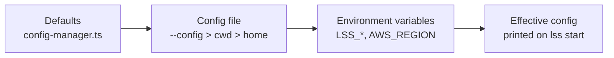

# Configuration Guide for LSS

LSS (Local Serverless Stack) supports configuration files to customize the behavior of the orchestrator: ports, the in-process AWS engine, the Lambda runtime, seeds, packaging, the DynamoDB proxy and dashboard branding.

## Configuration Files

LSS looks for configuration files in the following order:

1. A file passed explicitly: `lss <cmd> --config <path>` (the CLI exports it as `LSS_CONFIG_PATH` so the server reads the same file) — always wins
2. `lss.config.json` in the current working directory
3. `.lssrc` in the current working directory
4. `lss.config.json` in the home directory (`~`)
5. `.lssrc` in the home directory

The first file found will be used. Environment variables are always read afterwards and **override** values from the file (see [Priority Order](#priority-order)).



## Configuration Options

### lss.config.json or .lssrc

Both files should contain valid JSON with the following optional properties:

```json
{
  "serverPort": 14566,
  "enableDynamoProxy": false,
  "dynamoProxyPort": 8000,
  "region": "us-east-1",
  "persistence": true,
  "debug": false,
  "autoPackage": false,
  "packageCommand": "npx serverless package",
  "packageTimeoutMs": 300000,
  "lambdaRuntime": {
    "enabled": true,
    "execution": "auto",
    "invokePortOffset": 10000,
    "lazy": true,
    "idleTimeoutMs": 60000
  }
}
```

### Configuration Properties

- **serverPort** (number, default: 14566)
  - The one port the whole stack answers on: dashboard, REST API **and** the AWS
    wire. The Serverless Plugin registers here; your handlers point `AWS_ENDPOINT`
    here; you open the dashboard here.
  - It shares a listener with the engine because the two traffic shapes are
    distinguishable: a request carrying SigV4, `X-Amz-Target` or any `x-amz-*`
    header goes to the engine, everything else to the API/SPA. A bucket named
    `api` is therefore not a conflict — the SDK signs, the browser does not.
  - **Two listeners instead of one**: give `selfEngine.port` a different value.
    The orchestrator then binds `serverPort` and the engine binds its own, exactly
    as before.
  - Which **interface** that port is bound to, and which browser origins may call
    it, are separate knobs — see [`LSS_BIND_HOST`](#lss_bind_host-network-exposure)
    and [`LSS_CORS_ORIGINS`](#lss_cors_origins-browser-origins) below; the defaults
    are loopback only.
  - Example: `14566`

- <a id="lss_bind_host-network-exposure"></a>**LSS_BIND_HOST** (env var, default: `"127.0.0.1"` — no config-file equivalent)
  - The interface **every listener in the process** binds. **Loopback by default**: the
    dashboard, the REST API, the AWS wire, each service's API and Lambda-invoke port,
    and the optional DynamoDB proxy all accept only connections that originate on this
    machine.
  - **One switch, every listener.** LSS opens four kinds of listener and this variable
    governs all of them: the orchestrator (`index.ts`); every registered service's API
    Gateway port and **Lambda Invoke API** port (`services/gateway-manager.ts`); the
    engine's own front door when `selfEngine.port` differs from `serverPort`
    (`engine/backends/self-backend.ts`); and the optional DynamoDB proxy
    (`dev/dynamo-proxy.ts`). Through **0.17.2** the last three ignored it — a bare
    `server.listen(port)` binds the `::` wildcard, and `self-backend.ts` asked for
    `0.0.0.0` outright — so a loopback dashboard sat in front of gateways, invoke ports
    and (in split-listener mode) a whole AWS data plane that were open to the LAN
    anyway. That is fixed: the value is resolved once in
    `src/server/services/bind-host.ts` and every listener reads it from there, so
    "LSS listens on loopback" is now a statement about the **process**, not about one
    file. It also means you never have to widen listeners one at a time.
  - **Why loopback is the default.** The REST API has no authentication. Every table,
    queue, topic, bucket and **secret value** in the stack is readable through it, and
    writable — so on a shared network, the default of "not offered at all" is the only
    honest one for a tool that ships to every developer.
  - <a id="the-container-recipe"></a>**The container recipe** (the common case — LSS in a
    container, browser on the host). One line turns the whole stack on for the network:
    ```bash
    LSS_BIND_HOST=0.0.0.0 LSS_CORS_ORIGINS='*' npx lss start
    ```
    `LSS_BIND_HOST=0.0.0.0` is what makes a published port work at all: with
    `docker run -p 14566:14566` the forwarded connection arrives on the container's
    **external** interface, which a `127.0.0.1` listener refuses. `LSS_CORS_ORIGINS`
    is the browser half — see [below](#lss_cors_origins-browser-origins); without it a
    frontend served from anything other than `localhost` gets no CORS headers and its
    calls fail in the browser even though the port is reachable. Set both, or set
    neither; setting only the bind gets you a stack that curl can use and your app
    cannot. Prefer naming your real origins over `*` when you know them:
    ```bash
    LSS_BIND_HOST=0.0.0.0 \
      LSS_CORS_ORIGINS=http://localhost:5173,http://192.168.1.20:5173 \
      npx lss start
    ```
    In `docker-compose.yml` the same thing is two `environment:` entries. Publish the
    service ports you actually use alongside `14566` (`3010`, `13010`, …) — the bind
    covers them, but Docker still has to forward them.
  - **VS Code devcontainer forwarding needs none of this.** The forwarder attaches from
    *inside* the container, where loopback is the same network stack, so the safe
    default already works and the browser sees `http://localhost:<port>` — an origin the
    default CORS allowlist already grants.
  - **What you are accepting when you widen it.** Everyone who can reach those ports
    gets an unauthenticated API: they can list and read your local tables, queues and
    buckets, write to them, invoke any registered Lambda, and read **secret values**
    out of the emulated Secrets Manager. Since 1.0 the endpoints that spawn processes no
    longer take a caller-chosen binary: `/start` derives argv, cwd and env server-side,
    `/install` is shape- and flag-allowlisted, and `packageCommand`/`packageArgs` must
    match the packaging grammar (see [`packageCommand`](#packagecommand-allowlist)). So
    what you are mainly exposing is your **local dev data** rather than a shell on the
    host — a real but bounded thing. Bounded is not zero: a caller who reaches the API
    can still ask the project's own build to run, so "a network you trust" is the actual
    precondition. Keep production credentials out of `packageEnv` and the `secrets`
    seed map, and when you only need remote access *for yourself*, a tunnel
    (`ssh -L 14566:127.0.0.1:14566 <host>`) beats publishing the port.
  - Boot prints a one-line warning whenever the bind is **not** loopback, so a widened
    stack is never silent:
    ```
    ⚠️  LSS_BIND_HOST=0.0.0.0 — the dashboard, the REST API, the AWS wire and every
    service's API/invoke port are reachable from the network. This API has no
    authentication and can run commands on this host … — use it only where you trust
    every caller, and unset LSS_BIND_HOST to go back to the default (127.0.0.1,
    loopback origins only).
    ```
    One warning covers the process, because one value does; widening `LSS_CORS_ORIGINS`
    to `*` adds its own clause to the same line. ("Can run commands" means LSS's own
    commands — an `npm start`, a `serverless package` — not a caller-chosen one; see
    [`packageCommand`](#packagecommand-allowlist).) An address that is not one of this
    machine's own fails the boot with a named error (`EADDRNOTAVAIL`) instead of a stack
    trace.
  - It is deliberately **environment-only**: there is no `lss.config.json` key and it is
    not editable through `PUT /api/config`, because widening the bind through the very
    API it protects would hand the exposure back to any caller that already reached it.
  - **Interaction with `lambdaRuntime.invokeHost`.** That setting only *names* the host
    in the callback URL the engine records for a Lambda proxy; it never binds anything.
    Pointing it at a non-loopback address (the container case above) therefore also
    needs `LSS_BIND_HOST` set to an address that covers it, or the URL will name a port
    nothing is offering there.

- <a id="lss_cors_origins-browser-origins"></a>**LSS_CORS_ORIGINS** (env var, default: loopback origins only — no config-file equivalent)
  - Which **browser origins** may call the REST API cross-origin. Comma-separated list
    of exact origins (`scheme://host[:port]`), or a single `*` to allow any.
  - **Unset** means the built-in loopback allowlist: `http://localhost`,
    `http://127.0.0.1` and `http://[::1]` on any port. That covers the dashboard —
    same-origin when served by this process, and `http://localhost:3101` under
    `npm run dev` — and nothing else, so a random page the developer happens to open
    cannot make their own browser drive the stack.
  - **Setting it replaces that list**, it does not extend it. Include your loopback
    origins if you still want them:
    ```bash
    LSS_CORS_ORIGINS=http://localhost:3101,http://localhost:5173,http://10.0.0.5:5173
    ```
    Values are matched **exactly** against the request's `Origin` — scheme, host and
    port all count, so `http://localhost:5173` does not grant `https://localhost:5173`
    and `http://10.0.0.5` does not grant `http://10.0.0.5:5173`. Case and a trailing
    slash are forgiven on both sides (`https://App.Example.com/` matches
    `https://app.example.com`), because a hand-typed env var that silently matches
    nothing is the worst failure mode for a knob whose whole job is to unblock a
    frontend. There are no wildcards *inside* an entry; `*` is the only wildcard and it
    is all-or-nothing. An empty value is treated as unset, not as "deny everything".
  - **Why this exists.** LSS is routinely called *directly from a browser* — your own
    frontend listing a queue's messages, invoking a Lambda, reading a table through
    `/api/*` — and when the stack runs in a container that frontend is rarely on
    `localhost` from the API's point of view. A loopback-only allowlist would break
    exactly the workflow LSS is for. This is the supported way to say "these pages are
    mine". (A frontend calling a *service's* emulated API Gateway on its 30xx port is a
    separate matter: that listener answers from the route's own `cors:` declaration, as
    AWS does, and does not read this variable — though it does obey `LSS_BIND_HOST`.)
  - **What `*` means.** Any page in any tab of any browser that can route to the port
    may read and write your local emulator data — including secret values — through the
    user's own browser. Paired with a loopback bind that is only reachable from this
    machine, so the practical exposure is "a site I visit could talk to my dev stack".
    Paired with `LSS_BIND_HOST=0.0.0.0` it is the full network exposure described above.
    Name your origins when you can; reach for `*` when you can't (rotating container
    IPs, teammates on unpredictable hosts) and treat it as a trusted-network setting.
  - Boot warns about `*`, and about a non-loopback `LSS_BIND_HOST`, in the **same**
    one-line banner — it names each knob you widened and how to go back. An explicit
    named origin list prints nothing: you told LSS exactly who, which is the outcome
    this variable is trying to encourage.
  - Like `LSS_BIND_HOST` it is **environment-only** — no config key, no `PUT /api/config`
    spelling — for the same reason: the origin allowlist is half of the boundary, and a
    boundary that can be widened through the API it guards is not one.
  - Non-browser callers are untouched: curl, the CLI, `LssClient`, the MCP server and
    the AWS SDKs send no `Origin`, so no CORS decision is ever made for them. AWS wire
    traffic never reaches the middleware at all — `isAwsRequest()` hands it to the
    engine ahead of Express.
  - The two knobs are independent on purpose: the bind decides **who can open a
    socket**, CORS decides **which web pages the browser will let read the answer**.
    The container recipe needs both.

- **selfEngine** (object, optional)
  - `port` (default 14566, env `LSS_ENGINE_PORT`) — **equal to `serverPort` by
    default, which is what puts everything on one listener**; set it to a
    different value to split them, `dataDir` (default
    `~/.lss/projects/<project-slug>-<hash>/engine`, or `<stateDir>/engine` when
    `stateDir` is set — the home fallback is scoped per project so two checkouts
    never share one set of tables), `account`,
    `idleUnloadMs`, `memoryBudgetMb`, `fsync`, `fallbackEndpoint` (reverse-proxy
    AWS operations the engine does not implement to any AWS-compatible endpoint).
  - Full reference: [SELF_ENGINE.md](SELF_ENGINE.md).

- **enableDynamoProxy** (boolean, default: false)
  - Enable a proxy for DynamoDB on a separate port
  - Useful for tools that expect DynamoDB on port 8000
  - Example: `true`

- **dynamoProxyPort** (number, default: 8000)
  - Port where the DynamoDB proxy will run (only if enableDynamoProxy is true)
  - Example: `8000`

- **region** (string, default: "us-east-1")
  - Default AWS region for the engine and provisioning
  - The dashboard's region selector and every explorer endpoint / `LssClient`
    data method also accept an explicit region (`?region=` query param /
    trailing `region` argument) to inspect resources provisioned elsewhere
  - Example: `"us-east-1"`

- **persistence** (boolean, default: true)
  - Whether engine data survives a restart.
  - `false` swaps the file-backed store for an **in-memory** one — no
    `dataDir` is created, no catalog, WAL or blob is written, and every boot starts
    from an empty engine. That is the mode to use for an automated test run that
    needs a guaranteed clean slate and no leftover files. (The residency knobs —
    `selfEngine.idleUnloadMs` / `memoryBudgetMb` — are inert there: with no
    snapshot on disk, evicting a table would be data loss rather than eviction.)
  - Example: `true`

- **debug** (boolean, default: false)
  - Verbose orchestrator logging.
  - Example: `false`

- **seedsDir** (string, default: `"./seeds"`)
  - Directory containing DynamoDB seed files (`{tableName}.json`). Relative paths
    resolve from the working directory. Env: `LSS_SEEDS_DIR`.
  - Each `{tableName}.json` must contain a **JSON array of plain objects** (native
    JSON types, not DynamoDB-typed AttributeValues) — LSS marshalls them
    automatically. Example: `[{"userId": "u-1", "active": true}]`. See
    [examples/self-hosted/seeds/](../examples/self-hosted/seeds/).
  - Seeds are auto-applied when a table is created, and on demand via
    `lss seed [table]` / `lss seed:clear [table]` or the seed panel in the
    dashboard's DynamoDB tab (open a table → Seed).

- **LSS_ENGINE_DATA_DIR** (env var, no config-file equivalent beyond `selfEngine.dataDir`)
  - Overrides where the self engine keeps its state, without touching a config file.
    Together with `LSS_ENGINE_PORT` and `LSS_DASHBOARD_PORT` it is everything a second
    instance needs:
    ```bash
    LSS_DASHBOARD_PORT=3250 LSS_ENGINE_PORT=14766 \
      LSS_ENGINE_DATA_DIR=/tmp/lss-run-7/engine npx lss start
    ```
  - Reported as an env override by `GET /api/config`, like every other `LSS_*` var.

- **stateDir** (string, optional)
  - Directory where this instance keeps its state (PID/lock/log files), resolved
    relative to the working directory. Setting it isolates an instance so
    `lss stop --config <path>` targets it and not your dev instance — useful for
    e2e stacks running next to a normal one.
  - It is also where the engine's `dataDir` lands.
    Without it they fall back to a **per-project** directory under
    `~/.lss/projects/<project-slug>-<hash>/`, derived from the absolute project
    root — so two checkouts of the same repo, or two examples, never share state.
    Setting `stateDir` (the examples use `.lss`) keeps everything inside the
    project and is still the recommended default.

- **autoPackage** (boolean, default: false)
  - When registering a service, if `.serverless/cloudformation-template-update-stack.json` is missing, run the configured `packageCommand` in the service directory and retry.
  - Useful when integrating new microservices without manually running `serverless package` first.
  - Example: `true`

- <a id="packagecommand-allowlist"></a>**packageCommand** (string, default: `"npx serverless package"`)
  - Command executed in the service directory when `autoPackage` is enabled and the
    template is missing, and by `POST /api/services/package`.
  - Parsed as shell-style tokens (quoted args supported); not run through a shell.
  - **Set through `PUT /api/config`, it must match the packaging grammar** — tokenized
    exactly the way the packager tokenizes it before `spawn()`, so the checked string is
    the executed one:

    ```
    npm | yarn | pnpm        run | run-script   [script] [args…]
    serverless | sls | osls  package                     [args…]
    npx [-y|--yes]…   serverless|sls|osls[@version]   package   [args…]
    ```

    Every documented form still works: `"npx serverless package"`, `"npm run package"`,
    `"npm run package:local"`, `"yarn run package"`, `"serverless package --stage dev"`,
    `"sls package -c custom.yml"`, `"npx -y serverless@3.38.0 package"`. Anything else
    answers `400` naming the offending token and writes nothing.
  - **Why a grammar and not a runner allowlist.** The value becomes
    `spawn(firstToken, restTokens)` with `packageArgs` appended, and `PUT /api/config`
    has no authentication, so
    `PUT /api/config {"packageCommand":"/bin/sh","packageArgs":["-c","…"]}` followed by
    one `POST /api/services/package` ran an arbitrary binary with arbitrary argv as the
    user running the orchestrator — the same class as the `/start` and `/install`
    defects, through a third door. Checking only the **first token** did not close it:
    every package manager is an interpreter one subcommand in, and
    `spawn('npm', ['exec','-c','<shell string>'])` executes that string with no
    `shell: true` anywhere. `npm exec -c …`, `npx -c …`, `npm x`, `yarn dlx`,
    `pnpm dlx`, `yarn exec`, `yarn node -e …`, `yarn create`, `npm i <pkg>` and
    `yarn add <pkg>` (install scripts run as you) all named an allowed runner and all
    ran caller-chosen code. Pinning the **subcommand** is what removes them.
  - **A bare `yarn package` is rejected; write `yarn run package`.** yarn 1's implicit
    `run` is exactly what makes `yarn node -e '<js>'` and `yarn dlx <pkg>`
    indistinguishable from a script name, so the explicit form is required. The same
    goes for `pnpm package` → `pnpm run package`.
  - **Flags are screened too**, on every token of the command *and* every `packageArgs`
    element, because a flag can re-point an allowed program without changing a single
    positional token: `--node-options` (NODE_OPTIONS under another name),
    `--script-shell`/`--shell`/`--shell-mode` (which binary interprets the script),
    `--call`, `--userconfig`/`--globalconfig`/`--use-yarnrc` (an rc file that can set
    all of the above), `--registry` (npx fetches the Serverless CLI when the service has
    no local copy, and npm reads its own config flags from anywhere in the argv),
    `--prefix`/`--cwd`/`--dir` (run another package.json's scripts)
    and node's own `--require`/`--eval`/`--print`/`--import`/`--loader`/
    `--experimental-loader`/`--input-type`. Compared with dashes and underscores
    stripped, so `--nodeOptions` and `--node_options` are the same flag. Serverless's
    short flags are deliberately **not** screened — `-c`, `-p`, `-r` are `--config`,
    `--package` and `--region` there, and the grammar already makes them unreachable as
    npm/npx options — so `sls package -c custom.yml -p .build` keeps working.
  - **What stays expressible, stated plainly.** `npm run <script>` runs whatever the
    service's own `package.json` declares, and `serverless package` reads the service's
    own `serverless.yml`, plugins included. Both are the project's code, which you
    already trust by pointing LSS at the directory; forbidding them would mean the
    dashboard could not set a package command at all, which is what the onboarding flow
    is built on. What is gone is the choice of *program*: through this API a caller can
    only ask the project's own build to run.
  - **The fence is on the API, deliberately not on the read path.** A hand-edited
    `lss.config.json` and `LSS_PACKAGE_COMMAND` are *not* checked, because they are the
    operator's own shell — anyone who can write either already runs code on this host,
    and refusing their `packageCommand` would buy nothing while breaking legitimate
    local setups. The check exists for the one path a remote caller can reach.
  - The same rule applies to a per-service `servicePackaging[*].packageCommand`.
  - Example: `"npm run package"` or `"npx serverless package --stage dev"`

- **scanIgnore** (string[], default: `[]`)
  - Service directories `lss scan` and the dashboard onboarding must skip. Keys are
    spelled like `servicePackaging`/`serviceRuntime`: a path relative to this config
    file's directory or to the project root, or a directory basename.
  - For the stacks a monorepo never registers locally *by decision* — a bootstrap
    stack deployed once per AWS account, a `us-east-1` DNS/certificate stack the
    engine does not emulate. Without it they come back as pending work, with
    warnings, on every scan; permanent noise is how a real warning goes unread.
  - Example: `["infra/bootstrap", "infra/global"]`

- **packageTimeoutMs** (number, default: 300000)
  - Maximum time in milliseconds to wait for `packageCommand` before killing it.
  - Example: `600000` (10 minutes)

- **packageArgs** (string[], default: `[]`)
  - Extra arguments appended to **every** auto-package command. Passed as discrete
    argv elements straight to the process (no shell, no re-parsing), so values that
    contain `=` or spaces — e.g. `--param=custom-stage=offline` — are delivered intact.
  - Prefer this over embedding flags in `packageCommand`, which goes through a
    simple tokenizer.
  - **Written through `PUT /api/config` it is screened for the same redirecting flags
    as the command** (`--node-options`, `--script-shell`, `--prefix`, …; see
    [`packageCommand`](#packagecommand-allowlist)). It lands in the same argv one
    tokenizer earlier, so an unchecked arg list is an unchecked command — before this,
    `{"packageCommand":"npm","packageArgs":["exec","-c","<shell>"]}` was the identical
    bypass one key across. The error names the offending element by index
    (`"packageArgs[1]" cannot contain …`). The same applies to a per-service
    `servicePackaging[*].packageArgs`.
  - Example: `["--param=custom-stage=offline"]`

- **packageEnv** (object, default: `{}`)
  - Extra environment variables merged over the orchestrator's env for every package
    child process (per-service `packageEnv` wins on key collisions). Useful to inject
    dummy credentials for offline packaging, e.g. `{ "AWS_ACCESS_KEY_ID": "test" }`.
  - **Code-injection keys are rejected by `PUT /api/config`.** A handful of variables are
    read by the runtime or the dynamic linker *before* the program gets control, so
    setting them chooses the binary no matter which runner the
    [`packageCommand` allowlist](#packagecommand-allowlist) let through — which would
    make that allowlist decorative. Refused with a `400` naming the key:
    `NODE_OPTIONS` (`--require /tmp/x.js`), `NODE_REPL_EXTERNAL_MODULE`,
    `LD_PRELOAD`, `LD_AUDIT`, `LD_LIBRARY_PATH`, `DYLD_INSERT_LIBRARIES` and
    `DYLD_LIBRARY_PATH`. Matching is case-insensitive, because env lookup is
    case-insensitive on Windows and `node_options` would otherwise be the same bypass
    one keystroke away. The same check applies to a per-service `packageEnv` under
    `servicePackaging`. Everything a build legitimately needs — credentials, `AWS_*`,
    `SLS_*`, `NODE_ENV`, your own flags — is untouched, and like `packageCommand` the
    check guards the API rather than a hand-edited file.
  - `GET /api/config` still reports only the **key names** of both maps; values never
    leave the process.

- **servicePackaging** (object, default: `{}`)
  - Per-service packaging overrides. Each key identifies a service by its **directory
    name** (e.g. `"access"`) **or** by its path **relative to this config file's
    directory** using `/` (e.g. `"microservices/access"`). A relative-path key wins
    over a basename key.
  - Each value may set `packageCommand`, `packageArgs`, `packageEnv`, `packageTimeoutMs`.
    Resolution against the globals: per-service `packageCommand`/`packageTimeoutMs`
    **replace** the global value; `packageArgs` are **appended after** the global args;
    `packageEnv` is **merged over** the global env (per-service wins).
  - A per-service `packageCommand` is held to the **same packaging grammar** as the
    global one, a per-service `packageArgs` to the same flag screen, and a per-service
    `packageEnv` to the same rejected-key list — an override is a different value for
    the same setting, not a way around its validation.
  - **packageCwd** (string, relative to the **project root**, default: the service
    directory) — *where* the command runs. A resources-only stack often has no
    `package.json` of its own and is packaged by a script that lives at the monorepo
    root; the packaging grammar deliberately blocks `--prefix`/`--cwd`/`--dir`
    (they relocate a command), so before this key such a stack only worked by
    accident: npm walks up to the root manifest and runs the script from there.
    Now it can be stated:

    ```json
    "servicePackaging": {
      "infra/shared": {
        "packageCommand": "npm run package:local:infra",
        "packageCwd": "."
      }
    }
    ```

    Confined to the project root twice: lexically on write (`PUT /api/config`
    refuses an absolute path or any `..` segment) and by realpath when it is
    resolved, because the value becomes the working directory of a spawned child
    and a symlink can point out of the tree. A value that escapes is ignored with a
    warning and the service directory is used instead.
  - `packageArgs`/`packageEnv`/`servicePackaging` are file-only (no environment-variable
    equivalents). `LSS_PACKAGE_COMMAND`/`LSS_PACKAGE_TIMEOUT_MS` still apply as the global
    baseline that a per-service `packageCommand`/`packageTimeoutMs` can override.
  - Example — only the `access` service needs an offline param:
    ```jsonc
    "autoPackage": true,
    "servicePackaging": {
      "access": { "packageArgs": ["--param=custom-stage=offline"] }
    }
    ```

- **lambdaRuntime** (object, default: `{ "enabled": true, "execution": "auto", "invokePortOffset": 10000, "invokeHost": "127.0.0.1", "lazy": true, "idleTimeoutMs": 60000 }`)
  - Controls the Lambda runtime + API emulation (the serverless-offline replacement).
    When a service registers, LSS starts a runtime worker for its functions, binds an
    API Gateway emulator on the service's `apiPort` (30xx) and an AWS Lambda Invoke API
    on its `invokePort` (130xx).
  - `enabled` (boolean, default `true`): master switch for the runtime and listeners.
  - `execution` (`"auto"` | `"artifact"` | `"source"`, default `"auto"`): how handler code
    is loaded. `artifact` extracts the `sls package` zip and loads the compiled bundle
    (works uniformly for TS and JS); `source` requires handlers straight from the service
    source tree (TS via `esbuild-register`/`tsx`/`ts-node` resolved from the service's or
    LSS's node_modules); `auto` picks `artifact` when a zip exists, else `source`.
  - `watch` (boolean, default: `true` in source mode, `false` in artifact mode): hot
    reload — source changes restart the service worker; `serverless.yml`/`package.json`
    changes trigger a re-package (when `autoPackage` is on) and full re-registration.
  - `invokePortOffset` (number, default `10000`): when a service declares only an
    `apiPort`, its invoke port is derived as `apiPort + invokePortOffset`
    (e.g. 3010 → 13010).
  - `invokeHost` (string, default `"127.0.0.1"` — everything runs in this process):
    hostname used to build the invoke URL a service's event proxies call back on
    (`http://{invokeHost}:{invokePort}`). Override only when the orchestrator must
    be reachable under another name.
  - `lazy` (boolean, default `true`): fork a service's runtime worker on its **first
    invocation** instead of at registration. A worker is a Node process costing ~48 MB
    resident, so a 40-service monorepo paid ~1.9 GB before a single handler ran;
    deferring the fork brings a 40-service stack from ~2.0 GB to ~130 MB at rest and
    costs one cold start (~20 ms, measured) per service actually exercised. Handler
    resolution (and artifact extraction) still happens at registration, so a broken
    packaging is still reported there. Set `false` to restore the eager behaviour.
  - `idleTimeoutMs` (number, default `60000` — one minute): stop a worker that has
    served nothing for this long, returning the service to the lazy state; the next
    invocation re-forks it (~20 ms). LSS is a development stack, not a production
    workload — a handler only needs to be resident while it is being used, and a
    session that touches every service would otherwise end up as expensive as eager
    mode. An in-flight invocation is never interrupted. Set `0` to keep workers
    alive forever.
  - `maxWarmWorkers` (number, default: one per GB of system RAM, clamped to
    `2..12`): hard ceiling on resident workers. When a fork pushes past it, the
    least-recently-invoked idle worker is unloaded. This is what makes host memory a
    function of the services **in flight** rather than the services **registered**:
    a burst that touches all 40 services of a monorepo inside the idle window still
    settles at `maxWarmWorkers × ~48 MB`. Set `0` to remove the ceiling.

  > **Measured** on a synthetic 40-service / 400-lambda / 400-table stack: 128 MB
  > resident with everything registered and nothing invoked; 329 MB right after
  > invoking all 40 with `maxWarmWorkers: 4`; back to 132 MB once the idle timeout
  > elapsed — and the next request still answered in 23 ms.
  - Env overrides: `LSS_LAMBDA_RUNTIME`, `LSS_LAMBDA_EXECUTION`, `LSS_LAMBDA_WATCH`,
    `LSS_INVOKE_HOST`.

  > **Reading the runtime state.** `GET /api/services` reports `runtimeStatus` plus
  > `runtimeWarm`, and `GET /api/lambdas` reports `status` plus `warm`. `status`
  > stays `online` for a lazily-registered service — it *will* serve an invoke;
  > `warm: false` is what tells you no worker process is alive yet.

  Docker-in-Docker/devcontainer example:
  ```jsonc
  {
    "lambdaRuntime": {
      "invokeHost": "172.19.0.1"
    }
  }
  ```
  Or for one shell session:
  ```bash
  export LSS_INVOKE_HOST=172.19.0.1
  npx lss start
  ```

- **serviceRuntime** (object, default: `{}`)
  - Per-service runtime overrides, keyed like `servicePackaging` (directory basename or
    config-relative path; the relative-path key wins).
  - Each value may set `enabled`, `apiPort`, `invokePort`, `execution`, `watch`.
    Ports set here win over the register payload and over the service's
    `custom.lss` hints.
  - Example:
    ```jsonc
    "serviceRuntime": {
      "auth": { "apiPort": 3011, "invokePort": 13011 },
      "app":  { "apiPort": 3010, "execution": "source", "watch": true }
    }
    ```

- **branding** (object, optional — dashboard look & feel, purely cosmetic)
  - Make the dashboard carry your team's identity: title, logo, and theme colors.
  - `title` (default `"Local Serverless Stack"`): navbar + browser tab title.
  - `subtitle` (default `"Local development control plane"`): line under the title.
  - `logo` / `favicon`: an `http(s)`/`data:` URL used as-is, **or a file path**
    resolved relative to `lss.config.json` — the orchestrator serves it at
    `/api/config/branding/logo|favicon`, so assets can live next to the config.
  - `defaultTheme` (`"dark"` | `"light"`, default `"dark"`): theme applied until the
    user picks one in the UI menu (their choice is remembered per browser).
  - `colors`: [TreeUI](https://www.npmjs.com/package/@treeui/vue) token overrides
    applied to both themes. Keys are the token suffix (`"brand-primary"` →
    `--tree-color-brand-primary`) or a full custom property name (`"--tree-radius-md"`).
  - `themeColors.dark` / `themeColors.light`: per-theme overrides, merged over `colors`.
  - Example — company colors and logo:
    ```jsonc
    "branding": {
      "title": "Acme Cloud",
      "subtitle": "Sandbox local",
      "logo": "./assets/acme.svg",
      "defaultTheme": "light",
      "colors": { "brand-primary": "#e63946", "brand-hover": "#c1121f" },
      "themeColors": { "light": { "bg-primary": "#fdf6f0" } }
    }
    ```
  - A working showcase (local logo file + per-theme color overrides) ships with
    [examples/self-hosted](../examples/self-hosted/); every project under
    [examples/](../examples/) carries its own branding block.

> Note: configuration is read once when the orchestrator starts. After editing
> `lss.config.json`, restart the orchestrator for changes to take effect.

## Registering services (no plugin)

Since 1.0 there is no Serverless Framework plugin: services never announce
themselves. You bring them in through the orchestrator —

```bash
npx lss scan                 # list every Serverless/osls service under the project root
npx lss register ./orders    # register one or many (defaults to the current directory)
```

— or the dashboard's guided onboarding (first visit with no services; reopen it
from Settings), or `POST /api/services/register` / `LssClient.services.register`
from code. A bare `{ servicePath }` is a complete registration: with
`autoPackage` the orchestrator runs the package command when the template is
missing, then reads the service name, region and ports from the packaged
`.serverless/serverless-state.json`.

The onboarding's services step can also prepare a service before registering:
**Install selected** (`POST /api/services/install`, default `npm install`) and
**Package selected** (`POST /api/services/package`, the effective package
command). Per-service API/invoke ports and a custom package command are
editable inline; edits persist to `lss.config.json` as `serviceRuntime` /
`servicePackaging` entries (merged per service, so an edit to one field never
drops that entry's siblings).

### Service Ports (API emulation)

Each service declares its HTTP and invoke ports under `custom.lss` in its
`serverless.yml`, so LSS can bind the gateway (30xx) and Lambda invoke (130xx)
listeners:

```yaml
custom:
  lss:
    apiPort: 3010
    invokePort: 13010
```

When only `apiPort` is set, the orchestrator derives the invoke port via
`lambdaRuntime.invokePortOffset` (default: `apiPort + 10000`). Ports set in
`serviceRuntime` (lss.config.json) win over `custom.lss`; without either the
service gets no HTTP listener but stays invocable through `POST
/api/lambdas/:name/invoke` — and if the service **declares HTTP routes**, that
case now registers with a warning naming the `serviceRuntime` key to set,
because a service with 21 routes and no `apiPort` is almost always an omission
rather than a choice.

The layers below `serviceRuntime` (the register request, then `custom.lss`) are
recorded with the service as `portHints`, and the config layer is re-applied on
**every** activation — so editing a `serviceRuntime` port takes effect on the
next boot, and deleting one falls back to the service's own hint instead of the
cached number outliving the config that produced it. A copy-paste template lives at
[serverless.yml.example](serverless.yml.example).

## Examples

`.lssrc` accepts exactly the same JSON as `lss.config.json`. A full annotated
template ships as [lss.config.json.example](../lss.config.json.example) in the
repo (and `lss help` prints one).

## Language

The dashboard and the CLI speak English, Brazilian Portuguese and Spanish.

- **Dashboard**: the ⋮ menu in the header switches language; the choice is stored per browser
  (`lss-locale` in localStorage). With no stored choice the browser's languages decide
  (`pt` → `pt-BR`, `es-AR` → `es`, anything else → English).
- **CLI**: `LSS_LANG=pt-BR npx lss scan`, or the shell's own `LC_ALL` / `LC_MESSAGES` / `LANG`
  (in that order of precedence). Unrecognised values fall back to English.

Commands, flags, config keys and AWS service names are never translated — only prose is.

## Environment Variables

Environment variables can be used instead of — or to override — a configuration file:

- `LSS_CONFIG` - Explicit config file path for the CLI (equivalent to `--config <path>`; also honored by `LssClient`)
- `LSS_CONFIG_PATH` - Explicit config file path for the server (the CLI sets it from `--config` when spawning)
- `PORT` or `LSS_DASHBOARD_PORT` - The stack's port (dashboard + API + AWS wire)
- `LSS_BIND_HOST` - Interface **every** listener binds — orchestrator, per-service API and invoke ports, the split-listener engine, the DynamoDB proxy (default `127.0.0.1`, loopback only). Set `0.0.0.0` when the ports must be reachable from outside this machine — e.g. `docker run -p`; see [LSS_BIND_HOST](#lss_bind_host-network-exposure)
- `LSS_CORS_ORIGINS` - Browser origins allowed to call the REST API cross-origin: comma-separated exact origins, or `*` for any. Unset = loopback origins only. Pair it with `LSS_BIND_HOST` when a frontend outside this machine calls LSS directly; see [LSS_CORS_ORIGINS](#lss_cors_origins-browser-origins)
- `LSS_ENABLE_DYNAMO_PROXY` - Enable DynamoDB proxy (true/false or 1/0; the legacy unprefixed `ENABLE_DYNAMO_PROXY` is still honored as a fallback, deprecated)
- `LSS_DYNAMO_PROXY_PORT` - DynamoDB proxy port
- `AWS_REGION` - AWS region
- `LSS_PERSISTENCE` - Persistence (true/false or 1/0)
- `LSS_DEBUG` - Debug mode (true/false or 1/0)
- `LSS_AUTO_PACKAGE` - Run package command when template is missing (true/false or 1/0)
- `LSS_PACKAGE_COMMAND` - Override the package command
- `LSS_PACKAGE_TIMEOUT_MS` - Override the package timeout in milliseconds
- `LSS_LAMBDA_RUNTIME` - Enable/disable Lambda runtime + API emulation (true/false or 1/0)
- `LSS_LAMBDA_EXECUTION` - `auto`, `artifact`, or `source`
- `LSS_LAMBDA_WATCH` - Enable/disable runtime source watching (true/false or 1/0)
- `LSS_INVOKE_HOST` - Override `lambdaRuntime.invokeHost`
- `LSS_LANG` - CLI language (`en`, `pt-BR`, `es`); wins over `LC_ALL`/`LC_MESSAGES`/`LANG`
- `LSS_SEEDS_DIR` - Directory with DynamoDB seed files
- `LSS_ENGINE_PORT` - Self engine port (default: 14566)
- `LSS_ENGINE_DATA_DIR` - Self engine state directory (overrides `selfEngine.dataDir`)

### LssClient environment variables

The programmatic client resolves its target from constructor options, then env,
then config file:

- `LSS_BASE_URL` - Full orchestrator URL (wins over the rest)
- `LSS_SERVER_PORT` - Builds `http://localhost:<port>`
- `LSS_CONFIG` - Config file to read `serverPort` from
- `AWS_REGION` - Default region for data-plane calls

### Environment Variable Examples

```bash
# Set server port
export LSS_DASHBOARD_PORT=3200

# Enable DynamoDB proxy
export LSS_ENABLE_DYNAMO_PROXY=true

# Move the whole stack off its default port
export LSS_DASHBOARD_PORT=14766
export LSS_ENGINE_PORT=14766

# LSS in a container, browser and frontends on the host (the common container setup).
# Both halves: the bind opens every listener to the network, the origin list lets a
# non-loopback page read the answer. Unauthenticated — trusted networks only.
export LSS_BIND_HOST=0.0.0.0
export LSS_CORS_ORIGINS='*'

# …or, better, name the pages you actually run
export LSS_CORS_ORIGINS=http://localhost:5173,http://192.168.1.20:5173

# Start the orchestrator
npx lss start
```

## Priority Order

Configuration is resolved in this order (later values override earlier ones):

1. Default values
2. Configuration file (`lss.config.json` or `.lssrc`)
3. Environment variables (so an instance can be retargeted — ports, engine data dir, region — without touching the file)

## Getting Started

1. Create an `lss.config.json` in your project root — a minimal one is enough
   (every key has a sensible default):
   ```json
   {
     "serverPort": 3100,
     "services": ["dynamodb", "sqs", "sns", "s3", "lambda", "events"]
   }
   ```
   From a clone of this repo you can also `cp lss.config.json.example lss.config.json`
   for the fully annotated template.

2. Edit `lss.config.json` with your desired settings

3. Update `serverless.yml` with the orchestrator configuration (if using custom port)

4. Start the orchestrator:
   ```bash
   npx lss start
   ```

## Editing configuration from the dashboard

The **Settings** tab of the dashboard edits `lss.config.json` in place. Saving writes only
the fields you actually changed into the loaded config file (or creates `lss.config.json`
in the project root when none is loaded) and hot-reloads the in-memory config — the file
is yours to review and commit; LSS never touches git.

The HTTP surface behind it:

| Endpoint | What it does |
|---|---|
| `GET /api/config` | Full public-safe snapshot: engine kind + endpoint, self-engine block, lambda runtime (with the resolved residency policy), packaging, branding, `configPath`/`projectRoot`, and `envOverrides` (keys currently masked by env vars). Secret **values** never appear: `packageEnv` maps collapse to key names and the `secrets` seed map collapses to a count. |
| `PUT /api/config` | Persist a partial patch. Scalar/array keys replace; `null` deletes the key (the default returns). Object blocks (`lambdaRuntime`, `selfEngine`, `aossSidecar`, `branding`, …) merge **one level deep** — a partial edit never drops sibling settings like `branding.logo` — and a `null` subkey deletes just that subkey. Nested keys are validated too (`selfEngine.port` must be a port, `lambdaRuntime.execution` must be a known mode, unknown subkeys are rejected). `packageCommand` — global and per-service — must match the [packaging grammar](#packagecommand-allowlist) (runner **and** subcommand, so `npm exec -c '<shell>'` is rejected alongside `/bin/sh`), `packageArgs` is screened for the same runner-redirecting flags, and `packageEnv` must carry no code-injection key, because all three end up as arguments to `spawn()` and this endpoint is unauthenticated. Invalid patches answer `400` with every problem listed in `details` and nothing touches the file. |
| `POST /api/config/reload` | Re-read the config file from disk after a hand edit, without restarting the orchestrator. A file that no longer parses answers `400` and the working in-memory config stays untouched. |
| `GET /api/config/ports` | Every local port the stack exposes: orchestrator, engine, DynamoDB proxy, plus each registered service's HTTP API and Lambda invoke listeners. Shown on the dashboard Overview. |

One key is **never editable via the API**: `secrets` (seed material — edit the file
directly). Two settings are not config keys at all and therefore have no `PUT` spelling
either — `LSS_BIND_HOST` and `LSS_CORS_ORIGINS` are environment-only, because they *are*
the boundary around this unauthenticated API and a boundary that can be widened through
the API it guards is not one.

Both `PUT` and `reload` classify what changed:

- **Lazily-consumed keys** (`seedsDir`, `autoPackage`, packaging settings, `branding`,
  `lambdaRuntime`/`serviceRuntime` for the *next* registration) take effect immediately.
- **Boot-materialized keys** (ports, `persistence`, `region`, `stateDir`, `selfEngine`)
  come back in `restartRequired` — the
  running process keeps the old value until `lss stop && lss start` (the
  `restart (rebuild local)` VSCode tasks chain build + stop + start for the examples).
- Patch keys currently masked by an env var come back in `envOverridden`: the file was
  written, but the env value keeps winning until it is unset.

## Checking Current Configuration

Start the orchestrator and check the logs:

```bash
npx lss start
npx lss logs
```

The orchestrator will print a configuration summary when it starts, showing all active settings.

## Troubleshooting

### Configuration not being loaded

1. Ensure the file is valid JSON
2. Check the file location (must be in cwd or home directory)
3. Check file permissions (must be readable)
4. Look at the logs: `npx lss logs`

### Port already in use

If a port is already in use, change it in the configuration file:

```json
{
  "serverPort": 14766
}
```

The CLI honours the same override as an env var (`LSS_DASHBOARD_PORT`/`PORT`),
so `lss status`/`stop` keep finding the instance.

### Dashboard unreachable from outside the machine (or from the Docker host)

LSS binds `127.0.0.1` by default, so nothing outside this machine can connect —
that is intentional (the API is unauthenticated and every table, queue, bucket and
secret in the stack is readable through it).

1. Inside a **devcontainer**, use VS Code's port forwarding: it connects from inside
   the container, so the loopback bind is enough and nothing needs to change.
2. When the container publishes the port itself (`docker run -p 14566:14566`), start
   the stack with `LSS_BIND_HOST=0.0.0.0` — the published connection arrives on the
   container's external interface, which a loopback listener refuses. Boot then warns
   that the API is network-reachable; only do it on a network you trust.
3. One value covers the whole process — the dashboard/REST/AWS listener, every
   service's API and invoke port, the split-listener engine and the DynamoDB proxy —
   so there is no second knob to find when a **service** port is the one you cannot
   reach. Docker still has to `-p` each port you want forwarded.
4. If the browser can now *reach* the port but the page's calls fail, that is CORS, not
   the bind — see the next entry.
5. For remote access to your own machine, prefer a tunnel:
   `ssh -L 14566:127.0.0.1:14566 <host>`, leaving the bind on loopback.
6. `❌ Orchestrator could not bind <host>:<port> … does not belong to this host` means
   `LSS_BIND_HOST` names an address this machine does not own — use `127.0.0.1`,
   `0.0.0.0`, or one of its own addresses.

### The browser console says the request was blocked by CORS

The port answered, but the page's origin is not on the allowlist, so the response
carries no `Access-Control-Allow-Origin` and the browser refuses to hand it to your
code. With `LSS_CORS_ORIGINS` unset, only `http://localhost`, `http://127.0.0.1` and
`http://[::1]` (any port) are granted.

1. Add the origin the browser actually sent — copy it verbatim from the console error
   or from the failing request's `Origin` header, scheme and port included:
   ```bash
   export LSS_CORS_ORIGINS=http://localhost:3101,http://192.168.1.20:5173
   ```
   Setting the variable **replaces** the loopback default, so list your loopback
   origins too if you still open the dashboard that way.
2. `http` and `https`, and two different ports, are two different origins. A frontend on
   `https://` calling `http://` LSS is a mixed-content block in most browsers, not a
   CORS one — the console message says so.
3. When origins are unpredictable (rotating container IPs, teammates), `LSS_CORS_ORIGINS='*'`
   allows any page; boot warns while it is set.
4. This is a **browser-only** boundary. `curl`, `lss`, `LssClient`, the MCP server and
   the AWS SDKs send no `Origin` and were never affected — if those work and only the
   browser fails, you are in the right place.
5. `LSS_CORS_ORIGINS` governs the orchestrator's **REST API** (`/api/*`) and nothing
   else. Two neighbours look the same and are not: the **emulated API Gateway** on a
   service's `apiPort` answers CORS from that service's own `cors:` declaration in
   `serverless.yml`, exactly as AWS does — if your frontend is blocked calling a
   30xx port, declare CORS on the route; and an **S3 bucket** answers from its own
   `CorsConfiguration` (the engine falls back to a dev-permissive echo on a bucket with
   no rules). Neither reads this variable.

### Registration can't find the server

1. Verify the server is running: `npx lss status`
2. If you changed `serverPort`, run the CLI with the same config (`--config`)
   or export `LSS_DASHBOARD_PORT` so `lss register` targets the right port
3. Check the logs: `npx lss logs`

### Can't find configuration file

Use environment variables instead:

```bash
export LSS_DASHBOARD_PORT=3100
export LSS_ENGINE_PORT=14566
npx lss start
```
