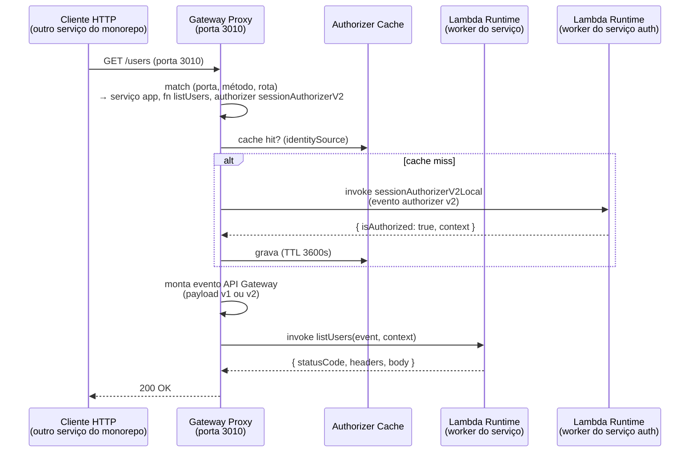

# PRD — Emulação de API Gateway e Runtime de Lambdas (substituição do serverless-offline)

| | |
|---|---|
| **Status** | Proposta |
| **Data** | 2026-07-08 |
| **Área** | Orquestrador (server + UI), plugin `serverless-lss`, `LssClient`, CLI |
| **Docs relacionados** | [README.md](README.md) (proposta original do orquestrador), [FEATURES.md](FEATURES.md), [CONFIGURATION.md](CONFIGURATION.md) |

---

## 1. Contexto e problema

O LSS nasceu para eliminar o custo de cada microserviço do monorepo subir seu próprio LocalStack: um único control plane provisiona DynamoDB, SQS, SNS e S3 a partir do CloudFormation template gerado pelo `sls package`. Isso resolveu o lado **assíncrono/dados** do desenvolvimento local.

O lado **síncrono** continua caro: cada módulo ainda precisa de um processo `serverless offline` próprio para expor as APIs HTTP e o endpoint de invoke de Lambda. Num monorepo com 15+ microserviços isso significa 15+ processos Node pesados (cada um com seu bootstrap do Serverless Framework, seus watchers e seu build), consumindo memória e CPU mesmo para serviços que o desenvolvedor não está tocando.

Hoje o serverless-offline é inclusive uma **dependência estrutural** do LSS: os Lambda proxies gerados no LocalStack encaminham eventos de SQS/Streams/S3 via HTTP para o endpoint de invoke do serverless-offline (`POST /2015-03-31/functions/{name}/invocations` na `lambdaPort`).

**Este PRD propõe o próximo passo natural do LSS**: o próprio orquestrador registrar os endpoints e Lambdas de cada serviço (a partir dos artefatos do `sls package`, como já faz com os demais recursos), expor as APIs em múltiplas portas via um proxy leve e executar os handlers diretamente — tornando o serverless-offline opcional e, na prática, substituível.

### Por que agora

- A proposta original ([README.md](README.md), "Ponte de execução") já previa "carregar e invocar .zip ou source" diretamente; a implementação foi pelo caminho proxy → serverless-offline por pragmatismo. A base (parser de CFN, cache de serviços, ProcessManager, auto-package) já existe.
- A decisão original de **ignorar API Gateway no parse** ("não útil localmente") era correta quando o serverless-offline cobria HTTP. Ao assumir esse papel, o API Gateway passa a ser útil localmente e a decisão se inverte.
- O contrato de rede já está definido: os proxies do LocalStack postam no invoke endpoint padrão da AWS. Se o LSS atender nessa mesma porta com a mesma API, **os event source mappings existentes continuam funcionando sem nenhuma alteração**.

## 2. Objetivos

1. **Registrar** todas as funções Lambda e rotas HTTP (REST API v1 e HTTP API v2 do API Gateway) de cada serviço no momento do `sls package`, sem manifest customizado — usando os artefatos que o Serverless Framework já gera em `.serverless/`.
2. **Expor as APIs em múltiplas portas** (uma porta 30xx por serviço, preservando as portas que o monorepo já usa) através de um proxy multi-porta dentro do próprio orquestrador — nenhuma chamada existente no monorepo precisa mudar.
3. **Executar os handlers** localmente (TypeScript e JavaScript), com variáveis de ambiente, timeout e `context` fiéis ao Lambda real.
4. **Expor o invoke de Lambda** compatível com a AWS (`POST /2015-03-31/functions/{name}/invocations`) em uma porta 130xx por serviço — todo Lambda registrado é invocável, mesmo os que não têm evento HTTP (agendados, consumidores de fila etc.).
5. **Suportar Lambda authorizers** (`request`, payload 1.0 e 2.0, `enableSimpleResponses`, cache por `resultTtlInSeconds`), inclusive quando o authorizer vive em **outro serviço** do monorepo.
6. **UI**: novos menus **Lambdas** e **APIs** no dashboard, mostrando o que está registrado, online e invocável.
7. **Hot reload**: alterações no fonte de um serviço registrado atualizam o Lambda no LSS automaticamente.

### Não-objetivos (desta iteração)

- **Emulação de triggers agendados** (`schedule`/EventBridge cron): fica em TODO — mas os Lambdas agendados **são registrados e invocáveis** manualmente (UI, invoke API, `LssClient`).
- WebSocket APIs (`websocket` events).
- Integrações não-proxy do API Gateway (templates VTL, mocks, integrações HTTP), API keys/usage plans, request validators, custom domains.
- Authorizers JWT (`type: jwt` do HTTP API) e Cognito — futuro; o escopo aqui são Lambda authorizers.
- Emular limites de payload/quotas do API Gateway.

## 3. Visão geral da solução

Três blocos novos no orquestrador, mais extensões no plugin, na UI e no `LssClient`:

1. **Function & Route Registry** (control plane): o parser passa a extrair funções + eventos HTTP + authorizers dos artefatos do `sls package`. O registro fica no cache de serviços existente (`~/.lss/orchestrator/cache/<service>/`).
2. **Lambda Runtime** (data plane): um worker Node leve por serviço carrega e executa os handlers (artefato compilado ou source), com env/timeout/context fiéis.
3. **Gateway Proxy multi-porta** (data plane): o orquestrador abre, por serviço, a porta de API (30xx) falando "API Gateway" e a porta de invoke (130xx) falando "AWS Lambda Invoke API".



O fluxo de eventos assíncronos existente **não muda**: os Lambda proxies do LocalStack continuam postando em `http://host.docker.internal:<invokePort>/2015-03-31/functions/{name}/invocations` — só que agora quem responde nessa porta é o LSS Lambda Runtime, não o serverless-offline.

```
ANTES  msg SQS → LocalStack ESM → proxy Lambda → HTTP invoke :13010 → serverless-offline → handler
DEPOIS msg SQS → LocalStack ESM → proxy Lambda → HTTP invoke :13010 → LSS Lambda Runtime → handler
```

## 4. Requisitos funcionais

### RF1 — Registro de funções e rotas no `sls package`

- **RF1.1**: Ao rodar `sls package` (hook `after:package:finalize` já existente), o serviço é registrado com **todas** as suas funções Lambda: nome curto, nome completo (`{service}-{stage}-{fn}`), handler, runtime, memória, timeout, env vars e triggers.
- **RF1.2**: Eventos `http` (REST API / payload v1) e `httpApi` (HTTP API / payload v2) são extraídos com método, path, cors e referência de authorizer. `ANY` e paths greedy (`{proxy+}`, `$default`) são suportados.
- **RF1.3**: Authorizers declarados no serviço (em `provider.httpApi.authorizers` para v2; inline no evento `http` para v1) são registrados com `type`, `identitySource`, `resultTtlInSeconds`, `enableSimpleResponses`, `payloadVersion` e o alvo (`functionName` local ou `arn` externo).
- **RF1.4**: Fonte de verdade continua sendo os artefatos do `sls package` — sem manifest customizado. O parser lê `.serverless/serverless-state.json` (funções, eventos e authorizers com variáveis resolvidas) em conjunto com o `cloudformation-template-update-stack.json` já usado hoje (recursos, env vars, nomes completos).
- **RF1.5**: O plugin passa a enviar também a porta de API do serviço (`apiPort`), com a mesma estratégia de descoberta do `invokePort` (ver §5.12). Payloads antigos (sem `apiPort`) continuam aceitos.
- **RF1.6**: Re-registro é idempotente e faz diff: rotas/funções removidas do serverless.yml somem do registry; portas alteradas fazem rebind dos listeners.

### RF2 — Lambda Runtime (execução de handlers TS/JS)

- **RF2.1**: Cada serviço registrado ganha um **worker process** dedicado que carrega e executa handlers sob demanda (lazy, com cache de módulo — "warm start").
- **RF2.2**: Estratégia de resolução de handler configurável (`execution`):
  - **`artifact`**: extrai o `.zip` gerado pelo `sls package` (cacheado em `~/.lss/orchestrator/runtime/<service>/`) e faz `require` do handler compilado. Funciona uniformemente para TS e JS, pois bundlers (serverless-esbuild/webpack) já emitiram JS.
  - **`source`**: `require` direto do source no `servicePath`. Para handlers `.ts`, registra um loader (`esbuild-register`/`tsx`) no worker. Melhor para hot reload (sem repackage).
  - **`auto`** (padrão): `artifact` se o artefato existir e estiver atualizado; senão `source`.
- **RF2.3**: Env vars do handler = `provider.environment` + `functions.<fn>.environment` (do CFN/state), aplicadas no worker do serviço. Um worker por serviço garante isolamento de env entre serviços (funções do mesmo serviço compartilham processo — mesmo comportamento do serverless-offline).
- **RF2.4**: `context` fiel: `functionName` (completo), `functionVersion: '$LATEST'`, `memoryLimitInMB`, `awsRequestId`, `getRemainingTimeInMillis()`, `invokedFunctionArn` sintético.
- **RF2.5**: Timeout do `functions.<fn>.timeout` (ou default do provider) é aplicado; estouro responde com erro no formato Lambda (`Task timed out after N seconds`) sem derrubar o worker.
- **RF2.6**: `console.*` do handler é capturado por invocação (ring buffer, como o log de processos atual) e exposto na UI/API.
- **RF2.7**: Crash do worker não derruba o orquestrador; o worker é reiniciado e o status do serviço reflete o erro.

### RF3 — Invoke API (porta 130xx)

- **RF3.1**: Por serviço, o orquestrador abre um listener na `invokePort` implementando `POST /2015-03-31/functions/{functionName}/invocations` (aceita nome curto e nome completo).
- **RF3.2**: Header `X-Amz-Invocation-Type` honrado: `RequestResponse` (200, resposta síncrona), `Event` (202, fire-and-forget), `DryRun` (204). Erro de handler → 200 com header `X-Amz-Function-Error: Unhandled` e payload de erro no formato Lambda (compatível com AWS SDK).
- **RF3.3**: **Todo** Lambda registrado é invocável por essa porta — incluindo os sem evento HTTP (agendados, consumidores). É o mesmo contrato que os Lambda proxies do LocalStack já usam, garantindo compatibilidade sem mudanças no provisioner.
- **RF3.4**: Invocação também disponível pela API do orquestrador (`POST /api/lambdas/:name/invoke`) para UI, `LssClient` e testes.

### RF4 — Gateway Proxy multi-porta (porta 30xx)

- **RF4.1**: Por serviço com rotas HTTP registradas, o orquestrador abre um listener na `apiPort` do serviço. Um único processo Node atende todas as portas — é isso que mantém o sistema leve.
- **RF4.2**: Roteamento por (porta → serviço, método, path): segmentos literais têm precedência sobre `{param}`, que têm precedência sobre `{proxy+}`/`$default`. Sem match → 404 com corpo explicativo (`{"message":"Not Found"}` + log com rotas candidatas).
- **RF4.3**: Evento montado conforme o tipo do evento de origem: `http` → payload **v1.0** (REST API: `httpMethod`, `multiValueHeaders`, `requestContext.identity` etc.); `httpApi` → payload **v2.0** (`routeKey`, `rawPath`, `cookies`, `requestContext.http` etc.).
- **RF4.4**: Resposta mapeada com as regras reais: v1 exige `statusCode` (malformada → 502); v2 aplica *inferred response* (retorno sem `statusCode` → 200 com body JSON e `content-type: application/json`). `isBase64Encoded` respeitado nos dois sentidos (binários).
- **RF4.5**: CORS: preflight `OPTIONS` respondido a partir da config `cors` do evento/provider (como o serverless-offline faz hoje), para que front-ends locais continuem funcionando.
- **RF4.6**: Porta ocupada (ex.: serverless-offline ainda rodando para aquele serviço): o orquestrador loga, marca a API como `port-conflict` na UI e **não** falha o registro — convivência durante a migração é cenário de primeira classe.

### RF5 — Lambda authorizers

- **RF5.1**: Suporte a authorizer `request` para REST (v1) e HTTP API (v2, payload 1.0 e 2.0), e `token` para REST. Configurações espelham o serverless.yml (ver Apêndice A com os dois exemplos reais).
- **RF5.2**: `identitySource` extraído da requisição (`method.request.header.X` no v1; `$request.header.x` no v2). Fonte ausente → 401 imediato (sem invocar o authorizer), como na AWS.
- **RF5.3**: Resposta do authorizer interpretada conforme o modo: policy IAM (v1 e v2 payload 1.0) com efeito Allow/Deny; *simple response* `{isAuthorized, context}` quando `enableSimpleResponses: true`. Negado → 403 `{"message":"Forbidden"}`. `context` + `principalId` propagados em `requestContext.authorizer` (v1) / `requestContext.authorizer.lambda` (v2).
- **RF5.4**: Cache por `resultTtlInSeconds`: chave = (serviço, authorizer, valores do identitySource), armazenado em memória com expiração. Endpoint para limpar o cache (essencial em testes e2e: trocar de usuário sem esperar TTL).
- **RF5.5**: **Resolução cross-service**: authorizer referenciado por `arn` (ex.: `arn:aws:lambda:...:function:authenticate-dev-sessionAuthorizer`) é resolvido no registry global pelo nome completo da função — funciona porque o LSS enxerga todos os serviços registrados. Isso resolve uma limitação real do serverless-offline no monorepo (cada instância só enxerga as próprias funções). Não resolvido → 500 com mensagem apontando qual serviço precisa ser registrado.

### RF6 — UI: menus Lambdas e APIs

- **RF6.1**: Novo item de navegação **Lambdas** (`/lambdas`): tabela com nome (curto + completo em `.mono`), serviço (link), runtime, handler, triggers (tags: HTTP, SQS, Stream, S3, Schedule, —), status (badge: `online` quando o worker do serviço está de pé; `registered` quando registrado sem runtime; `error`), contadores de invocações/erros.
- **RF6.2**: Detalhe do Lambda (`/lambdas/:name`): abas **Invoke** (editor JSON de payload, botão invocar, resultado + logs da invocação), **Triggers**, **Env**, **Logs** — seguindo o padrão `?tab=` existente.
- **RF6.3**: Novo item **APIs** (`/apis`): rotas agrupadas por serviço, com badge da porta e status do listener (`online` / `port-conflict` / `stopped`); colunas: método (badge), path (`.mono`), Lambda alvo (link), authorizer (tag), payload (v1/v2). Ação "copiar como curl".
- **RF6.4**: Overview ganha totalizadores: Lambdas online e rotas expostas.
- **RF6.5**: Página do serviço ganha controles do runtime (start/stop do worker + listeners) e os cards de Lambdas/rotas do serviço.

### RF7 — Hot reload

- **RF7.1**: Com `watch` habilitado, o LSS observa o source do serviço registrado (globs derivados dos handlers + `serverless.yml`), com debounce.
- **RF7.2**: Mudança de handler em modo `source`: invalida o cache de módulos do worker (restart do worker — barato, workers são leves). Em modo `artifact`: dispara re-package via o `serverless-packager` existente (respeitando `packageCommand`/`packageArgs`/`packageEnv` por serviço) e re-registra.
- **RF7.3**: Mudança no `serverless.yml`: re-package + re-registro completo (rotas/authorizers/env atualizados), reusando o fluxo de `autoPackage`.
- **RF7.4**: UI mostra `lastReloadAt` e status de reload (ok/erro com log) por serviço.

## 5. Design técnico

### 5.1 Fonte de verdade: artefatos do `sls package`

Princípio mantido da proposta original: **nenhum manifest customizado**. Dois arquivos de `.serverless/`:

| Arquivo | Já usado? | O que passa a fornecer |
|---|---|---|
| `cloudformation-template-update-stack.json` | ✅ (recursos) | `AWS::Lambda::Function` (nome completo, handler, runtime, env, memória, timeout) — o parser já extrai isso hoje em `parseLambda()`; passa a ser usado de fato |
| `serverless-state.json` | ❌ novo | `service.functions` com `events` (`http`/`httpApi`) e `provider.httpApi.authorizers`, com variáveis já resolvidas — a forma declarativa dos eventos, muito mais simples que reconstruir rotas a partir de `AWS::ApiGateway::Resource/Method` |

Racional: reconstruir rotas REST a partir do grafo CFN (`RestApi → Resource → Method → Integration`) é possível mas frágil; o `serverless-state.json` entrega exatamente a semântica do serverless.yml que o desenvolvedor escreveu, já resolvida. O CFN continua canônico para recursos e para o nome completo das funções.

### 5.2 Registro (plugin + rota `/register`)

**Plugin** (`packages/serverless-plugin`): payload estendido de forma retrocompatível —

```jsonc
POST /api/services/register
{
  "servicePath": "/repo/services/app",
  "invokePort": 13010,          // já existe
  "apiPort": 3010,              // NOVO
  "region": "us-east-1"         // já existe
}
```

Descoberta das portas no plugin (precedência): `custom.lss.{apiPort,invokePort}` → `custom['serverless-offline'].{httpPort,lambdaPort}` (drop-in para quem já usa offline) → ausente (o servidor aplica a regra de offset, §6). Erros continuam **não-bloqueantes** (packaging nunca falha por causa do orquestrador).

**Servidor** (`routes/services.ts` + `cloudformation-parser.ts`): o parse passa a produzir, além dos recursos atuais, `functions[]` e `httpRoutes[]`/`authorizers[]`, persistidos no `metadata.json` do cache existente. `ServiceMetadata` ganha `apiPort`, `functions`, `routes`, `authorizers`, `runtimeStatus`.

### 5.3 Registry em runtime

Novo singleton `FunctionRegistry` (padrão `getInstance()` como os demais): mapas em memória reconstruídos do cache no boot —

- `porta → serviço` (para o Gateway Proxy e para o Invoke listener)
- `serviço → rotas ordenadas por especificidade`
- `nome (curto | completo | arn) → função` (global, cross-service — usado pelo invoke e pelos authorizers)

Reidratado no start do orquestrador (mesma estratégia do `CacheManager` hoje: cache em disco sobrevive a restart; listeners e workers sobem de novo).

### 5.4 Lambda Runtime (workers)

Novo serviço `LambdaRuntimeManager` + script `runtime-worker`:

- `child_process.fork(runtime-worker.js)` por serviço, `cwd = servicePath`, `env = provider.environment` (+ `AWS_ENDPOINT`/credenciais dummy se o serviço já os define, como nos examples).
- Protocolo IPC: `{invokeId, functionName, handlerRef, event, contextSpec, deadlineMs}` → `{invokeId, ok, payload | errorShape, logs[], durationMs}`.
- Worker resolve o handler (estratégias do RF2.2), cacheia o módulo, executa com `Promise.race` contra o deadline, captura `console.*` no escopo da invocação.
- Overrides por função de `environment` (v1: aplicados por invocação via snapshot/restore de `process.env` no worker; limitação documentada para invocações concorrentes com env conflitante — mesma classe de limitação do serverless-offline).
- Estratégia `artifact`: extração do zip com `adm-zip` (dependência já presente) para `~/.lss/orchestrator/runtime/<service>/<hash>/`; `package.individually` suportado (um zip por função).
- Estratégia `source`: loader TS opcional; se `esbuild-register`/`tsx` não estiver disponível no serviço nem no LSS, erro claro com instrução.

### 5.5 Invoke listener (porta 130xx)

Servidor HTTP mínimo (`node:http`, sem Express — mesma linha do dynamo-proxy) por `invokePort`:

- `POST /2015-03-31/functions/:name/invocations` → `FunctionRegistry` → `LambdaRuntimeManager.invoke()`.
- Semântica AWS: `X-Amz-Invocation-Type`, `X-Amz-Function-Error`, `X-Amz-Log-Result` (base64 dos logs, útil para debug via SDK).
- Compatibilidade dupla comprovada pelo código atual: é exatamente o endpoint que `generateProxyLambdaCode` já usa nos proxies do LocalStack — a troca serverless-offline → LSS runtime é transparente para o lado de eventos.

### 5.6 Gateway Proxy (porta 30xx)

Servidor HTTP (`node:http`) por `apiPort`, todos no processo do orquestrador:

- Pipeline: `match rota` → `authorizer (se houver)` → `montar evento v1/v2` → `invoke via LambdaRuntimeManager` → `mapear resposta`.
- Matching: tabela de rotas compilada por serviço (segmentação por `/`, ranking literal > `{param}` > `{proxy+}`; método exato > `ANY`; v2 `$default` por último).
- Montagem de eventos e mapeamento de respostas centralizados em `api-gateway-event.ts` (v1) e `api-gateway-event-v2.ts` (v2) — puros e unit-testáveis.
- `requestId` gerado por requisição e propagado para logs (correlação UI).

### 5.7 Authorizers

Novo `AuthorizerService`:

- Config normalizada no registro (v1 inline no evento; v2 em `provider.httpApi.authorizers`).
- Execução: monta o evento de authorizer conforme `type`/`payloadVersion`, invoca via `FunctionRegistry` (resolução local → global por nome completo extraído do ARN), interpreta policy ou simple response.
- Cache: `Map<cacheKey, {expiresAt, result}>`; `resultTtlInSeconds: 0` desliga o cache; `POST /api/apis/authorizer-cache/clear` (global ou `?service=`/`?authorizer=`) para testes.
- Falha do authorizer (erro/timeout) → 500 `{"message":"Internal Server Error"}` no v1, 500 no v2 — nunca "falha aberta".

### 5.8 Hot reload

Novo `SourceWatcher` (chokidar):

- Escopo observado: diretórios dos handlers (derivados de `functions[].handler`) + `serverless.yml` + `package.json`; ignora `node_modules`, `.serverless`, `.esbuild`.
- Debounce (default 500ms). Ação conforme §RF7.2/RF7.3. Serializa reload por serviço (sem corridas com invocações em andamento: o worker antigo drena e morre).
- Config `watch` global e por serviço; default `true` em modo `source`, `false` em modo `artifact` (repackage é caro; o dev pode preferir disparar `sls package` manualmente, que já re-registra via plugin).

### 5.9 UI

Segue os padrões existentes (TreeUI, polling com `setInterval`, `api.ts` central):

- `api.ts`: tipos + métodos `lambdas.*`, `apis.*`.
- Componentes: `components/lambdas/LambdasList.vue`, `LambdaDetail.vue` (abas via `?tab=`), `components/apis/ApisView.vue`; páginas finas em `pages/`; rotas lazy no `router.ts`; `TTab` novos no `App.vue`.
- Badges: `online → success`, `registered → warning`, `port-conflict → warning`, `error → danger`, `stopped → neutral` (mesma paleta de `statusTone()`).
- Polling: listas 10s; detalhe do Lambda sem polling (refresh manual + pós-invoke).

### 5.10 API HTTP do orquestrador (novos endpoints)

| Método/Rota | Propósito |
|---|---|
| `GET /api/lambdas` | Lista global: nome, serviço, runtime, handler, triggers, status, métricas |
| `GET /api/lambdas/:name` | Detalhe (aceita nome curto ou completo) |
| `POST /api/lambdas/:name/invoke` | `{payload?, invocationType?}` → `{ok, payload, functionError?, logs, durationMs}` |
| `GET /api/lambdas/:name/logs` | Ring buffer de logs de invocação |
| `GET /api/apis` | Rotas agrupadas por serviço + status dos listeners |
| `POST /api/apis/authorizer-cache/clear` | Limpa cache de authorizers (`?service=`, `?authorizer=`) |
| `POST /api/services/:name/runtime/start` / `stop` | Sobe/derruba worker + listeners do serviço |
| `GET /api/services/:name/runtime` | Status do runtime (worker pid, portas, uptime, lastReloadAt) |

`GET /api/services` e `GET /api/services/:name` passam a incluir contagem de funções/rotas e `runtimeStatus`.

### 5.11 LssClient

Novos namespaces (HTTP, mesmos padrões de `http.ts`):

```ts
lss.lambdas.list(); lss.lambdas.get(name);
lss.lambdas.invoke(name, { payload, invocationType });   // e2e: dispara agendados/consumidores diretamente
lss.lambdas.logs(name);
lss.apis.list();
lss.apis.clearAuthorizerCache({ service?, authorizer? }); // e2e: troca de sessão sem esperar TTL
lss.services.runtime(name); lss.services.startRuntime(name); lss.services.stopRuntime(name);
```

### 5.12 Configuração

`lss.config.json` (tudo opcional, defaults sensatos):

```jsonc
{
  "lambdaRuntime": {
    "enabled": true,            // liga runtime + listeners no registro
    "execution": "auto",        // auto | artifact | source
    "watch": true,              // hot reload (ver §5.8 para defaults por modo)
    "invokePortOffset": 10000   // apiPort 30xx → invokePort 130xx
  },
  "serviceRuntime": {
    "app": { "apiPort": 3010, "invokePort": 13010, "execution": "source" },
    "auth": { "apiPort": 3011, "invokePort": 13011, "watch": false }
  }
}
```

Precedência de portas por serviço: `serviceRuntime` (config) → payload do plugin (`custom.lss` → `custom.serverless-offline`) → `invokePort = apiPort + invokePortOffset`. Env overrides: `LSS_LAMBDA_RUNTIME`, `LSS_LAMBDA_EXECUTION`, `LSS_LAMBDA_WATCH` (padrão dos demais).

`serverless.yml` do serviço:

```yaml
custom:
  lss:
    apiPort: 3010       # opcional; cai para serverless-offline.httpPort
    invokePort: 13010   # opcional; cai para serverless-offline.lambdaPort
```

## 6. Convenção de portas

Formaliza a convenção do monorepo: **API em 30xx, invoke no equivalente 130xx** (offset 10000).

| Serviço | API (Gateway Proxy) | Invoke (Lambda Runtime) |
|---|---|---|
| app | 3010 | 13010 |
| auth | 3011 | 13011 |

O offset é configurável (`invokePortOffset`) e qualquer porta pode ser fixada explicitamente. Portas do próprio LSS (3100 dashboard, 4566 LocalStack, 8000 dynamo-proxy) não mudam.

## 7. Compatibilidade e migração

- **Opt-in por serviço**: com `lambdaRuntime.enabled: false` (ou sem `apiPort`/rotas), nada muda — o LSS segue como hoje (proxies → serverless-offline). Um serviço migra simplesmente **deixando de subir o serverless-offline**; o LSS já ocupa as mesmas portas com os mesmos contratos.
- **Convivência**: durante a migração, serviços em serverless-offline e serviços no LSS runtime coexistem; conflito de porta é sinalizado, não fatal (RF4.6).
- **Chamadas do monorepo**: zero mudanças — mesmas portas, mesmos paths, mesmo invoke API.
- **Event source mappings**: zero mudanças no provisioner (§5.5).
- **Rollback**: parar o runtime do serviço (UI/API) e subir o serverless-offline de volta.

## 8. Fases de entrega

| Fase | Entrega | Critério de aceite |
|---|---|---|
| **1. Registry** | Parser lê `serverless-state.json`; plugin envia `apiPort`; cache persiste funções/rotas/authorizers; `GET /api/lambdas` e `GET /api/apis` (read-only) | `sls package` num example registra 9 funções e rotas visíveis via API |
| **2. Lambda Runtime + Invoke** | Workers por serviço, estratégias `artifact`/`source`/`auto`, listener 130xx, `POST /api/lambdas/:name/invoke` | Proxies de SQS/Stream/S3 do LocalStack funcionam **sem serverless-offline rodando**; invoke manual ok em serviço TS e JS |
| **3. Gateway Proxy** | Listeners 30xx, matching, payloads v1 e v2, mapeamento de respostas, CORS, `port-conflict` | `curl` nas rotas do example responde igual ao serverless-offline (paridade validada nos testes de integração) |
| **4. Authorizers** | `request`/`token`, payload 1.0/2.0, simple responses, cache TTL + clear, resolução cross-service | Os dois exemplos do Apêndice A funcionam, incluindo authorizer de outro serviço |
| **5. UI** | Menus Lambdas e APIs, detalhe com invoke/logs, controles de runtime no serviço, stats no Overview | Fluxo completo operável pelo dashboard |
| **6. Hot reload** | SourceWatcher, reload em `source` e `artifact`, status na UI | Editar um handler reflete na próxima chamada sem passos manuais |
| **7. Docs & client** | `LssClient` (§5.11), FEATURES.md, CONFIGURATION.md, README, example atualizado com fluxo sem serverless-offline | FEATURES.md com "Asserted by" preenchido para cada promessa |

Fases 1–2 já entregam valor sozinhas (invoke universal + independência dos proxies); 3–4 completam a substituição.

## 9. Testes

Seguindo o contrato do projeto (toda feature prometida entra em [FEATURES.md](FEATURES.md) com "Asserted by"):

- **Unit**: parser de `serverless-state.json` (rotas, authorizers, edge cases: `ANY`, `{proxy+}`, `$default`, cors); montagem de eventos v1/v2 e mapeamento de respostas (fixtures comparadas com payloads reais da AWS); matching de rotas (precedência); authorizer (policy Allow/Deny, simple response, cache TTL, identitySource ausente); resolução de portas; `FunctionRegistry` (nome curto/completo/arn).
- **Integration** (`features.test.ts`, instância isolada): registrar example → invocar via 130xx e via `/api/lambdas/:name/invoke`; `curl` em rota v1 e v2; authorizer com cache (2ª chamada não invoca o authorizer — assert por contador de invocações); authorizer cross-service com dois examples registrados; fluxo SQS→handler **sem serverless-offline**; hot reload (editar handler do example e re-assertar resposta).
- **Fixture novo**: um example TypeScript mínimo (os atuais são JS puro) com `httpApi` v2 + authorizer, para cobrir a matriz TS×JS / v1×v2.

## 10. Riscos e mitigação

| Risco | Mitigação |
|---|---|
| Fidelidade dos payloads do API Gateway (casos de borda: multiValue, base64, cookies v2) | Módulos de evento puros + fixtures capturadas da AWS real; paridade validada contra serverless-offline na fase 3 |
| Handlers TS sem artefato e sem loader disponível | Erro acionável (instrui instalar `esbuild-register` ou usar `execution: artifact`); `auto` prefere artifact |
| Dependências nativas / `node_modules` em modo `artifact` com externals | Fallback documentado: resolver módulos com `paths` incluindo `node_modules` do serviço |
| Env vars por função em worker compartilhado (invocações concorrentes) | Snapshot/restore por invocação + documentação da limitação (igual serverless-offline); serviços com conflito real podem isolar via `serviceRuntime` |
| Porta em uso (offline legado, outro processo) | Estado `port-conflict` visível na UI; registro nunca falha por isso |
| Worker vazando memória/estado entre invocações | Igual ao Lambda real (reuso de container é semântica esperada); restart manual pela UI e restart automático em crash |
| Divergência artefato × source (dev esqueceu de re-packagear em modo `artifact`) | UI mostra hash/timestamp do artefato vs source (`stale` badge); watch em modo artifact pode re-packagear |
| Escopo do parser de authorizers (variações do serverless.yml) | Escopo fechado nos formatos do Apêndice A (request/token, v1/v2); demais formatos → warning no registro, rota fica sem auth explícita e **retorna 500**, nunca falha aberta |

## 11. Métricas de sucesso

- **Memória**: N processos serverless-offline substituídos por 1 orquestrador + N workers leves; alvo: redução ≥ 60% de RSS agregado no monorepo de referência.
- **Zero mudanças** em chamadas HTTP e SDKs do monorepo (portas e contratos preservados).
- **Tempo de subida** do ambiente local completo (todas as APIs disponíveis) reduzido para segundos após `lss start` (registros vêm do cache).
- **Paridade**: suíte de paridade v1/v2 verde contra o comportamento do serverless-offline nos examples.

## 12. Futuro (fora deste PRD)

- **Triggers agendados** (`schedule`/`rate`/`cron`): emulação de disparo periódico pelo orquestrador (TODO assumido — os Lambdas já ficam invocáveis manualmente por UI/API/`LssClient`).
- Authorizers JWT (httpApi) e Cognito.
- WebSocket APIs.
- Invocação direta LocalStack proxy → runtime sem hop HTTP (otimização).
- Métricas por função (p50/p95, erros) no dashboard.
- `lss dev <service>`: atalho de CLI que registra + sobe runtime + watch em um comando.

---

## Apêndice A — Exemplos de authorizers suportados

**HTTP API (v2), request + simple response** (declarado em `provider.httpApi.authorizers`):

```yaml
sessionAuthorizerV2:
  type: request
  functionName: sessionAuthorizerV2Local   # função do próprio serviço
  identitySource:
    - $request.header.authorization
  resultTtlInSeconds: 3600
  enableSimpleResponses: true
  payloadVersion: '2.0'
```

→ LSS extrai `authorization` do header; cache key = valor do header; espera `{isAuthorized, context}`.

**REST API (v1), request + ARN cross-service** (declarado no evento `http` da função):

```yaml
authorizer:
  name: sessionAuthorizer
  arn: arn:aws:lambda:${self:provider.region}:${self:custom.accountId}:function:authenticate-${self:provider.stage}-sessionAuthorizer
  type: request
  identitySource: method.request.header.code
  resultTtlInSeconds: 3600
```

→ LSS resolve `authenticate-{stage}-sessionAuthorizer` no registry global (serviço `authenticate` precisa estar registrado); extrai o header `code`; espera policy IAM; propaga `principalId` + `context` em `requestContext.authorizer`.

## Apêndice B — Formas de invocar um Lambda registrado

| Canal | Quem usa | Contrato |
|---|---|---|
| `POST :130xx/2015-03-31/functions/{name}/invocations` | AWS SDK, LocalStack proxies, scripts existentes | AWS Lambda Invoke API |
| `POST /api/lambdas/:name/invoke` | UI, `LssClient`, testes | JSON simples com logs e duração |
| Rotas HTTP nas portas 30xx | Serviços do monorepo, front-ends | HTTP normal (API Gateway emulado) |
| Event source mappings (SQS/Streams/S3) | Fluxo assíncrono | Inalterado — proxies do LocalStack |
