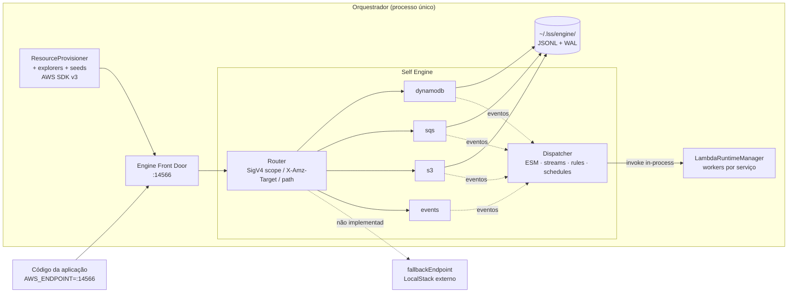

# PRD — Self Engine: emulação AWS nativa no orquestrador (substituição do LocalStack)

| | |
|---|---|
| **Status** | Proposta |
| **Data** | 2026-07-10 |
| **Área** | Orquestrador (server + UI), CLI, `LssClient`, testes |
| **Docs relacionados** | [PRD_API_LAMBDA_EMULATION.md](PRD_API_LAMBDA_EMULATION.md) (runtime de Lambda + API Gateway — entregue), [README.md](README.md) (proposta original), [FEATURES.md](FEATURES.md), [CONFIGURATION.md](CONFIGURATION.md) |

---

## 1. Contexto e problema

O LSS já eliminou dois pesos do desenvolvimento local: cada serviço não sobe mais seu próprio LocalStack (o control plane provisiona tudo a partir do CloudFormation), e o serverless-offline foi substituído pelo runtime de Lambda + emulação de API Gateway nativos ([PRD anterior](PRD_API_LAMBDA_EMULATION.md), hoje implementado — FEATURES.md §12).

Sobrou o maior peso de todos: **o próprio LocalStack**.

- **Custo de hardware**: um container Docker com Python + dezenas de serviços emulados, consumindo centenas de MB de RAM e CPU constante — para servir, na prática, DynamoDB, SQS, SNS, S3 e EventBridge em escala de desenvolvimento (10²–10⁴ itens).
- **Custo financeiro**: imagens community `>= 2026.5` **exigem auth token**; recursos PRO são pagos. A dependência deixou de ser "grátis por padrão".
- **Custo operacional**: exige Docker instalado e rodando (WSL2, CI, máquinas corporativas restritas); o LocalStack real intercepta as portas 4566–4599 em alguns setups, causando roteamento silencioso errado; os Lambda proxies gerados sofrem cold start e dependem de `host.docker.internal`.
- **Latência de boot**: subir container + healthcheck + provisionamento leva dezenas de segundos; a engine própria deve bootar em < 500 ms.

**Este PRD propõe a `self engine`**: um modo opt-in (`lss start --self-engine`) em que o orquestrador — o mesmo processo Node único de hoje — resolve os recursos AWS por conta própria. Ele continua recebendo os CloudFormation templates via `POST /api/services/register`, mas em vez de traduzi-los em chamadas SDK contra o LocalStack, atende ele mesmo as APIs da AWS: criar uma tabela DynamoDB vira metadado + arquivo local; inserir um item vira um append em disco; uma mensagem SQS é entregue ao handler **in-process**, sem proxy, sem Docker, sem container.

**Prioridade explícita: leveza, não velocidade.** A engine não precisa ser a mais rápida — precisa consumir o mínimo de RAM e CPU, hidratar dados sob demanda e devolver memória quando ociosa.

### Por que agora

- O runtime de Lambda nativo já existe e é o destino natural dos eventos: o dispatcher da engine pode chamar `LambdaRuntimeManager.invoke()` **in-process**, eliminando o hop HTTP e os Lambda proxies — exatamente o item "invocação direta LocalStack proxy → runtime sem hop HTTP" listado como futuro no PRD anterior.
- Todo o tráfego SDK interno do LSS (provisioner, explorers, seeds, dynamo-proxy) já converge para um único ponto: `LocalStackManager.getConfig()` ([localstack-manager.ts:211](../src/server/services/localstack-manager.ts#L211)). Trocar o endpoint carrega todos os consumidores de uma vez.
- A suíte de integração hoje é **bloqueada por token** (`LOCALSTACK_AUTH_TOKEN`) no CI. Com a engine própria, a suíte roda em qualquer PR, sem Docker e sem secret.

## 2. Objetivos

1. **Modo de engine selecionável**: `engine: "localstack" | "self"` na config (env `LSS_ENGINE`, CLI `--self-engine`). LocalStack continua sendo o default até a paridade ser comprovada; nada muda para quem não opta.
2. **Front door AWS único**: uma porta (default **14566**) servindo os protocolos de DynamoDB, SQS, SNS, S3, EventBridge, Lambda (control plane) e STS — de forma que **o código de aplicação com AWS SDK aponte `AWS_ENDPOINT` para a engine e funcione sem modificação**, e os próprios explorers/seeds/provisioner do LSS funcionem inalterados.
3. **DynamoDB fiel e leve**: tabelas como metadado; itens em arquivo local (JSONL snapshot + WAL); linguagem de expressões completa (KeyCondition, Filter, Update, Condition, Projection); GSI/LSI respondidos com semântica correta.
4. **Eventos in-process**: SQS→Lambda, DynamoDB Streams→Lambda, notificações S3 e regras/schedules EventBridge entregues direto ao runtime nativo — sem Lambda proxies, sem polling ocioso.
5. **Registro lazy**: registrar um serviço grava só metadados (KB); dados hidratam no primeiro acesso e desidratam após ociosidade, sob um orçamento de memória com LRU.
6. **Fallback transparente**: `fallbackEndpoint` opcional encaminha, verbatim, qualquer serviço/operação não implementado para um LocalStack externo — adoção gradual desde a primeira fase.
7. **Paridade comprovada**: suíte diferencial (mesmos testes contra self e LocalStack) + fixtures douradas gravadas contra a AWS real; cada promessa entra no FEATURES.md com "Asserted by".

### Não-objetivos (travados)

- Verificação de assinatura SigV4, IAM/políticas, multi-account (conta fixa `000000000000`), STS além de `GetCallerIdentity`.
- Kinesis, Step Functions, Secrets Manager/SSM, Cognito, CloudFormation API, PartiQL, backup/export de DynamoDB.
- Assinaturas SNS→HTTP; S3 multipart antes da fase de hardening; simulação de capacidade/throttling.
- **Remover o modo LocalStack** — ele permanece para quem precisa de serviços fora do escopo da engine.

## 3. Visão geral da solução

**A API wire da AWS é o seam.** Como o front door é obrigatório de qualquer forma (requisito: SDKs da aplicação sem modificação), ele vira **o único ponto de troca**: o provisioner, os explorers e o seed manager continuam usando AWS SDK v3 normalmente — apenas apontados para a engine. Nenhum código de provisionamento é duplicado; qualquer divergência de comportamento é, por construção, um bug da engine detectado pelo uso diário.



O fluxo assíncrono, antes e depois:

```
ANTES  msg SQS → LocalStack ESM → proxy Lambda (container) → HTTP invoke :130xx → LSS Lambda Runtime → handler
DEPOIS msg SQS (engine) → dispatcher in-process → LambdaRuntimeManager.invoke() → handler
```

Os Lambda proxies são **absorvidos, não removidos**: a engine aceita `CreateFunction`/`AddPermission`/`CreateEventSourceMapping` como operações de metadado (o zip é descartado, o env `INVOKE_URL` é guardado). O provisioner fica byte-idêntico nos dois modos, e o `INVOKE_URL` armazenado dobra como fallback HTTP para serviços que ainda rodem serverless-offline.

## 4. Requisitos funcionais

### RF1 — Seleção de engine

- **RF1.1**: `engine: "self"` na config (ou `LSS_ENGINE=self`, ou `lss start --self-engine`) sobe a engine em vez do LocalStack. Flags contraditórias (`--pro`, `--external`, `--localstack-token`) falham rápido com mensagem clara; chaves `localstack*` são ignoradas com warning único.
- **RF1.2**: Boot da engine em < 500 ms, sem Docker, sem healthcheck-polling. Código da engine carregado via `import()` dinâmico — no modo LocalStack, o RSS do orquestrador não muda um byte.
- **RF1.3**: A engine responde `GET /_localstack/health` com corpo no formato LocalStack (além de `GET /_lss/health`), para que `waitForReady`, o poll do CLI e tooling do usuário continuem funcionando. `GET /api/health` ganha `engine: {kind, running, port}`.

### RF2 — Front door e protocolos

- **RF2.1**: Roteamento por precedência: (1) escopo de credencial SigV4 do header `Authorization` → `{service, region}` (a região passa a vir da requisição, substituindo o global mutável `currentRegion` do provisioner); (2) `X-Amz-Credential` de URLs pré-assinadas; (3) prefixo de `X-Amz-Target` (`DynamoDB_20120810.`, `AmazonSQS.`, `AWSEvents.`); (4) `Action=` em form body — inclusive em paths de QueueUrl (SQS Query legado posta em `/000000000000/<fila>`); (5) heurística de path (`/2015-03-31/…` → Lambda; senão S3 path-style, com virtual-host peel como fallback).
- **RF2.2**: Operação/serviço não implementado: com `fallbackEndpoint` configurado → reverse proxy verbatim (streaming, sem bufferizar corpo); sem fallback → erro 400 no formato do protocolo, apontando a matriz de cobertura em `docs/SELF_ENGINE.md`. **Nunca sucesso silencioso.**
- **RF2.3**: Mecânicas de wire obrigatórias desde a v1 (sem elas os SDKs atuais quebram):
  - Decoder de **`aws-chunked`** com trailers CRC32 (SDK v3 ≥ 3.729 envia em todo `PutObject`; sem decodificar, todo upload corrompe).
  - Header **`x-amzn-query-error`** nos erros JSON de SQS (`QueueAlreadyExists;Sender` etc.) — o trait `awsQueryCompatible` do SDK v3 reescreve `err.name` a partir dele; a idempotência do provisioner depende dos nomes legados.
  - **`MD5OfMessageBody`/`MD5OfMessageAttributes`** no `SendMessage` (clientes validam e lançam erro em mismatch).
  - Serialização de erro por protocolo: JSON `{"__type":"…#ResourceInUseException"}`; Query `<ErrorResponse>`; S3 `<Error><Code>` com **HEAD sem corpo**; Lambda `{"Type":"User"}` + `x-amzn-ErrorType`. Toda resposta com `x-amzn-RequestId` (S3: `x-amz-request-id` + `x-amz-id-2`).
  - Quirks S3: elementos XML legados `CloudFunctionConfiguration`/`CloudFunction` na notification config; `GetBucketLocation` → `<LocationConstraint/>` vazio em us-east-1; ETags MD5 entre aspas; `SkipDestinationValidation` aceito silenciosamente.
- **RF2.4**: Contrato de erros como tabela testada (cada linha = um teste diferencial): `ResourceInUseException`, `ResourceNotFoundException`, `ValidationException` de TTL casando `/already (enabled|disabled)/i`, `ConditionalCheckFailedException`, `QueueNameExists` + header compat, `QueueDoesNotExist` (mensagem contém `NonExistentQueue`), `BucketAlreadyOwnedByYou`, `NoSuchBucket`/`NoSuchKey`, `ResourceConflictException`, `ResourceAlreadyExistsException`. ARNs idênticos aos que o provisioner monta à mão (conta `000000000000`; delete de SNS casa por `endsWith(':' + name)`).
- **RF2.5**: Stub STS `GetCallerIdentity` (~20 linhas) — muitos bootstraps de aplicação chamam antes de qualquer coisa e falham de forma confusa sem ele.

### RF3 — DynamoDB

- **RF3.1**: `CreateTable` com validação de KeySchema (HASH/HASH+RANGE, tipos S/N/B), GSI/LSI, `StreamSpecification`, `BillingMode`; `DescribeTable` com a shape completa que ORMs (dynamoose, onetable) introspectam — `TableStatus: ACTIVE` e `LatestStreamArn` presentes imediatamente (o retry 5×300 ms do provisioner passa na primeira).
- **RF3.2**: CRUD + `Query`/`Scan` com paginação (`ExclusiveStartKey`/`LastEvaluatedKey`, inclusive LEK de índice), `ScanIndexForward`, e a regra clássica de paridade: **`Limit` conta itens examinados antes do `FilterExpression`** (pinado por teste diferencial).
- **RF3.3**: Linguagem de expressões completa: Condition/Filter (comparadores, `BETWEEN`, `IN`, `AND/OR/NOT`, parênteses, `attribute_exists/_not_exists`, `attribute_type`, `begins_with`, `contains`, `size`), Update (`SET` com `+`/`-`/`if_not_exists`/`list_append`, `REMOVE`, `ADD`, `DELETE`), Projection com document paths (`a.b[0].c`), placeholders de nomes/valores com os erros da AWS para placeholder não usado/não definido. Aritmética de `N` em string decimal (sem drift de float).
- **RF3.4**: **GSI/LSI respondidos por scan da tabela base na v1** — velocidade não é objetivo; zero write amplification e zero superfície de bug de manutenção de índice (o clássico: item que muda de chave de índice no update). Semântica de projeção (KEYS_ONLY/INCLUDE) e índices esparsos aplicada na leitura. Índices materializados ficam como otimização futura atrás da mesma interface de query.
- **RF3.5**: TTL lazy: itens expirados filtrados na leitura e removidos na compactação (emitindo REMOVEs no stream) — zero timers.
- **RF3.6**: Não suportado responde erro explícito: transações (hardening — atômicas trivialmente com single-writer; o trabalho é a shape de `TransactionCanceledException`), `UpdateTable`, parâmetros legados (`KeyConditions`, `Expected` → `ValidationException` apontando o equivalente), PartiQL (nunca). `ConsistentRead`/`ReturnConsumedCapacity` aceitos (sempre consistente / zeros).

### RF4 — SQS e dispatcher

- **RF4.1**: Fila com contadores vivos (available, inFlight, delayed) — `GetQueueAttributes` reflete o estado real, mantendo o QueueInspector (`await-idle`, métricas) funcionando inalterado.
- **RF4.2**: `ReceiveMessage` com long-poll **event-driven** (promise estacionada acordada por mensagem visível — sem loop de polling); visibility timeout com um único timer por fila armado para o deadline mais próximo; FIFO com lock por MessageGroupId e janela de dedup.
- **RF4.3**: Entrega a Lambda via event source mapping **in-process**: batch ≤ `batchSize`, `maximumBatchingWindowInSeconds` honrado (timer só armado com mensagem pendente), evento `Records` fiel (receive counts, md5, eventSourceARN). Sucesso → delete; falha → redelivery por visibilidade (exatamente como a AWS — sem maquinaria própria de retry).
- **RF4.4**: `UpdateEventSourceMapping Enabled=false` **é** o hold do QueueInspector — hold/captured/release funcionam desde a fase P2.
- **RF4.5**: Resolução de destino no dispatcher: `FunctionRegistry.resolve(ref)` → invoke in-process; senão função metadata-only com `INVOKE_URL` armazenado → POST no formato AWS Invoke (serverless-offline remanescente continua funcionando); senão log + contador de falha. `RuntimeUnavailable` → retry com backoff limitado.
- **RF4.6**: Hardening: `RedrivePolicy`→DLQ (exige campo novo `redrivePolicy` no parser de CFN), `ReportBatchItemFailures`, `FilterCriteria` (reusa o matcher do EventBridge), serializer do protocolo Query legado (aws-sdk v2/boto3 antigo) — até lá, requisição Query recebe erro alto e claro ("seu SDK antecede o protocolo JSON do SQS").

### RF5 — S3 e DynamoDB Streams

- **RF5.1**: Buckets com corpo de objeto **sempre em disco** (blobs por hash, stream disco↔socket — corpo nunca entra no heap); `PutObject` (aws-chunked), `GetObject` (Range), `HeadObject`, `DeleteObjects`, `CopyObject`, `ListObjectsV2` (chaves XML-escaped, `encoding-type=url`, `KeyCount`, tokens de continuação opacos).
- **RF5.2**: Notificações S3 com globs de evento e filtros prefix/suffix; fan-out pós-commit via `setImmediate`; registros `eventVersion: 2.1` (chave URL-encoded, sequencer); 2 retries assíncronos e drop com log.
- **RF5.3**: DynamoDB Streams: shard único implícito (= ordem de single-writer); registros INSERT/MODIFY/REMOVE com imagens conforme `StreamViewType` em ring bounded (1k registros / 24 h); tailer serial por ESM com TRIM_HORIZON/LATEST honrados na criação; retry do mesmo batch ≤ `maximumRetryAttempts` (cap 5) e então destino OnFailure SQS com envelope `DDBStreamBatchInfo` da AWS. A wire API de Streams (`GetShardIterator` etc.) não é necessária para o dispatch interno e fica para hardening.

### RF6 — EventBridge e schedules

- **RF6.1**: Buses, `PutRule`/`PutTargets`, `PutEvents` com resultado por entrada (bus inexistente → erro por entrada, não da requisição); matcher de padrões puro e unit-testável (`pattern.ts`): v1 cobre chaves aninhadas, OR por array, exact, `prefix`, `exists`; `anything-but`/`numeric`/`suffix`/`wildcard` no hardening. **Operador desconhecido é rejeitado no `PutRule`** (`InvalidEventPatternException`) — nunca silenciosamente no match.
- **RF6.2**: Targets com `Input`/`InputPath` (subset dot-path); envelope canônico do EventBridge **sem wrapper `Records`** (o consumer-service do exemplo depende disso).
- **RF6.3**: **Schedules** (`rate()` na v1, cron AWS de 6 campos na sequência): timer wheel global com um único `setTimeout` unref'd pendente, desligado sem regras — fecha o TODO documentado de triggers agendados; `serverless.yml` `schedule:` já compila para `AWS::Events::Rule`, então o `cleanupExpiredOrders` do multi-service-sample passa a disparar sem mudança de parser.

### RF7 — Armazenamento, laziness e orçamento de memória

- **RF7.1**: Layout em `~/.lss/engine/` (ou `<stateDir>/engine/` quando `stateDir` configurado — isolamento de testes preservado):

```
~/.lss/engine/
  engine.json                          # {schemaVersion, account, createdAt}
  dynamodb/<region>/<table>/
    meta.json                          # input do CreateTable + TTL + streamSpec + serviço dono
    snapshot.jsonl                     # 1 item por linha, formato AttributeValue (N/B sem perda)
    wal.jsonl                          # {"seq":n,"op":"PUT"|"DEL","key":…,"item":…}
  sqs/<region>/<queue>/queue.json      # só atributos — mensagens vivem em memória
  sns/<region>/topics.json
  events/<region>/buses.json + rules/<bus|_default>/<rule>.json
  s3/<bucket>/{bucket.json, index.{snapshot,wal}.jsonl, blobs/<hash>}
  lambda/<region>/{functions.json, event-source-mappings.json}   # UUIDs preservados
```

- **RF7.2**: **Três níveis de residência**: (1) sempre residente — só catálogos de metadados (~100–200 KB num monorepo grande; registrar serviço = escrever metadado, nada "sobe"); (2) hidratado no primeiro toque do data plane, streamado via `readline` (nunca `readFileSync` de arquivo inteiro); (3) nunca residente — corpos S3 e histórico de WAL.
- **RF7.3**: Política de flush: appends bufferizados, flush a 20 ms / 256 KB / dehydrate / shutdown; fsync só em rename de compactação, dehydrate e shutdown; `fsync: true` opt-in (modo paranoico). Linha final rasgada do WAL é descartada no replay com warning; `seq` + `lastSeq` do snapshot tornam o replay exato. **Barra de crash-safety declarada**: crash perde ≤ 20 ms de escrita — a fonte de verdade (CFN + seeds) é regenerável; garantia maior não compra nada que `lss seed` não restaure.
- **RF7.4**: Compactação quando WAL > max(1 MB, 4× snapshot) ou em dehydrate/shutdown: stream para `snapshot.jsonl.tmp` → fsync → rename → truncar WAL; expirados de TTL removidos aqui; compactação de S3 coleta blobs órfãos.
- **RF7.5**: Orçamento duro de memória (`memoryBudgetMb`, default 128) com LRU por store (`approxBytes()` incremental); um sweep de 60 s (timer unref'd) desidrata stores ociosos; limites da AWS (item 400 KB, batches) aplicados — fidelidade que dobra como guarda de memória; cap por fila (120k mensagens, válvula de segurança documentada). **Inventário de timers fechado: nenhum busy-polling em lugar nenhum.**
- **RF7.6**: Mensagens SQS são memory-only com snapshot em shutdown gracioso (com `persistence: true`) — dado transiente não merece a maior amplificação de escrita do sistema.
- **RF7.7**: Critérios de aceite de footprint, assertados em CI: engine ociosa com 3 serviços registrados adiciona ≤ 30 MB de RSS sobre o baseline; ≤ 120 MB total hidratado no fixture sintético de 15 serviços.

### RF8 — Compatibilidade interna

- **RF8.1**: Explorers (dynamo, s3, queues), rotas, dashboard, seeds (`assertLocalEndpoint` generalizado para aceitar o endpoint da engine ativa), `LssClient.waitUntilReady()`, registro via plugin e rehydrate de cache funcionam **sem alteração** — todos já falam SDK contra o endpoint central.
- **RF8.2**: A persistência da engine faz o papel do volume do LocalStack: no boot, ESMs e schedules são rearmados a partir de `lambda/` + `events/`.
- **RF8.3**: `enableDynamoProxy` (porta 8000) continua funcionando, apontado para a engine. `getInvokeHost()` default vira `127.0.0.1` em modo self (nada roda em Docker); config explícita vence.

## 5. Design técnico

### 5.1 Seam e ciclo de vida

Uma única interface de **ciclo de vida** (não de provisionamento — provisionar continua sendo falar AWS wire):

```ts
// src/server/engine/engine-backend.ts
export interface EngineBackend {
  readonly kind: 'localstack' | 'self';
  start(): Promise<void>;
  stop(): Promise<void>;
  isRunning(): boolean;
  getEndpoint(): string;
  getConfig(): { endpoint: string; region: string;
                 credentials: { accessKeyId: string; secretAccessKey: string } };
  healthDetail(): Record<string, unknown>;
}
```

- `backends/localstack-backend.ts`: o `localstack-manager.ts` atual movido verbatim (managed/external, ciclo Docker). `LocalStackManager.getInstance()` vira fachada deprecada delegando ao novo `EngineManager` — **zero churn nos ~10 call sites** (index.ts, provisioner, explorers, seed-manager, routes/config, dynamo-proxy).
- `backends/self-backend.ts`: abre o store, sobe o listener `node:http`, inicia o dispatcher.

Alternativa considerada e rejeitada: uma interface `ResourceProvisioner` dual (caminho in-process paralelo ao SDK). Rejeitada porque o wire server é obrigatório de qualquer forma — um segundo caminho de provisionamento duplicaria a lógica mais delicada do repositório (resolução `resourcesByLogicalId` → ARN, idempotência por nome de erro) e deixaria o control plane divergir do que os SDKs da aplicação observam.

### 5.2 Layout de módulos

```
src/server/engine/
  engine-manager.ts  engine-backend.ts
  backends/{localstack-backend,self-backend}.ts
  http/{router,sigv4,aws-chunked,errors}.ts
  http/protocols/{aws-json,query-xml,rest-xml,rest-json}.ts
  store/{engine-store,atomic,wal,hydration}.ts        # hydration = níveis de residência + LRU
  emulators/dynamodb/{index,schema,query,streams}.ts
  emulators/dynamodb/expressions/{lexer,parser,condition-eval,update-eval,projection-eval}.ts
  emulators/dynamodb/expressions/corpus/              # corpus de testes do dynalite (spec, não código)
  emulators/sqs/{index,queue,md5}.ts
  emulators/sns/index.ts
  emulators/s3/index.ts
  emulators/events/{index,pattern}.ts
  emulators/lambda-ctl/index.ts                       # absorção de proxies + ESMs como metadado
  emulators/sts.ts
  dispatch/{dispatcher,sqs-poller,stream-tailer,scheduler}.ts
tests/unit/engine/**   tests/differential/**   docs/SELF_ENGINE.md
```

Cada emulador importa apenas `http/*`, `store/*` e tipos do dispatcher; efeitos entre serviços (stream → lambda, s3 → lambda) passam pelo dispatcher. XML por um serializer de template de ~80 linhas — nenhuma dependência nova, nenhum binding nativo (o piso Node 20 do repo exclui `node:sqlite`; `better-sqlite3` violaria zero-native-deps — por isso JSONL, decisão unânime dos três designs).

### 5.3 Configuração

```jsonc
{
  "engine": "localstack",            // "localstack" | "self" — env LSS_ENGINE
  "selfEngine": {
    "port": 14566,                   // env LSS_ENGINE_PORT
    "dataDir": "~/.lss/engine",      // <stateDir>/engine quando stateDir definido
    "account": "000000000000",
    "idleUnloadMs": 300000,
    "memoryBudgetMb": 128,
    "fsync": false,
    "fallbackEndpoint": null         // ex.: "http://localhost:4566" → proxy verbatim do não-implementado
  }
}
```

CLI: `lss start --self-engine` (→ `LSS_ENGINE=self`), `--engine-port <n>`. `persistence` e `region` existentes são honrados.

### 5.4 DynamoDB — parser de expressões

Parser recursive-descent **escrito à mão** (~700 linhas), com a gramática, as tabelas de mensagens de erro e o corpus de testes do **dynalite** vendorados como *especificação* (não como código). Racional: os parsers PEG.js gerados do dynalite são ~10k linhas de artefato ilegível com AST acoplada ao formato interno dele — o "adapter fino" é para onde os bugs migrariam. A gramática é pequena e congelada desde 2015; o corpus, não o código, é o ativo transferível. **Gate de spike** (ver §10): se o spike não bater a barra, a decisão pré-comprometida é vendorar os parsers do dynalite — sem redebate.

### 5.5 Portas

| Porta | Papel |
|---|---|
| **14566** | Engine front door (default) — **fora da faixa 4566–4599** que o LocalStack real intercepta silenciosamente em Docker Desktop/WSL2 (fail-fast de bind não detecta interceptação de rede); já é a convenção do repo (testes e2e, eventbridge-sample) |
| 4566 | Disponível como opt-in de uma linha (`selfEngine.port`) para drop-in de `AWS_ENDPOINT` legado |
| 3100 / 30xx / 130xx / 8000 | Dashboard, API Gateway emulado, invoke API, dynamo-proxy — inalterados |

`EADDRINUSE` → fail-fast com dica (provável LocalStack real rodando).

## 6. Matriz de operações

Piso duro = toda chamada que o próprio LSS faz (provisioner, explorers, seeds); conjunto app = exemplos + handlers típicos. Fora da matriz = erro explícito ou fallback — **nunca sucesso silencioso**.

| Serviço | v1 (interno + app) | Hardening (P5) | Nunca (erro explícito) |
|---|---|---|---|
| DynamoDB | CreateTable, DescribeTable, DeleteTable, ListTables, Update/DescribeTimeToLive, Put/Get/Delete/UpdateItem, Query, Scan, BatchWriteItem (Unprocessed sempre vazio), BatchGetItem | TransactWrite/GetItems, UpdateTable, params legados, Streams wire API | PartiQL, backup/export |
| SQS | CreateQueue (sucesso idempotente com atributos iguais), GetQueueUrl, Get/SetQueueAttributes (contadores vivos), ListQueues, DeleteQueue, SendMessage(+Batch), ReceiveMessage (long poll), DeleteMessage(+Batch), PurgeQueue, ChangeMessageVisibility | Protocolo Query, redrive APIs, tags | — |
| SNS | CreateTopic, ListTopics, DeleteTopic, GetTopicAttributes, Publish (logado/contado; sem fan-out) | Subscribe/Unsubscribe + entrega lambda/sqs | Assinaturas HTTP |
| S3 | CreateBucket, HeadBucket, ListBuckets, DeleteBucket, GetBucketLocation, Get/PutBucketVersioning (flag), Get/PutBucketNotificationConfiguration, ListObjectsV2, PutObject, GetObject (Range), HeadObject, DeleteObject(s), CopyObject | família multipart, version stacks | APIs de ACL/policy |
| EventBridge | Create/DeleteEventBus, PutRule, DeleteRule, Enable/DisableRule, PutTargets, RemoveTargets, PutEvents | List/Describe, TestEventPattern | Archives (aceita + warning, paridade com o parser atual) |
| Lambda | Invoke (handler compartilhado com o invoke listener do gateway-manager), GetFunction, Create/UpdateFunctionConfiguration (metadado), DeleteFunction, Add/RemovePermission (no-op registrado), Create/List/Update/DeleteEventSourceMapping (Enabled = hold/release) | ListFunctions, GetFunctionConfiguration | versions/aliases |
| STS | GetCallerIdentity | — | todo o resto |

## 7. Compatibilidade e migração

- **Opt-in por instância LSS.** Híbrido por tipo de recurso (dynamo nativo + s3 no LocalStack, roteado por config) foi **rejeitado**: matriz de teste 2^n e cadeias de trigger cross-engine quebradas. A adoção gradual vem do `fallbackEndpoint` (serviço inteiro não-implementado passa reto para um LocalStack) — cada fase entrega um todo utilizável.
- **Continua funcionando por construção**: explorers, dashboard, seeds, QueueInspector (hold/await-idle/release), plugin, `LssClient`, dynamo-proxy, serverless-offline (via fallback de `INVOKE_URL`).
- **Muda (documentado em SELF_ENGINE.md + CHANGELOG)**: `AWS_ENDPOINT` da aplicação → `http://localhost:14566` (uma env var; o eventbridge-sample já aponta para 14566 e vira demo canônica); dados do volume LocalStack não migram (re-registrar + `lss seed`); aws-sdk v2 em SQS quebrado até P5 (erro alto e claro); multipart S3 até P5 (`NotImplemented` claro); cold start de proxies e o bug de naming no cleanup de ESMs ficam irrelevantes no modo self.
- **Rollback**: `engine: "localstack"` de volta — nada no cache dos serviços é específico da engine.

## 8. Fases de entrega

Cada fase entra no [FEATURES.md](FEATURES.md) com "Asserted by", CHANGELOG e cobertura diferencial.

| Fase | Entrega | Critério de aceite |
|---|---|---|
| **P0 — Seam + front door + fallback** | Extração do `EngineBackend` (fachada compat), config/CLI, router + SigV4 scope + serializers de erro + aws-chunked + request-ids, alias `/_localstack/health`, fallback proxy, stub STS | Suítes existentes verdes em modo localstack (refactor neutro); self boota < 500 ms sem Docker; **suíte de integração inteira verde com a engine na frente do LocalStack via fallback** (transparência do router provada antes de existir qualquer emulador) |
| **P1 — DynamoDB + storage + seeds** | §RF3 + RF7 completos (WAL/snapshot/hydration/budget) | sample-microservice registra sem Docker (não-Dynamo via fallback); `lss seed`/`seed:clear` verdes; Dynamo explorer funcional; spec diferencial (~120 casos: Limit-antes-de-filter, GSI esparso, LEK de índice, aritmética decimal, tabela de UpdateExpression) idêntica em self vs LocalStack; critérios de RSS assertados em CI |
| **P2 — Lambda-ctl + dispatcher + SQS** | Absorção de proxies/ESMs, SQS JSON + `x-amzn-query-error` + MD5s, entrega in-process | Fluxo de pedido e2e sem Docker (POST /orders → tabela → SendMessage → consumer in-process → await-idle 200); hold/captured/release verdes; spec diferencial SQS+ESM |
| **P3 — S3 + Streams** | aws-chunked round-trip, notificações prefix/suffix, INSERT/MODIFY/REMOVE com imagens | Upload em `incoming/` dispara onUpload; S3 explorer + `buckets.getObject` verdes |
| **P4 — EventBridge + SNS mínimo + schedules** | Pattern matcher, targets Input/InputPath, `rate()` + cron | eventbridge-sample totalmente nativo (filtro de padrão assertado); fixture `rate(1 minute)` dispara (histórico de invocação) — **linha nova no FEATURES: "Schedule triggering (self-engine)"** |
| **P5 — Hardening** | SQS Query serializer, DLQ/RedrivePolicy (+parser), ReportBatchItemFailures, FilterCriteria, transações, multipart, assinaturas SNS, `lss engine compact\|inspect`, docs | **CI: suíte de integração completa roda contra a self-engine sem gate em todo PR** (sem token, sem Docker); job LocalStack permanece gated |

P0+P1 já entregam valor sozinhos (DynamoDB nativo + resto via fallback); P2 corta a dependência de Docker do fluxo assíncrono típico; P4 fecha o TODO de schedules.

## 9. Testes

1. **Unit por módulo**: matcher de padrões e expressões como suítes table-driven que dobram como documentação de cobertura.
2. **Suíte diferencial parametrizada** por `LSS_TEST_ENGINE=self|localstack`: os mesmos specs SDK v3 contra os dois alvos, com asserções engine-agnósticas (shape/status/`err.name`, nunca igualdade de timestamp). Alvo self roda em qualquer ambiente; alvo LocalStack fica atrás de Docker+token.
3. **Fixtures douradas gravadas contra a AWS real** (script gravador): fidelidade ancorada na AWS, não na aproximação do LocalStack; divergências deliberadas logadas em SELF_ENGINE.md.
4. **Fixtures de contrato de erro**: `err.name`, `$metadata.httpStatusCode` e mapeamento `x-amzn-query-error` (consumidores enumerados por linha da tabela §RF2.4).
5. **Smoke de protocolo legado**: um script boto3 e um aws-sdk-v2 para os branches Query.
6. **Smoke de RAM**: 5 serviços, 10k itens seedados, 1k ops mistas → teto de RSS + verificação de que idle-unload libera os maps de fato.

## 10. Spikes de de-risking (antes da P1)

| # | Aposta | Spike | Gate |
|---|---|---|---|
| 1 | Parser de expressões à mão | 3 dias: lexer + KeyCondition/Condition + avaliação, rodando contra o corpus do dynalite | ≥ 95% do corpus passando e sem surpresa de gramática → segue; senão vendora os parsers do dynalite (pré-decidido) |
| 2 | "Internals funcionam sem modificação sobre o wire" | 2–3 dias: capture-replay — apontar o `ResourceProvisioner` + SeedManager reais para um stub que loga requisições cruas e implementar respostas até `provisionResources` + `seedAll` completarem no sample-microservice | Enumera empiricamente o piso real de ops/erros internos e valida o router de escopo SigV4 com tráfego SDK v3 real |
| 3 | aws-chunked/checksums com o SDK v3 atual (3.974) | 1 dia: echo server de PutObject/GetObject; round-trip binário via SDK cru e via S3Explorer | Igualdade byte a byte + ETag aceito |
| 4 | Semântica de ESM in-process vs expectativas do QueueInspector | 3 dias: protótipo do store SQS + um poller ligado ao `LambdaRuntimeManager.invoke()`; rodar os testes de integração existentes de hold/captured/release e await-idle sem modificação | Testes verdes + comportamento de `RuntimeUnavailable` sob restart de worker |
| 5 | Disciplina de memória real | 2 dias: fixture sintético (30 tabelas × 10k itens), ciclos hydrate→mutate→idle→dehydrate medindo RSS | Eviction do budget dispara; dehydrate devolve RSS ao baseline (±10 MB) |

## 11. Riscos e mitigação

| Risco | Impacto | Mitigação |
|---|---|---|
| Correção das expressões DynamoDB — resultado silenciosamente errado | O mais alto (passa no dev, quebra em prod) | Spike com gate; corpus do dynalite como spec; fixtures douradas vs AWS real; ordem Limit/filter pinada |
| Drift de wire vs SDKs reais (aws-chunked, query-compat, nomes de elemento XML, MD5) | Uploads corrompem / idempotência quebra | Lista de mecânicas obrigatórias v1 (§RF2.3); CI diferencial em bump de SDK; explorers + provisioner como testes de conformidade vivos |
| Mismatch de nome de erro quebra idempotência do provisioner | Re-registro falha | Tabela de contrato de erros = testes diferenciais dedicados |
| Scope creep rumo a "reimplementar o LocalStack" | Nunca entrega | Matriz de operações é o contrato; fora dela = erro alto ou fallback; não-objetivos travados no PRD |
| Memória crescendo derrota o objetivo central | Propósito perdido | Budget LRU duro, níveis de residência, blobs streamados, inventário de timers, asserção de RSS em CI |
| Migração de protocolo em SDK novo (precedente: SQS Query→JSON) | SDK novo quebra a engine | Roteamento por escopo SigV4 é agnóstico de protocolo; serializers isolados; branch novo é aditivo |
| Timing do dispatch in-process diverge do poller LocalStack | Testes sensíveis a tempo flakam | Semântica alvo é a AWS (redelivery por visibilidade, FIFO por grupo); clock injetável; latência menor documentada |
| Corrupção/crescimento de WAL | Perda de dado local | Replay tolerante a linha rasgada, seq/lastSeq, renames atômicos, compactação, `schemaVersion`; pior caso: `rm -rf` + re-seed (aceitável em dev, documentado) |
| Duas engines para sempre = manutenção dupla | Arrasto de time | Wire seam mantém UM provisioner/explorers; backend LocalStack congelado, não evoluído; suíte parametrizada barateia a paridade |
| Interceptação de porta pelo LocalStack real (4566–4599) | Roteamento silenciosamente errado | Default 14566 (fora da faixa, convenção do repo); EADDRINUSE fail-fast com dica |
| Usuários de serverless-offline deixados para trás | Bloqueio de adoção | Fallback HTTP via `INVOKE_URL` no dispatcher; fixture diferencial com lambdaRuntime desabilitado |
| Proxy `fallbackEndpoint` corrompe corpos streamados | Bugs confusos em modo híbrido | Aceite da P0 = suíte de integração inteira através do proxy; streaming verbatim (sem bufferizar), só rewrite de Host |

## 12. Métricas de sucesso

- **Zero Docker** no fluxo de desenvolvimento típico (DynamoDB + SQS + S3 + EventBridge + Lambdas + APIs) a partir da P4.
- **RSS**: engine ociosa ≤ +30 MB sobre o orquestrador; ≤ 120 MB hidratado no fixture de 15 serviços (vs centenas de MB do container LocalStack) — assertado em CI.
- **Boot**: ambiente completo utilizável < 5 s após `lss start --self-engine` (vs dezenas de segundos de container + healthcheck).
- **CI sem segredo**: suíte de integração completa rodando em todo PR sem `LOCALSTACK_AUTH_TOKEN`.
- **Paridade**: suíte diferencial verde nos dois alvos; zero mudanças em explorers, seeds, plugin e `LssClient`.

## 13. Questões em aberto (decisão do mantenedor)

1. **Quão importantes são clientes aws-sdk v2 / boto3 nas aplicações dos usuários?** Decide se o serializer Query de SQS (e os params legados de DynamoDB) ficam na P5 ou sobem para a P2.
2. **`engine: "self"` deve virar default quando a P4 fechar (LocalStack rebaixado a opt-in), e em qual versão?** Proposta: revisitar na 0.9.0 com dados de adoção.
3. **Existe conta AWS de dev disponível para gravar as fixtures douradas?** Sem ela, o fallback é gravar contra o LocalStack + divergências documentadas — enfraquece o ratchet de fidelidade.

## 14. Futuro (fora deste PRD)

- Índices GSI/LSI materializados atrás da mesma interface de query (se algum dia perfilado como necessário).
- Short-circuit do provisioner em modo self (pular a absorção de proxies) — otimização, não requisito.
- Wire API de DynamoDB Streams (`GetRecords`/`GetShardIterator`) para consumidores externos.
- SNS→HTTP, S3 versioning completo, Step Functions local (avaliar demanda).
- `lss engine inspect` na UI: visão de stores hidratados, WAL, budget de memória em tempo real.
